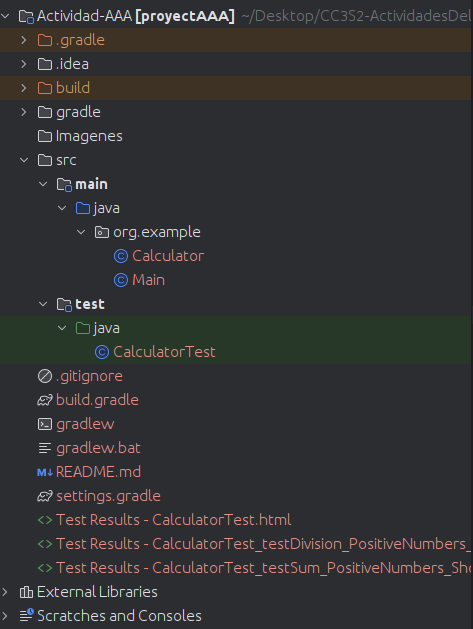
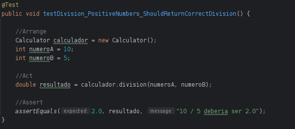

# ACTIVIDAD AAA
- Nombres y Apellidos: David Fernando Reeves Goñi

## Organizacion de la actividad
Primero descargo el proyecto Java que se encontraba en el repositorio del curso para posteriormente
abrir el directorio "Actividad-AAA"

## Entendiendo la Actividad
Debemos crear un ejemplo de tarea que implica escribir pruebas unitarias siguiendo el patrón AAA para una clase Calculador. 
Esta clase tendra los metodos para realizar operaciones basicas de matematicas como restar, sumar, dividir y multiplicar.
Tambien otro punto a considerar es que las pruebas unitarias para cada uno de estos métodos deben ser usando JUnit 5, 
aplicando el patrón AAA.

## Archivos
### 1) Archivio Main.java

- main(String[] args): Método principal de la clase que actúa como punto de entrada para la ejecución del programa.

### 2) Archivo Calculator.java

- `sumar(int numeroA, int numeroB)`: Método que suma dos números enteros y devuelve el resultado. Donde `numeroA` es el primer número entero a sumar. 
y `numeroB` es el Segundo número entero a sumar. Para posteriormente retornar la suma de los dos números enteros.

- `restar(int numeroA, int numeroB)`: Método que resta un número entero de otro y devuelve el resultado. Donde `numeroA` es el número entero del que se va a restar
el numero `numeroB`. Para posteriormente retornar la resta de los numeros.

- `multiplicacion(int numeroA, int numeroB)`: Método que multiplica dos números enteros y devuelve el resultado. multiplica los numeros  `numeroA` y `numeroB`.
Para posteriormente retornar la multiplicacion de los numeros.

- `division(int numeroA, int numeroB)`: Método que divide un número entero por otro y devuelve el resultado como un valor de punto flotante. Para ello utiliza
las variables `numeroA` y `numeroB`. Teniendo en cuenta la excepcion si numeroB es igual a cero, se lanza una excepción de ArithmeticException con el mensaje "Division por cero".

### 3) Archivo CalculatorTest.java

- `testSum_PositiveNumbers_ShouldReturnCorrectSum()`: Este método de prueba verifica si la suma de dos números 
positivos devuelve el resultado correcto. Se espera que la suma de 10 y 5 sea 15.

- `testRestar_PositiveNumbers_ShouldReturnCorrectSubtraction()`: Este método de prueba verifica si la resta de dos 
números positivos devuelve el resultado correcto. Se espera que la resta de 10 y 5 sea 5.

-`testMultiplicacion_PositiveNumbers_ShouldReturnCorrectMultiplication()`: Este método de prueba verifica si la 
multiplicación de dos números positivos devuelve el resultado correcto. Se espera que la multiplicación de 10 y 5 sea 50.

- `testDivision_PositiveNumbers_ShouldReturnCorrectDivision()`: Este método de prueba verifica si la división de 
dos números positivos devuelve el resultado correcto. Se espera que la división de 10 por 5 sea 2.0.

- `testDivision_DivideByZero_ShouldThrowArithmeticException()`: Este método de prueba verifica si se lanza una 
excepción de ArithmeticException cuando se intenta dividir un número por cero. Se espera que al dividir 10 por 0 se lance una excepción de ArithmeticException.

