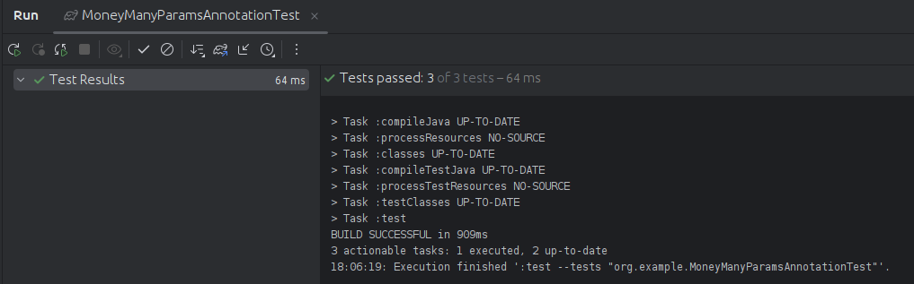

# Actividad1-Testing
## Organizacion de la actividad
Descargo el proyecto Java que de encontraba en el repositorio del curso para posteriormente abrir el directorio "Actividad1-Testing"

## Entendiendo la actividad
En esta actividad Utilizaremos JUnit 5 y AssertJ para crear pruebas unitarias
en el desarrollo de software. Para garantizar la calidad del código y mejorar la robustez de sus aplicaciones.
Posteriormente responderemos 5 preguntas que forman parte de la actividad

## Archivos
### 1) Archivo Addres.java

- `street`: La clase utiliza esta cadena que representa la dirección de la calle.
- `Address(String streetA)`: Con este constructor inicializo el atributo `street` con el valor proporcionado.
- `getStreet()`: Método que devuelve la dirección de la calle almacenada en el atributo `street`.

### 2) Archivo Client.java

- `addresses`: Creo una lista que almacena las direcciones asociadas al cliente.
- `Client()`: Con este Constructor inicializo la lista de direcciones como una nueva instancia de `ArrayList`.
- `addAddress(Address address)`: Con este método agrego una dirección a la lista de direcciones del cliente.
- `getAddresses()`: Con este método devuelvo la lista de direcciones asociadas al cliente.

### 3) Archivo Money.java

- `amount`: Con esta variable entera represento la cantidad de dinero.
- `currency`: Con esta cadena represento la moneda en la que se expresa la cantidad.
- `Money(int amount, String currency)`: Con este constructor inicializo una instancia de `Money` con la cantidad y la moneda especificadas, tambien lanza una excepción `IllegalArgumentException` si la cantidad es negativa.
- `getAmount()`: Método getter para devolver la cantidad de dinero.
- `getCurrency()`: Método getter para devuelver la moneda.
- `equals(Object anObject)`: Método para comparar dos objetos de tipo `Money` para determinar si son iguales. Retorna `true` si tienen la misma cantidad y moneda, y `false` en caso contrario.

### 4) Archivo ClientTest.java

- `setUp()`**: Creo una instancia para un objeto client, tambien 
 instancia un par de direcciones `address` y `otherAddress`, ambas con la misma calle "street A". Se inicializa un objeto `client` de tipo `Client`.
- `afterCreationShouldHaveNoAddress()`: Utilizando AAA para este metodo: 
  - **Arrange**: No se realiza ninguna acción en esta sección.
  - **Act**: Se obtiene el número de direcciones del cliente.
  - **Assert**: Se verifica que el número de direcciones sea igual a 0.

- `shouldAllowToAddAddress()`**: Utilizando AAA para este metodo:
  - **Arrange**: Se añade una dirección al cliente.
  - **Act**: Se obtiene el número de direcciones del cliente después de agregar una dirección.
  - **Assert**: Se verifica que el número de direcciones sea igual a 1.

- `shouldAllowToAddSameAddresses()`**: Utilizando AAA para este metodo: 
  - **Arrange**: Se añaden dos direcciones al cliente, ambas con la misma calle "street A".
  - **Act**: Se obtienen las calles de ambas direcciones del cliente.
  - **Assert**: Se verifica que las calles de las dos direcciones sean iguales.

- Compruebo el test:

### 5) Archivo MoneyIlegalArgumentExceptionTest.java

-`constructorShouldThrowIAEForInvalidAmount()`: Utilizando AAA para este metodo:
  - **Arrange**: Se establece una moneda válida como "USD".
  - **Act**: Se ejecuta el constructor `Money` con un monto de dinero inválido, que se pasa como argumento al método.
  - **Assert**: Se verifica que se lance una excepción `IllegalArgumentException` al intentar crear un objeto `Money` con un monto de dinero inválido.

- Compruebo el test:

### 6) Archivo MoneyManyParamsAnnotationTest.java

-`constructoShouldAmountAndCurrency()`: Utilizando AAA para este metodo:
  - **Arrange**: Establezco múltiples pares de valores de cantidad y moneda usando la anotación `@CsvSource`.
  - **Act**: Creo un objeto `Money` con cada par de valores de cantidad y moneda proporcionados.
  - **Assert**: Verifico que el monto y la moneda del objeto `Money` creado sean iguales a los valores proporcionados.

- Compruebo el test:

### 7) Archivo MoneyValueTest.java

- `constructorShouldSetAmountAndCurrency()`: Utilizando AAA para este metodo:
  - **Arrange**: Creo objetos `Money` con diferentes valores de cantidad y moneda.
  - **Act**: Accedo al monto y la moneda de cada objeto `Money`.
  - **Assert**: Verifico que el monto y la moneda de cada objeto `Money` sean los esperados.

- Compruebo el test:

### 8) Archivo MoneyOneParamAnnotationTest.java

- `constructoShouldAmountCurrency(int amount)`: Utilizando AAA para este metodo:
  - **Arrange**: Creo un objeto `Money` con el monto proporcionado por el parametro y una moneda fija (USD).
  - **Act**: Accedo al monto del objeto `Money`.
  - **Assert**: Verifico que el monto del objeto `Money` sea igual al valor proporcionado por el parámetro.

- Compruebo el test:

### 9) Archivo MoneyTest.java

- `shouldReturnFalseIfNotEqual()`: Utilizando AAA para este metodo:
  - **Arrange**: Instancio un objeto `Money` con un monto de 100 y una moneda USD (SUT).
  - **Act**: Verifico si el metodo `equals` devuelve `false` al compararlo con otro objeto `Money` que tiene un monto diferente y una moneda diferente.
  - **Assert**: Verifico que el resultado de la comparacion sea `false`.

- `constructorShouldSetAmountAndCurrency()`: Utilizando AAA para este metodo:
  - **Arrange**: Instancio un objeto `Money` con un monto de 100 y una moneda USD (SUT).
  - **Act**: Verifico si el monto y la moneda del objeto `Money` son los esperados.
  - **Assert**: Verifico que el monto sea 100 y que la moneda sea USD.

- `shouldReturnTrueIfEqual()`: Utilizando AAA para este metodo:
  - **Arrange**: Instancio un objeto `Money` con un monto de 100 y una moneda USD (SUT), y otro objeto `Money` con el mismo monto y moneda.
  - **Act**: Verifico si el método `equals` devuelve `true` al comparar el objeto `Money` con otro objeto `Money` que tiene el mismo monto y moneda.
  - **Assert**: Verifico que el resultado de la comparación sea `true`.

- Compruebo el test: 

## Preguntas de la actividad
1. Explica el siguiente gráfico en términos de SUT y DOC para pruebas unitarias

El diagrama que presenta la actividad muestra cómo se relacionan una clase de prueba, el sistema en prueba (SUT) con los objetos colaboradores dependientes (DOC) durante las pruebas unitarias.
Estas son las interacciones:

- Entradas directas: Datos o llamadas de método que la clase de prueba envía al SUT.
- Salidas directas: Respuestas del SUT a la clase de prueba.
  
2. Imaginemos algún servicio financiero (clase FinancialService) que, en función del último pago del cliente y su tipo (cualquiera que sea), calcula algún "bonus".

Identifica el SUT y sus colaboradores (DOC) y describe los tipos de interacción que ocurren
dentro del método calculateBonus() importantes para la prueba.

En este escenario, el objeto bajo prueba (SUT) es el método `calculateBonus()` contenido en la clase `FinancialService`. Este método se encarga de determinar un bono según el último pago y el tipo de cliente.

Dentro del método `calculateBonus()`, los objetos colaboradores identificados son:

- `clientDAO`: Se comunica con la base de datos para obtener y almacenar datos del cliente.
- `calculator`: Un componente usado para calcular el valor del bono basado en el tipo de cliente y el pago.

Entrada indirecta: `clientDAO.getClientType(clientId)`

Salida indirecta: `calculator.calculateBonus(clientType, payment)`, `clientDAO.saveBonusHistory(clientId, bonus)`

3. Sea la abstracción POO siguiente: 

### **Razones para Preocuparse por Interacciones Indirectas**
a. **Impacto en la Experiencia del Cliente**: Aunque las interacciones no directas no involucran una comunicación directa con el cliente, pueden tener un impacto significativo en la calidad del servicio o producto final que se entrega al cliente.

b. **Efecto de Propagación**: Un error en un nivel inferior puede propagarse a través de las interacciones no directas y amplificar problemas en niveles superiores.

c. **Revelación de Dependencias Ocultas**: Las interacciones no directas a menudo revelan dependencias que no son evidentes entre componentes o roles, las cuales pueden ser críticas para la estabilidad y eficiencia del sistema.

4. Completa la actividad proporcionada en el repositorio escribiendo el código fuente necesario para pasar las pruebas.
Uno de los tests realizados en clase es **`MoneyOneParamAnnotationTest`** y **`MoneyManyValueTest`**.

5. ¿Cuál es la diferencia entre una prueba unitaria y otros tipos de pruebas, como las pruebas de
   integración o las pruebas de aceptación? 

Aunque las pruebas unitarias tienen como objetivo evaluar unidades aisladas de código, las pruebas de integración se concentran en examinar cómo interactúan estas unidades entre sí. Por otro lado, las pruebas de aceptación se enfocan en validar si el software satisface los requisitos y las expectativas del cliente.