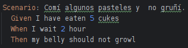

# Actividad 4 - HelloCucumber

## Organizacion de la actividad

Descargo el proyecto Java que de encontraba en el repositorio del curso para posteriormente abrir el directorio "ACTIVIDAD4-HELLOCUCUMBER"

## Entendiendo la Actividad
La actividad consiste en ejecutar scripts de Cucumber a traves de Java usando Gradle. Para ello debo extender el 
archivo belly.feature ubicado en "src/test/resources/skeleton", utilizando algunos escenarios Gherkin adicionales para 
probar adecuadamente la clase 'Belly' y solo debo modificar el archivo belly.feature, no debo modificar otro.

## Archivos
### 1) Archivo Belly.java

- `eatenCucumbers`: Instanciamos esta variable que almacena la cantidad total de pepinos que se han comido.
- `timeWaited`: Instanciamos esta variable que almacena el tiempo total que se ha esperado en horas.

- `reset()`: Este metodo restablece las variables `eatenCucumbers` y `timeWaited` a cero.
- `eat(int cukes)`: Este metodo simula comer pepinos. Acepta un parámetro `cukes`, la cantidad de pepinos comidos.
- `wait(int timeInHours)`: Este metodo simula esperar un cierto tiempo en horas.
- `isGrowling()`: Este metodo verifica si el estómago está gruñendo. Devuelve `true` si el tiempo esperado es mayor o 
- igual a 2 horas y la cantidad de pepinos comidos es mayor que 10.

### 2) Archivo RunCukesTest.java

Esta clase es una configuración para ejecutar pruebas escritas con Cucumber en Java.

- `@RunWith(Cucumber.class)`: Esta anotación indica que JUnit debe ejecutar las pruebas de esta clase utilizando 
- el corredor de pruebas de Cucumber. Esto permite que JUnit ejecute las pruebas Cucumber como cualquier otra prueba de JUnit.
- `@CucumberOptions(glue = "skeleton")`: Esta anotación proporciona opciones de configuración para la ejecución de las pruebas de Cucumber.
- `public class RunCukesTest { }`: Esta es la definición de la clase `RunCukesTest`, que simplemente actúa como un 
- punto de entrada para la ejecución de las pruebas Cucumber.

### 3) Archivo Stepdefs.java

- `belly`: Utilizo una sentencia de un objeto de la clase `Belly`, que se utiliza para simular el comportamiento de un 
estómago en los escenarios de prueba.

- `I_have_eaten_cukes(int cukes)`: Utilizo este método que se ejecuta cuando el paso "Given" del escenario de prueba es 
"I have eaten (\\d+) cukes". Obtiene un argumento `cukes` que representa el número de pepinos que se han comido, y luego 
invoca el método `eat(int cukes)` del objeto `belly`.
- `i_wait_hour(int arg1)`: Con este método ejecuto el paso "When" del escenario de prueba es "I wait (\\d+) hour". Tomo 
un argumento `arg1` que representa el número de horas de espera, y luego invoca el método `wait(int hours)` del objeto `belly`.
- `my_belly_should_growl()`: Con este método se ejecuta cuando el paso "Then" del escenario de prueba es "my belly should growl". 
Comprueba si el estómago (`belly`) está gruñendo utilizando el método `isGrowling()` y realiza una afirmación de que el resultado es verdadero.
- `my_belly_should_not_growl()`: Con este método se ejecuta cuando el paso "Then" del escenario de prueba es "my belly should not growl".
Comprueba si el estómago (`belly`) no está gruñendo utilizando el método `isGrowling()` y realiza una afirmación de que el resultado es falso.

### 4) Archivo belly.feature
En el siguiente archivo feature agregue nuevos escenarios para testearlos con la clase Stepdefs.java, en las siguientes lineas  y 
capturas de los escenarios y muestro el testeo de cada una de ellas:

#### Comí muchos pasteles y gruñí

#### Comí algunos pasteles y  no gruñí.

#### No Comí pasteles y no gruñí.

#### Comí 10 pasteles y  no gruñí.

#### Comí muchos pasteles y gruñí después de esperar.

#### Comí unos cuantos pasteles y no gruñí después de esperar.

#### Comí 15 pasteles y no gruñí.

#### Comí 50 pasteles y gruñí despues de esperar.

