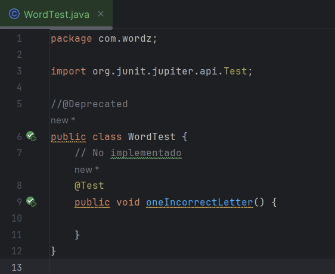

# Actividad TDD 1

1. Escribe el siguiente código para comenzar nuestra prueba:

- Para iniciar el diseño, optamos por emplear una clase denominada "Word" para representar la palabra en cuestión, Asimismo determinamos suministrar la palabra a adivinar como un argumento en la construcción de la instancia de la clase "Word" que deseamos instanciar. Implementamos estas elecciones de diseño en la prueba.

- En este punto, empleamos la función de autocompletar para generar una nueva clase llamada "Word" en tu propio archivo. Haz doble clic en el árbol de carpetas src/main, evitando seleccionar src/test. Luego, haz clic en "Aceptar" para crear el archivo en la estructura de directorios correcta, dentro del paquete correspondiente.

- Renombro el parámetro del constructor de Word

- Vuelvo a la prueba para capturar el nuevo objeto como una variable local para que podamos probarlo:

- Paso la adivinación es una decisión fácil: Utilizo un metodo que llamaremos guess(). Podemos
   codificar estas decisiones en la prueba:

- Pasar la adivinación es una decisión fácil: Utilizo un método que llamaremos guess(). Podemos
   codificar estas decisiones en la prueba:

- Haz clic en Enter para agregar el método, luego cambie el nombre del parámetro a un **nombre**
   **descriptivo**:

- Agrego una forma para obtener la puntuación resultante de esa suposición.
   Comienza con la prueba:

- Registra estas elecciones en el caso de prueba.
- A continuación, ejecuta este caso de prueba. Resulta en un fallo. Este paso es inesperadamente crucial. Al principio, podríamos creer que solo buscamos que las pruebas pasen. Sin embargo, esto no es del todo cierto. Una parte fundamental del trabajo en TDD implica tener la certeza de que nuestras pruebas están operativas. La observación de un fallo en una prueba cuando sabemos que aún no hemos codificado el comportamiento para que pase nos proporciona la seguridad de que nuestra prueba probablemente esté evaluando los aspectos adecuados.

- Hago que la prueba pase agregando código a la clase Word:

- Creo la clase score:

Observamos test no pasan, ahora escribamos el minimo codigo de prueba para que estas pasen .

- creamos la clase Letter  que tiene como Objeto INCORRECT:

- Ahora en la clase Score adicionamos la línea **`return (Letter) Letter.INCORRECT;`** implica una conversión explícita de un objeto de tipo **`Object`** a un objeto de tipo **`Letter`**.

- Probamos el test y finalmente paso :

