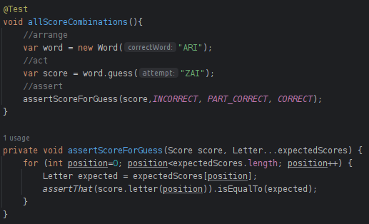

# Actividad TDD 3

La tarea se estructura en 3 fases de TDD, donde en cada una se llevarán a cabo pruebas que seguirán los siguientes pasos:

falla → éxito → optimización

Donde:

- **`falla`** = pruebas que no tienen éxito
- **`exito`** = pruebas que resultan satisfactorias
- **`optimizacion`** = proceso de mejora del código sin cambiar su comportamiento

### 1° Ciclo TDD

**1.** Comencemos en `rojo`. Escriba una prueba fallida para una sola letra correcta:

- Pregunta Describe el propósito de esta prueba: 
En esta prueba se comprueba la efectividad del método **`guess()`** perteneciente a la clase **`Word`**, al verificar si la letra proporcionada por el usuario concuerda correctamente con alguna letra de la palabra representada por la instancia de **`Word`**. En esta instancia particular, la prueba confirma que al adivinar la letra 'A' en una palabra de una sola letra ('A'), el resultado debe indicar que la letra adivinada es correcta.

**2.** Ahora pasemos a `**verde**` agregando el código de producción para que pase la prueba:

Utilizamos el (IDE) para facilitar la creación de la clase Score:

- Para abordar el nuevo comportamiento evaluado por la prueba oneCorrectLetter(), hemos incluido el código anteriormente mencionado. En lugar de que el método `**assess ()**` siempre retorne Letter.INCORRECT como lo hacía anteriormente, la nueva prueba ha señalado una nueva dirección. Ahora, el método **`assess()`** debe ser capaz de devolver el puntaje correcto cuando se adivina una letra correctamente.
- Para lograr este objetivo, hemos añadido un atributo llamado resultado para almacenar el último puntaje, código para devolver dicho resultado en el método **`letter()`**, y código en el método **`assess()`** para verificar si la primera letra de la adivinanza coincide con la primera letra de la palabra. Si hemos realizado correctamente estos cambios, ambas pruebas deberían pasar sin problemas ahora.

Pregunta: Ejecuta todas las pruebas para ver cómo lo estamos haciendo. ¿Qué encuentras aquí?.

Vemos que el test ha pasado correctamente (`**VERDE**`).

**3.** Vamos a refactorizar(`azul`). Extrae un método `isCorrectLetter()` para mayor claridad:

Una vez más, realizamos todas las pruebas para demostrar que esta refactorización no ha roto nada.
Las pruebas pasan !a `verde`

Hay dos aspectos adicionales para refactorizar en esta fase, El primero implica la optimizacion de un método para hacer que la prueba sea más comprensible, Vamos a reestructurar el código de la prueba para aumentar su claridad e Introduciremos un metodo de asercion personalizado.

La siguiente mejora que podríamos considerar implica un cambio en el diseño. Vamos a proceder con la mejora.

**4.** Cambiemos cómo especificamos la posición de la letra para verificar en el método **`assess()`**

### **2°Ciclo TDD: Avanzando en el diseño con combinaciones de dos letras**

**1.** Comencemos escribiendo una prueba para una segunda letra que está en la posición incorrecta(**`ROJO`**):

La prueba falla! 

**2.** Agreguemos el código inicial para verificar todas las letras en nuestra adivinación:

**3.** Agreguemos código para detectar cuándo una letra correcta está en la posición incorrecta:

La prueba paso **`Verde`**

### **3°Ciclo TDD: Prueba** para evaluar el comportamiento en torno a la segunda letra en la posición incorrecta.

1. Agrega una nueva prueba ejercitando las tres posibilidades de puntuació (**`rojo`**)

Ejecutamos la prueba:

La prueba falla  **`(rojo)`**

1. Agrega una lista List de resultados para almacenar el resultado de cada posición de letra por
separado:

Ejecutemos la prueba , en efecto la prueba pasa  (**`Verde`**)

1.  Extraigamos la lógica dentro del cuerpo del ciclo en un método scoreFor():**`(AZUL)`**

El código anterior ahora es mucho más legible. El contenido del método scoreFor() ahora presenta de manera concisa las reglas para asignar puntajes a cada letra. Hemos sustituido la estructura if-else-if por una estructura if-return más sencilla. Determinamos el puntaje y salimos del método de inmediato.

El siguiente trabajo es limpiar el código de prueba **`(AZUL)`**

Finalmente nuestro codigo de prueba es el siguiente:

Ahora toca verificar que todo sigue en verde y no hayamos roto nada ...

Las pruebas pasaron **`(verde)`** con un codigo refactorizado **`( azul)`.**