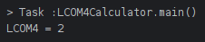
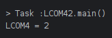

# Ejemplo 3 de la Actividad de Metricas de Calidad de Software

Para analizar el nivel de cohesion de una clase utilizamos la clase `LCOM4Calculator` proporcionada utilizando la metrica LCOM4, primero revisemos como se calcula esta metrica:

```java
package com.example.Ejemplo3ActividadMetricasDeCalidadDeSoftware;

import java.util.*;

public class LCOM4Calculator {
    private static class ClassInfo {
        List<String> methods = new ArrayList<>();
        Map<String, Set<String>> methodAttributes = new HashMap<>();
        Set<String> attributes = new HashSet<>();
        
        public void addMethod(String methodName, Set<String> attrs) {
            methods.add(methodName);
            methodAttributes.put(methodName, attrs);
            attributes.addAll(attrs);
        }
        
        public int calculateLCOM4() {
            Map<String, Set<String>> graph = new HashMap<>();
            for (String method : methods) {
                graph.put(method, new HashSet<>());
            }
            for (int i = 0; i < methods.size(); i++) {
                for (int j = i + 1; j < methods.size(); j++) {
                    String method1 = methods.get(i);
                    String method2 = methods.get(j);
                    Set<String> attrs1 = methodAttributes.get(method1);
                    Set<String> attrs2 = methodAttributes.get(method2);
                    if (!Collections.disjoint(attrs1, attrs2)) {
                        graph.get(method1).add(method2);
                        graph.get(method2).add(method1);
                    }
                }
            }
            return countComponents(graph);
        }
        
        private int countComponents(Map<String, Set<String>> graph) {
            Set<String> visited = new HashSet<>();
            int components = 0;
            for (String method : methods) {
                if (!visited.contains(method)) {
                    dfs(graph, method, visited);
                    components++;
                }
            }
            return components;
        }
        
        private void dfs(Map<String, Set<String>> graph, String method, Set<String> visited) {
            Stack<String> stack = new Stack<>();
            stack.push(method);
            while (!stack.isEmpty()) {
                String current = stack.pop();
                if (!visited.contains(current)) {
                    visited.add(current);
                    for (String neighbor : graph.get(current)) {
                        if (!visited.contains(neighbor)) {
                            stack.push(neighbor);
                        }
                    }
                }
            }
        }
    }
    
    public static void main(String[] args) {
        ClassInfo classInfo = new ClassInfo();
        classInfo.addMethod("method1", new HashSet<>(Arrays.asList("attr1", "attr2")));
        classInfo.addMethod("method2", new HashSet<>(Arrays.asList("attr2")));
        classInfo.addMethod("method3", new HashSet<>(Arrays.asList("attr3")));
        int lcom4 = classInfo.calculateLCOM4();
        System.out.println("LCOM4 = " + lcom4);
    }
}
```

1. **LCOM4** mide el numero de componentes conexos en un grafo donde:
    - Los nodos representan los metodos de la clase.
    - Hay una arista entre dos nodos si los métodos correspondientes comparten al menos un atributo.

2. Una clase altamente cohesiva tendra pocos componentes conexos (idealmente, uno), mientras que una clase con baja cohesion tendra muchos componentes.

### Analisis de la clase `LCOM4Calculator`

La clase `LCOM4Calculator` incluye una clase estatica interna `ClassInfo` que proporciona la funcionalidad principal para calcular LCOM4. Vamos a desglosar el contenido de la clase y calcular LCOM4 paso a paso:

1. **Metodos y Atributos**:
    - `addMethod(String methodName, Set<String> attrs)`: Añade un metodo y sus atributos.
    - `calculateLCOM4()`: Calcula LCOM4 para la clase.
    - `countComponents(Map<String, Set<String>> graph)`: Cuenta los componentes conexos en el grafo.
    - `dfs(Map<String, Set<String>> graph, String method, Set<String> visited)`: Realiza una busqueda en profundidad para contar componentes conexos.

2. **Construccion del grafo**:
    - Los metodos son los nodos del grafo.
    - Se añade una arista entre dos nodos si los metodos correspondientes comparten algun atributo.

3. **Componentes conexos**:
    - Se utiliza DFS (Depth First Search) para contar los componentes conexos en el grafo.

### Ejemplo de calculo con datos de ejemplo

En el metodo `main` de `LCOM4Calculator`, se añaden tres metodos con los siguientes atributos:
- `method1` con atributos `attr1` y `attr2`.
- `method2` con atributo `attr2`.
- `method3` con atributo `attr3`.

Los metodos `method1` y `method2` comparten `attr2`, pero `method3` no comparte ningun atributo con los otros metodos.

### Grafo de metodos y atributos

Representacion del grafo:
- Nodos: `method1`, `method2`, `method3`.
- Aristas:
    - `method1` - `method2` (comparten `attr2`).

El grafo seria:
- `method1` <-> `method2`
- `method3` (sin conexion)

### Calculo de LCOM4

1. **Inicializacion**:
    - Nodos: `method1`, `method2`, `method3`.
    - `method1` y `method2` estan conectados.
    - `method3` esta aislado.

2. **Conteo de componentes conexos**:
    - Componente 1: {`method1`, `method2`}
    - Componente 2: {`method3`}

Total de componentes conexos = 2.

### Resultado

Para los metodos y atributos proporcionados:
- LCOM4 = 2.



## Cálculo de LCOM4

### Clase `CineManager`

#### Atributos
- `List<Pelicula> peliculas`
- `Map<Integer, Sala> salas`

#### Métodos
- `agregarPelicula(Pelicula pelicula)`
- `eliminarPelicula(String titulo)`
- `agregarSala(Sala sala)`
- `eliminarSala(int id)`
- `sesionesPorPelicula(String titulo)`
- `programarSesion(String titulo, Sesion sesion)`
- `contarPeliculas()`
- `contarSalas()`

### Construcción del Grafo

1. **Nodos**: Representan los métodos.
2. **Aristas**: Dos nodos están conectados si los métodos correspondientes comparten al menos un atributo.

#### Métodos y sus atributos utilizados

1. `agregarPelicula(Pelicula pelicula)`:
   - Utiliza: `peliculas`

2. `eliminarPelicula(String titulo)`:
   - Utiliza: `peliculas`

3. `agregarSala(Sala sala)`:
   - Utiliza: `salas`

4. `eliminarSala(int id)`:
   - Utiliza: `salas`

5. `sesionesPorPelicula(String titulo)`:
   - Utiliza: `peliculas`

6. `programarSesion(String titulo, Sesion sesion)`:
   - Utiliza: `peliculas`

7. `contarPeliculas()`:
   - Utiliza: `peliculas`

8. `contarSalas()`:
   - Utiliza: `salas`

### Grafo de métodos

- Nodos: `agregarPelicula`, `eliminarPelicula`, `agregarSala`, `eliminarSala`, `sesionesPorPelicula`, `programarSesion`, `contarPeliculas`, `contarSalas`.
- Aristas (conexiones):
  - `agregarPelicula` - `eliminarPelicula` (comparten `peliculas`)
  - `agregarPelicula` - `sesionesPorPelicula` (comparten `peliculas`)
  - `agregarPelicula` - `programarSesion` (comparten `peliculas`)
  - `agregarPelicula` - `contarPeliculas` (comparten `peliculas`)
  - `eliminarPelicula` - `sesionesPorPelicula` (comparten `peliculas`)
  - `eliminarPelicula` - `programarSesion` (comparten `peliculas`)
  - `eliminarPelicula` - `contarPeliculas` (comparten `peliculas`)
  - `sesionesPorPelicula` - `programarSesion` (comparten `peliculas`)
  - `sesionesPorPelicula` - `contarPeliculas` (comparten `peliculas`)
  - `programarSesion` - `contarPeliculas` (comparten `peliculas`)
  - `agregarSala` - `eliminarSala` (comparten `salas`)
  - `agregarSala` - `contarSalas` (comparten `salas`)
  - `eliminarSala` - `contarSalas` (comparten `salas`)

### Componentes Conexos

1. **Componente 1** (relacionado con `peliculas`):
   - `agregarPelicula`
   - `eliminarPelicula`
   - `sesionesPorPelicula`
   - `programarSesion`
   - `contarPeliculas`

2. **Componente 2** (relacionado con `salas`):
   - `agregarSala`
   - `eliminarSala`
   - `contarSalas`

```java
public static void main(String[] args) {
        ClassInfo classInfo = new ClassInfo();

        // Agregar métodos y atributos de CineManager
        classInfo.addMethod("agregarPelicula", new HashSet<>(Arrays.asList("peliculas")));
        classInfo.addMethod("eliminarPelicula", new HashSet<>(Arrays.asList("peliculas")));
        classInfo.addMethod("agregarSala", new HashSet<>(Arrays.asList("salas")));
        classInfo.addMethod("eliminarSala", new HashSet<>(Arrays.asList("salas")));
        classInfo.addMethod("sesionesPorPelicula", new HashSet<>(Arrays.asList("peliculas")));
        classInfo.addMethod("programarSesion", new HashSet<>(Arrays.asList("peliculas")));
        classInfo.addMethod("contarPeliculas", new HashSet<>(Arrays.asList("peliculas")));
        classInfo.addMethod("contarSalas", new HashSet<>(Arrays.asList("salas")));

        int lcom4 = classInfo.calculateLCOM4();
        System.out.println("LCOM4 = " + lcom4);
    }
```

### Resultado LCOM4

- **LCOM4 = 2** (dos componentes conexos).


