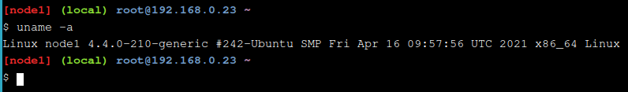
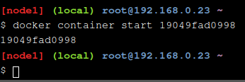
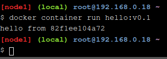
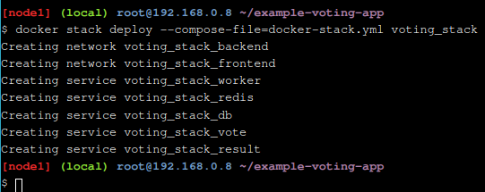
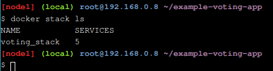
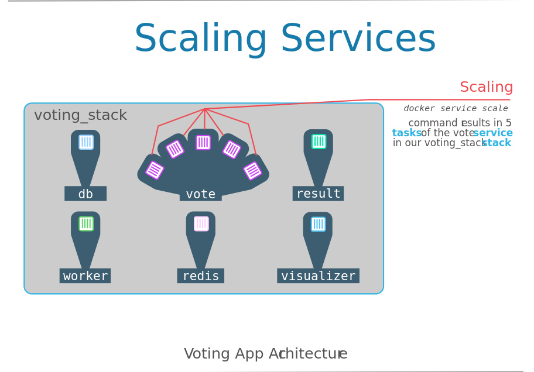

# Uso de Play with docker

### Objetivos

- Adquirir conocimientos sobre la administración de recursos en Docker, incluyendo contenedores, imágenes, redes y volúmenes.
- Familiarizarse con el uso de Play with Docker para explorar y aprender sobre Docker en un entorno seguro y accesible.
- Mostrar cómo PWD ofrece un entorno Docker completo accesible desde un navegador web, eliminando la necesidad de configuraciones complejas o recursos locales.
- Resaltar la capacidad de PWD para proporcionar un entorno de aprendizaje interactivo, permitiendo a los usuarios experimentar con Docker de manera práctica, cometer errores y aprender de ellos en un entorno controlado y seguro.
- Destacar cómo PWD permite una rápida experimentación con diversas características de Docker, facilitando a los usuarios probar nuevas ideas, configuraciones o arquitecturas de aplicaciones sin retrasos.
- Subrayar la importancia de tener un entorno aislado para aprender y experimentar, como el que ofrece PWD, donde las acciones de un usuario no afectan a otros usuarios ni al entorno de producción.

El **entrenamiento Play with Docker** ofrece laboratorios y tutoriales diseñados para proporcionar experiencia práctica con Docker. En esta plataforma, encontramos una mezcla de laboratorios y tutoriales que benefician a usuarios de Docker como administradores de sistemas, profesionales de TI y desarrolladores. Aquí se incluyen tutoriales prácticos accesibles directamente desde el navegador, instrucciones para configurar y usar Docker en su propio entorno, y recursos sobre las mejores prácticas para desarrollar e implementar sus propias aplicaciones. Para obtener una comprensión integral de Docker, completaré los stages 1 y 2, siguiendo los laboratorios de la plataforma.

# Stage 1

Primero me dirijo al enlace de play-with-docker.com para encontrar los stages 1 y 2.


Abajo del login, encuentro el enlace para training.play-with-docker.com.


En esta página puedo acceder a los stages 1 y 2.


Primero me dirijo al stage 1, donde tengo acceso a las 3 partes que lo conforman.


Dentro del primer paso del stage 1 encuentro sus instrucciones.


## Sección 1 del stage1: Tus primeros contenedores de Linux

En este laboratorio ejecutaré un contenedor para explorar los fundamentos de cómo funcionan los contenedores y cómo el Docker Engine los ejecuta y aísla entre sí. Si ya tienes experiencia con la ejecución de contenedores y comandos básicos de Docker, puedes avanzar más rápido.

Consejos:

En este entorno, los fragmentos de código se presentan de tres maneras:

- El código que aparece en un cuadro como el de abajo se puede hacer clic en él y se escribirá automáticamente en la ventana de terminal correspondiente:

  ```uname -a```



- El código que aparece en ventana observo debo escribir el comando para iniciar el contenedor. Normalmente habrá un ID único u otro dato que necesito ingresar y que no puedo proporcionar. Los elementos que aparecen en `< >` son las partes que debo sustituir según las instrucciones.

  ```docker container start <container ID>```

### 1.0 Corriendo mi primer contenedor

Como en la mayoría de los temas técnicos, una aplicación "hello world" es un buen punto de partida. Puedo escribir o hacer clic en el siguiente código para ejecutar mi primer contenedor Docker:

```docker container run hello-world```


Con esto ya tengo mi primer contenedor. La salida del contenedor hello-world me da una idea de lo que acaba de suceder. Esencialmente, el Docker Engine que se ejecuta en mi terminal intentó encontrar una imagen llamada hello-world. Dado que acabo de comenzar, no hay imágenes almacenadas localmente, por lo que Docker Engine va a su registro Docker predeterminado, que es Docker Hub, para buscar una imagen llamada "hello-world". Encuentra la imagen allí, la descargo y luego la ejecuto en un contenedor. Y la única función de hello-world es mostrar el texto que veo en mi terminal, después de lo cual el contenedor se cierra.


## Explicación de la imagen:

Esta ilustración detalla cómo se ejecuta un contenedor Docker usando la imagen "hello-world". Al escribir `docker run hello-world` en la terminal, si la imagen no está disponible localmente, el Docker Engine la busca y la descarga del registro de Docker, que almacena imágenes tanto públicas como privadas. Una vez descargada, el Docker Engine ejecuta la imagen, y el mensaje "Hello from Docker!" confirma que el contenedor se ha ejecutado correctamente.

Se podría pensar que esto es muy similar a ejecutar una VM, pero con un repositorio central de imágenes de VM. En este ejemplo simple, eso es básicamente cierto. Sin embargo, a medida que avanzo en estos ejercicios, comenzaré a ver diferencias importantes entre Docker y los contenedores en comparación con las VMs. Por ahora, la explicación simple es esta:

- **La VM es una abstracción de hardware:** toma las CPU físicas y la RAM de un host, y las divide y comparte entre varias máquinas virtuales más pequeñas. Hay un sistema operativo y una aplicación ejecutándose dentro de la VM, pero el software de virtualización generalmente no tiene conocimiento real de eso.
- **El contenedor es una abstracción de aplicación:** el enfoque está realmente en el sistema operativo y la aplicación, y no tanto en la abstracción del hardware. Muchos usuarios utilizan tanto VMs como contenedores en sus entornos y, de hecho, pueden ejecutar contenedores dentro de VMs.

### 1.1 Imágenes Docker

En el resto de este laboratorio, ejecutaré un contenedor de Alpine Linux. Alpine es una distribución de Linux ligera, rápida de descargar y ejecutar, lo que la hace un punto de partida popular para muchas otras imágenes.

Para comenzar, ejecuta lo siguiente en tu terminal:

```docker image pull alpine```


El comando pull descarga la imagen de Alpine desde el registro de Docker y la guarda en tu sistema. En este caso, el registro es Docker Hub. Puedes cambiar el registro, pero eso se aborda en otro laboratorio.

Puedes usar el comando docker image para ver una lista de todas las imágenes en tu sistema:

```docker image ls```


La salida mostrará una lista de imágenes disponibles localmente, incluyendo Alpine y hello-world.

### 1.1 Ejecutar un Contenedor Docker

Voy a ejecutar un contenedor Docker basado en esta imagen. Para hacerlo, usaré el comando docker container run:

```docker container run alpine ls -l```


Aunque la salida del comando ls no sea muy emocionante, detrás de escena suceden varias cosas. Cuando ejecuto run, el cliente de Docker encuentra la imagen, crea el contenedor y luego ejecuta un comando en ese contenedor. Al ejecutar docker container run alpine, proporcioné un comando (ls -l), por lo que Docker ejecutó este comando dentro del contenedor, mostrándome el listado del directorio. Después de que el comando ls terminó, el contenedor se cerró.


### Explicación de la imagen:

La imagen ilustra el proceso de ejecución de un contenedor Docker utilizando la imagen "alpine". Primeramente, se ejecuta el comando `docker run alpine ls -l` desde la terminal, iniciando así un contenedor Alpine. Dentro de este entorno aislado, se ejecuta el comando `ls -l`, que muestra una lista detallada de directorios y archivos dentro del contenedor. Una vez completada la ejecución del comando, el contenedor se detiene y regresa al sistema operativo host, concluyendo su ciclo de vida temporal dentro del entorno Docker.


Es importante notar que el contenedor se cerró después de ejecutar el comando, y esto tiene su relevancia, como veremos más adelante. Ahora escribo lo siguiente en mi terminal:

``` docker container run alpine echo "hello from alpine" ```


En este caso, Docker ejecutó el comando `echo` dentro del contenedor alpine y luego finalizó. En comparación con una máquina virtual que necesita tiempo para arrancar y emular un sistema operativo completo, los contenedores Docker operan a nivel de aplicación, evitando muchos de estos pasos y ejecutando solo lo necesario para la aplicación. Esta agilidad es la razón por la que se dice que los contenedores son rápidos.

Vamos a realizar las mismas instrucciones para el texto proporcionado:

``` docker container run alpine /bin/sh ```


Inicié una tercera instancia del contenedor alpine y ejecuté el comando `/bin/sh` y luego salió. No proporcioné ningún comando adicional a `/bin/sh`, por lo que simplemente lanzó el shell, salió del shell y luego detuvo el contenedor. Docker tiene una facilidad para eso, agregando una bandera para ejecutar el contenedor en un terminal interactivo. Para este ejemplo, escribe lo siguiente:

``` docker container run -it alpine /bin/sh ```


Ahora estoy dentro del contenedor ejecutando un shell de Linux y puedo probar algunos comandos como `ls -l`, `uname -a` y otros. Debo tener en cuenta que Alpine es un sistema operativo Linux pequeño, por lo que pueden faltar varios comandos. Para ello puedo salir del shell y del contenedor escribiendo el comando `exit`.

Puedo ver estas instancias usando el comando `docker container ls`. El comando `docker container ls` por sí solo muestra todos los contenedores que están actualmente en ejecución:

``` docker container ls ```


Como no hay contenedores en ejecución, veré una línea en blanco. Probaré una variante más útil: 

``` docker container ls -a ```


Lo que veré ahora es una lista de todos los contenedores que ejecuté. Observo que la columna STATUS muestra que estos contenedores salieron hace algún tiempo.

Esta tabla muestra todos los contenedores que he ejecutado recientemente, junto con el comando que cada uno ejecutó y su estado de salida.


### Explicación de la imagen

La representación gráfica muestra la salida del comando Docker `docker container ls -a`, listando todos los contenedores, incluidos los inactivos. Se observan cuatro contenedores en la imagen. Los tres primeros contenedores han completado con éxito con un código de estado 0 después de ejecutar comandos como "ls -l", "/bin/sh" y "echo". El cuarto contenedor aún está en ejecución y ha ejecutado el comando "hello-world". Cada contenedor está identificado por un ID único, respectivamente: fa0c53730b9, 36171a5da744, a6a94d6db2f2, c3171ed9e3dc, y tiene nombres asociados como ecstatic_curran, fervent_newton, nostalgic_bhaskara y stupefied_mcclintock.

### 1.2 Aislamiento de Contenedores

En los pasos anteriores ejecuté varios comandos mediante instancias de contenedores con la ayuda de `docker container run`. El comando `docker container ls -a` me mostró varios contenedores listados. ¿Por qué hay tantos contenedores listados si todos son de la imagen `alpine`?

Aunque cada comando `docker container run` usó la misma imagen `alpine`, cada ejecución fue un contenedor separado e independiente. Cada contenedor tiene un sistema de archivos separado y se ejecuta en un espacio de nombres diferente; por defecto, un contenedor no puede interactuar con otros contenedores, incluso aquellos de la misma imagen.

```sh
docker container run -it alpine /bin/ash
```


El `/bin/ash` es otro tipo de shell disponible en la imagen `alpine`. Una vez que el contenedor se inicia y está en el prompt del contenedor, debo escribir los siguientes comandos:

```sh 
echo "hello world" > hello.txt
ls
```


El primer comando `echo` crea un archivo llamado "hello.txt" con las palabras "hello world" dentro de él. El segundo comando te da una lista de directorios de los archivos y debería mostrar mi nuevo archivo "hello.txt". Ahora escribiré `exit` para salir de este contenedor.


Para demostrar cómo funciona el aislamiento, ejecuto lo siguiente:

```sh
docker container run alpine ls
```


Es el mismo comando `ls` que usé dentro del shell interactivo `ash` del contenedor, mi comando se ejecutó en una nueva instancia separada, aunque esté basada en la misma imagen. La segunda instancia no puede interactuar con la primera porque Docker Engine las mantiene separadas y no hemos configurado ningún parámetro adicional que permita la interacción entre estas dos instancias.

Los usuarios de Docker aprovechan esta característica no solo por seguridad, sino para probar los efectos de realizar cambios en aplicaciones. El aislamiento permite a los usuarios crear rápidamente copias de prueba separadas e independientes de una aplicación o servicio y ejecutarlas en paralelo sin interferir entre sí. De hecho, hay todo un ciclo de vida donde los usuarios realizan cambios y los llevan a producción utilizando este concepto básico y las capacidades integradas de Docker Enterprise.

En este momento, la pregunta es "¿cómo vuelvo al contenedor que tiene mi archivo 'hello.txt'?"

```sh
docker container ls -a
```


Gráficamente, esto es lo que sucedió en nuestro Docker Engine:

### Explicación de la imagen


La imagen proporciona un diagrama explicativo sobre el aislamiento de contenedores en Docker. En la parte superior se representan dos instancias de contenedor, cada una basada en una imagen distinta, ejecutándose en un entorno Linux a través de un motor Docker. En la parte inferior se muestran dos imágenes, "alpine" y "hello-world", que actúan como plantillas para la creación de los contenedores. Cada contenedor se genera a partir de una imagen específica. Además, se destacan algunos comandos utilizados dentro de los contenedores, como "ls -l", "/bin/ash", "echo" y "hello", los cuales interactúan con archivos y procesos internos. La columna "COMMAND" identifica el contenedor único mediante su ID, como se observa con el ejemplo de salida del contenedor con ID 3030c9c91e12, permitiendo ejecutar comandos específicos en esa instancia mediante comandos Docker adecuados.

```bash
docker container start <ID del contenedor>
```



En lugar de usar el ID completo del contenedor, puedo usar solo los primeros caracteres, siempre y cuando sean suficientes para identificarlo de manera única. Así que, en el ejemplo anterior, podría simplemente usar "1904" para identificar la instancia del contenedor, ya que ningún otro contenedor en esta lista comienza con esos caracteres.

Ahora utilizo el comando docker container ls nuevamente para listar los contenedores en ejecución.


Observo que esta vez la instancia de contenedor sigue en ejecución. Usaré el shell ash, por lo que, en lugar de salir automáticamente como lo hizo /bin/sh anteriormente, ash espera un comando. Podré enviar un comando al contenedor para que lo ejecute usando el comando exec, de la siguiente manera:

```bash
docker container exec <ID del contenedor> ls
```


Esta vez obtengo una lista de directorios que muestra el archivo "hello.txt" porque estoy utilizando la instancia del contenedor en la que creamos ese archivo.

### Explicación de la imagen


La imagen muestra el aislamiento de contenedores en Docker con un diagrama claro y conciso. En la parte superior se representan dos instancias de contenedor ejecutándose en un entorno Linux mediante un motor Docker. Cada contenedor está basado en una imagen diferente, "alpine" y "hello-world", mostradas en la parte inferior. Las imágenes sirven como plantillas para crear los contenedores, los cuales ejecutan diversos comandos como "ls -l", "/bin/ash", "echo" y "hello", mostrados en la imagen. Estos comandos permiten la interacción con los archivos y procesos internos de cada contenedor, ilustrando el concepto fundamental del aislamiento y la portabilidad de los contenedores Docker.

## Sección 2 del stage 1: Personalización de imágenes de Docker

En el ejercicio anterior, descargué imágenes del Docker Store y ejecuté múltiples instancias, observando cómo cada una estaba aislada de las demás. Aunque hay muchas imágenes disponibles, para reutilizar y compartir contenedores personalizados, como en mi instancia de Alpine con el archivo "hello.txt", necesito crear imágenes personalizadas.

Primero, aprenderé a crear una imagen a partir de una instancia de contenedor. Luego, exploraré el uso de Dockerfile para crear imágenes de manera más potente y útil. Finalmente, veré cómo inspeccionar una imagen y explorar su sistema de archivos para comprender mejor su funcionamiento interno.

### Creación de imágenes en un contenedor

Comenzaré ejecutando un shell interactivo en un contenedor de Ubuntu:

```bash
docker container run -ti ubuntu bash
```


Como aprendí antes, esto descarga la imagen "ubuntu" del Docker Store y ejecuta el shell bash dentro del contenedor.

Para personalizar, instalaremos un paquete llamado figlet en este contenedor. Escribe los siguientes comandos en la línea de comandos del contenedor Ubuntu:

```bash
apt-get update
apt-get install -y figlet
figlet "hello docker"
```


Esto imprimirá "hello docker" en caracteres ASCII grandes en la pantalla. Luego, sal del contenedor:

```bash
exit
```


Supongamos que esta nueva aplicación figlet es útil y quieres compartirla con mí equipo. Podría decirles que sigan los mismos pasos, pero en aplicaciones del mundo real, este proceso podría volverse complicado y propenso a errores. Es más fácil crear una imagen para compartir.

Primero, obtendré el ID del contenedor usando el comando ls:

```bash
docker container ls -a
```


Esto muestra todos los archivos añadidos o modificados al instalar figlet. Docker rastrea toda esta información.

Para crear una imagen, debo ejecutar "commit" en este contenedor, lo cual crea una imagen localmente:

```bash
docker container commit <CONTAINER_ID>
```


He creado mi primera imagen. Para verla en la lista de imágenes disponibles:

```bash
docker image ls
```


La imagen personalizada no tiene información en las columnas REPOSITORY o TAG, lo que dificulta su identificación. Para solucionar esto, etiqueto la imagen con un nombre:

```bash
docker image tag <IMAGE_ID> ourfiglet
docker image ls
```


Ahora, la imagen tiene un nombre amigable "ourfiglet".

Aquí tengo una vista gráfica de lo que acabo de completar.

### Explicación de la imagen


La imagen muestra un diagrama que explica cómo crear imágenes en Docker a partir de una instancia de contenedor. Primero, se ejecuta un contenedor Ubuntu y se instala 'figlet' usando el comando `apt-get figlet`. Luego, se detiene el contenedor y se confirma el cambio para crear una nueva imagen que incluye 'figlet'. El diagrama ilustra el proceso con íconos y flechas, destacando el rol del Motor Docker en un entorno Linux. Este visual es útil para entender cómo Docker permite la creación de imágenes personalizadas a partir de contenedores existentes.

Ahora vamos a ejecutar un contenedor basado en la imagen recién creada, ourfiglet:

```bash
docker container run ourfiglet figlet hello
```


Como el paquete figlet está presente en mi imagen ourfiglet, el comando devuelve un mensaje de hello en la salida.

Este ejemplo demuestra que puedo crear un contenedor, agregarle todas las bibliotecas y binarios necesarios, y luego "confirmar" el contenedor para crear una imagen reutilizable. Sin embargo, la imagen actualmente solo está almacenada localmente.

### Creación de una imagen utilizando un Dockerfile

Instalar software manualmente en un contenedor y luego confirmar la imagen es una forma de crear imágenes, pero hay un método más eficiente: usar un Dockerfile. Un Dockerfile es un archivo de texto que contiene todas las instrucciones para construir una imagen, facilitando la gestión de cambios.

Por ejemplo, si se lanza una nueva versión de figlet, con un Dockerfile podría simplemente recomponer la imagen utilizando las instrucciones originales. Es similar a cómo se gestionan los archivos de código fuente.

Voy a crear una aplicación "hello world" en Node.js utilizando un Dockerfile. Primero, crea un archivo llamado `index.js` con el siguiente contenido:

```javascript
var os = require("os");
var hostname = os.hostname();
console.log("hello from " + hostname);
```


Para guardar los cambios en el archivo presiono esc y luego escribo wq, por último enter.

Luego, creo un archivo llamado Dockerfile con el siguiente contenido:

```dockerfile
FROM alpine
RUN apk update && apk add nodejs
COPY . /app
WORKDIR /app
CMD ["node", "index.js"]
```


Para guardar los cambios en el archivo presiono esc y luego escribo wq, por último enter.

Finalmente, construyo mi primera imagen desde este Dockerfile y la llamo hello:v0.1:

```bash
docker image build -t hello:v0.1 .
```


Esto completa el proceso de creación de una imagen Docker desde un Dockerfile.

### Explicación de la imagen


Esta imagen trata sobre la construcción de un Dockerfile y su relación con la imagen de Docker resultante. En la izquierda, una montaña etiquetada como "alpine" indica la distribución ligera de Alpine Linux, utilizada como imagen base en los Dockerfiles. En el centro, un diagrama muestra comandos como `FROM alpine`, `RUN apk update && apk add nodejs`, `COPY . /app`, `WORKDIR /app`, y `CMD ["node", "index.js"]`, que indican el uso de Alpine, la actualización del sistema, la adición de Node.js, la copia de archivos, la configuración del directorio de trabajo y el comando de inicio del contenedor. A la derecha, se muestra cómo estos comandos se ensamblan en capas que forman la imagen de Docker, representadas como una ecuación, donde los elementos del Dockerfile se combinan para crear el contenedor final.

Luego, inicio un contenedor para verificar que la aplicación se ejecute correctamente:

```bash
docker container run hello:v0.1
```



Creé dos archivos: El código de la aplicación (index.js) es un código en JavaScript que imprime un mensaje. Y el Dockerfile contiene las instrucciones para que el motor de Docker cree el contenedor personalizado.

### Capas de imágenes

Cuando se ejecutan las imágenes, parecen ser un solo sistema operativo y aplicación. Pero las imágenes en sí mismas se construyen en capas. Las capas son un concepto importante. Para explorar esto, realizaremos otro conjunto de ejercicios.

Primero, la imagen que creé anteriormente usando el comando `history`:

```bash
docker image history <image ID>
```


Lo que veo es la lista de imágenes de contenedores intermedias que se construyeron en el camino para crear mi imagen final de la aplicación Node.js. Algunas de estas imágenes intermedias se convertirán en capas en mi imagen de contenedor final. En la salida del comando `history`, las capas originales de Alpine están en la parte inferior de la lista y luego cada personalización que agregamos en nuestro Dockerfile es un paso propio en la salida. Para ver esto, modificaremos un poco nuestra aplicación y crearé una nueva imagen.

```bash
echo "console.log(\"this is v0.2\");" >> index.js
```


Esto agregará una nueva línea al final de mi archivo index.js anterior para que mi aplicación imprima una línea adicional de texto. Ahora construiré una nueva imagen usando el código actualizado.

```bash
docker image build -t hello:v0.2 .
```


### Explicación de la imagen


La imagen muestra cómo se construye un Dockerfile y su relación con la imagen de Docker resultante. A la izquierda, se ve una ilustración de una montaña alpina que simboliza la distribución ligera de Alpine Linux, comúnmente utilizada como imagen base en Dockerfiles. En el centro, se muestra un diagrama con los comandos del Dockerfile: `FROM alpine` para usar la imagen base Alpine, `RUN apk update && apk add nodejs` para actualizar el sistema y añadir Node.js, `COPY . /app` para copiar archivos al contenedor, `WORKDIR /app` para establecer el directorio de trabajo y `CMD ["node", "index.js"]` para definir el comando de inicio del contenedor. A la derecha, se representa cómo estos comandos se ensamblan en capas que forman la imagen de Docker, similar a una ecuación, donde los elementos del Dockerfile se combinan para crear el contenedor final.

### Inspección de Imágenes

¿Qué pasa si obtenemos un contenedor de Docker Store u otro registro y queremos saber más sobre su contenido? Docker tiene un comando de inspección para imágenes que proporciona detalles sobre la imagen del contenedor, los comandos que ejecuta, el sistema operativo y más.

La imagen de Alpine debería estar presente localmente por los ejercicios anteriores; si no, ejecuta el siguiente comando para descargarla:

```bash
docker image pull alpine
```


Una vez que estés seguro de que está ahí, inspecciónala:

```bash
docker image inspect alpine
```


Ahí hay mucha información:

- Las capas de las que está compuesta la imagen.
- El controlador utilizado para almacenar las capas.
- La arquitectura/SO para la que ha sido creada.
- Metadatos de la imagen.

Obtén la lista de capas:

```bash
docker image inspect --format "{{ json .RootFS.Layers }}" alpine
```


Ahora veré la imagen personalizada Hello. Necesito el ID de la imagen:

```bash
docker image inspect --format "{{ json .RootFS.Layers }}" <image ID>
```


Tengo tres capas en la aplicación. Tenía la imagen base Alpine (`FROM` en el Dockerfile), luego un comando `RUN` para instalar algunos paquetes, y luego un comando `COPY` para agregar nuestro código JavaScript. ¡Esas son nuestras capas! Si observo de cerca, incluso puedo ver que tanto alpine como hello están usando la misma capa base, lo sé porque tienen el mismo hash sha256.

## Sección 3 del stage 1: Implementar y administrar múltiples contenedores

En la introducción a Swarm Mode para profesionales de TI, se destaca la limitación de utilizar instancias únicas de contenedores en un único host, algo adecuado para desarrolladores individuales o administradores de TI en entornos de prueba. Para aplicaciones reales más complejas, Docker ofrece herramientas más sofisticadas como Docker Compose y Docker Swarm Mode. Mientras que Compose gestiona múltiples contenedores en un solo sistema basado en un archivo de texto, Swarm Mode coordina múltiples motores Docker para operaciones distribuidas, asegurando alta disponibilidad, escalabilidad, balanceo de carga y más, siendo preferido en entornos de producción por su funcionalidad avanzada.

### La aplicación

La aplicación de votación es una aplicación de múltiples contenedores, frecuentemente utilizada para demostraciones en reuniones y conferencias de Docker. Permite a los usuarios votar entre dos opciones, siendo las predeterminadas "gato" y "perro", aunque se pueden cambiar por "espacio" o "tabulador".

### Inicializa tu Swarm

Lo primero que debo hacer es indicar a mi hosts de Docker que quiero usar el Modo Swarm de Docker. Los Swarms pueden ser solo un nodo, pero esto es inusual ya que no tendría capacidades de alta disponibilidad y limitaría severamente la escalabilidad. La mayoría de los Swarms en producción tienen al menos tres nodos de gestión y muchos nodos de trabajo.

Inicializar el Modo Swarm de Docker, en la primera ventana de terminal etiquetada como [node1]:

```bash
docker swarm init --advertise-addr $(hostname -i)
```


Ahora tengo mí primer gestor de Swarm y está escuchando en la dirección IP devuelta por el comando `(hostname -i)`.


Para agregar un trabajador a este Swarm, ejecuta el siguiente comando:


Para agregar un gestor a este Swarm, ejecuto `docker swarm join-token manager` y siguo las instrucciones.


### Mostrar miembros del Swarm

Desde la primera ventana de terminal, verifico el número de nodos en el Swarm (ejecutar este comando desde el nodo trabajador de la segunda terminal fallará, ya que los comandos relacionados con Swarm deben emitirse contra un gestor de Swarm).

```bash
docker node ls
```


En nuestro ejercicio, tenemos solo un gestor y un trabajador, pero puedes ver cómo múltiples gestores y trabajadores interactúan en el diagrama.

### Explicación de la imagen


La imagen representa la arquitectura de Docker Enterprise Edition con un balanceador de carga TCP. Hay dos tipos de nodos: "Manager" y "Worker". El nodo Manager, marcado como "node1", es parte del grupo de consenso de los nodos Swarm Manager (raft). Las líneas punteadas muestran la conexión entre el nodo Manager y cada nodo Worker, indicando comunicación. Para alta disponibilidad, se utilizan generalmente 3, 5 o 7 managers, que también pueden ser workers. Los workers no pueden ser managers a menos que se promuevan explícitamente. Esta imagen ofrece una visión general de los roles de los nodos y sus interacciones en un cluster Swarm de Docker.

### Clonar la Aplicación de Votación

Primero, obtendré el código de la aplicación de votación desde Github.

```sh
git clone https://github.com/docker/example-voting-app
cd example-voting-app
```


### Desplegar un Stack

Un stack es un grupo de servicios desplegados juntos, componiendo diferentes componentes de una aplicación que corren en instancias separadas. Cada servicio puede estar compuesto por uno o más contenedores llamados tareas, y todas las tareas y servicios forman un stack.

El archivo que define un stack es un archivo de texto simple, fácil de editar y rastrear. En el ejercicio, hay un archivo llamado `docker-stack.yml` en la carpeta actual que se usará para desplegar la aplicación de votación:

```sh
cat docker-stack.yml
```


Este archivo YAML define todo el stack: la arquitectura de los servicios, el número de instancias y cómo están interconectados y se manejan las actualizaciones. Algunos puntos importantes:

- En la parte superior del archivo, veré la línea "services:". Estos son los componentes individuales de la aplicación. En la aplicación de votación tenemos servicios como redis, db, vote, result, worker y visualizer.
- Debajo de cada servicio hay líneas que especifican cómo debe ejecutarse ese servicio:
  - La familiar línea `image` especifica la imagen del contenedor a usar para un servicio particular.
  - Los puertos y redes pueden ser usados internamente dentro del stack o permitir comunicación externa.
  - Algunos servicios tienen una línea `replicas` que indica el número de instancias del servicio que los managers del Swarm deben iniciar al desplegar el stack. Docker balanceará automáticamente la carga entre múltiples réplicas usando balanceadores de carga integrados.

En el terminal del manager, ejecutaré:

```sh
docker stack deploy --compose-file=docker-stack.yml voting_stack
```



Para verificar si el stack se desplegó, ejecutaré:

```sh
docker stack ls
```



Para obtener detalles de cada servicio dentro del stack:

```sh
docker stack services voting_stack
```


Para listar las tareas del servicio `vote`:

```sh
docker service ps voting_stack_vote
```


Desde la columna NODE, puedo ver que una tarea está corriendo en cada nodo. Esta aplicación tiene un SWARM VISUALIZER incorporado para mostrar cómo está configurada y funcionando. También puede acceder a la interfaz web de la aplicación para votar por perros o gatos, y seguir los resultados. Abra la interfaz varias veces para emitir múltiples votos.

### Explicación de la imagen


Esta imagen muestra la estructura de una aplicación de votación con Docker Swarm. Vemos tres elementos principales: Stacks, Services y Tasks. El stack agrupa servicios relacionados que funcionan juntos, típico en aplicaciones de producción. Dentro del stack, se representan tres servicios: 'db' (base de datos), 'vote' y 'result', cada uno identificado con un símbolo de contenedor. Un servicio consiste en varias tareas, que incluyen contenedores, réplicas, puertos y políticas de actualización. En la parte inferior, dos tareas del servicio 'vote' indican instancias individuales de contenedores de Docker.

### Escalar una aplicación

Imaginemos que nuestra votación de gatos vs. perros se ha vuelto viral y nuestros dos servidores web front-end ya no pueden manejar la carga. ¿Cómo podemos agregar más réplicas de nuestro servicio de votación? En producción, podría automatizarlo a través de las API de Docker, pero por ahora lo haré manualmente.

```bash
docker service scale voting_stack_vote=5
```


Aquí está nuestra nueva arquitectura después de escalar.



La imagen muestra la arquitectura de una aplicación de votación centrada en la escalabilidad de servicios clave. El conjunto `voting_stack` incluye la interfaz de votación, procesador de votos y otros servicios. La `db` almacena datos críticos de votación, `worker` procesa tareas operativas, y `redis` gestiona datos temporales. La flecha de `voting_stack` a `db` indica interacción directa, y `worker` utiliza `redis` para almacenamiento temporal. La instrucción `docker service scale voting_stack_vote=5` ejemplifica la escalabilidad con Docker, implementando cinco instancias del conjunto de servicios de votación.

### Conlusión
Con solo unos pocos comandos puedo desplegar un conjunto completo de servicios usando Docker Swarm Mode para coordinar todo el stack, todo esto organizado en el sencillo y comprensible formato de Docker Compose, accesible para cualquier persona.

