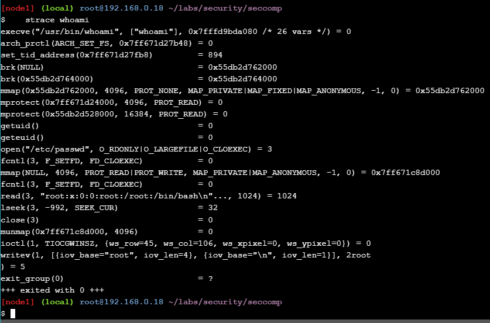
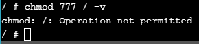

# Stage 2

En la página de play with docker me dirijo al según stage en el que tengo los siguientes laboratorios:


Comienzo con el primero que es de perfiles de Seccomp y después continuo con los demás

## Sección 1 del stage 2: Perfiles de Seccomp

El seccomp es una función de seguridad en el kernel de Linux que funciona como un firewall para las llamadas al sistema (syscalls). Utiliza reglas de Berkeley Packet Filter (BPF) para filtrar estas llamadas y controlar cómo se manejan. Estos filtros pueden restringir considerablemente el acceso de un contenedor al kernel de Linux del host de Docker, especialmente para contenedores o aplicaciones simples.

### Prequisitos

Para este laboratorio en Play With Docker, si estoy utilizando otro entorno, debo asegurarme de contar con lo siguiente:

- Un Docker Host basado en Linux con seccomp habilitado.
- Docker 1.10 o superior (preferiblemente 1.12 o superior).

Puedo verificar si seccomp está habilitado en mí sistema utilizando los siguientes comandos:

Desde Docker 1.12 o superior:

```bash
docker info | grep seccomp
```


Si no obtengo una línea que mencione "seccomp" en la salida, significa que seccomp no está habilitado en el kernel de mí sistema.

Desde la línea de comandos de Linux:

```bash
grep SECCOMP /boot/config-$(uname -r)
```


Esto me debería mostrarar la configuración actual del kernel relacionada con seccomp. Pero por alguna razón que desconozco presenta ese error con que no puede encontrar el archivo. No encontré la forma de como solucionarlo.

### Seccomp y Docker
Docker ha utilizado seccomp desde la versión 1.10 del motor Docker, operando en modo filtro y usando un DSL basado en JSON para definir perfiles que se compilan en filtros seccomp. Al ejecutar un contenedor, se aplica el perfil seccomp predeterminado a menos que se sobrescriba con la bandera --security-opt en el comando docker run. Por ejemplo, el comando docker run -it --rm --security-opt seccomp=<profile>.json alpine sh ... inicia un contenedor interactivo con un proceso de shell y aplica el perfil seccomp descrito por <profile>.json. El comando envía el archivo JSON del cliente al daemon, donde se compila en un programa BPF usando un envoltorio en Go alrededor de libseccomp. Los perfiles seccomp de Docker usan un enfoque de lista blanca que especifica las llamadas al sistema permitidas. Docker admite muchas tecnologías de seguridad, que pueden interferir con las pruebas de perfiles seccomp. Por ello, la mejor manera de probar los perfiles seccomp es agregar todas las capacidades y deshabilitar apparmor usando las banderas --cap-add ALL y --security-opt apparmor=unconfined.

### Paso 1: Clonar el repositorio de GitHub de los laboratorios

Primero, debo clonar el repositorio de GitHub del laboratorio para acceder a los perfiles seccomp necesarios para este laboratorio.

```bash
git clone https://github.com/docker/labs
```


Cambio al directorio labs/security/seccomp:

```bash
cd labs/security/seccomp
```


Los pasos siguientes asumirán que estoy ejecutando comandos desde este directorio, lo cual es importante para referenciar los perfiles seccomp en los comandos docker run a lo largo del laboratorio.

### Paso 2: Probar un perfil seccomp

A continuación, usaré el perfil seccomp deny.json del repositorio de guías del laboratorio. Este perfil tiene una lista vacía de syscalls permitidos, lo que significa que todos los syscalls serán bloqueados. Para la demostración, añadiré todas las capacidades y desactivaré apparmor para asegurar que solo mí perfil seccomp esté bloqueando los syscalls.

Usando el comando docker run para intentar iniciar un nuevo contenedor con todas las capacidades añadidas, apparmor desactivado y el perfil seccomp-profiles/deny.json aplicado:

```bash
docker run --rm -it --cap-add ALL --security-opt apparmor=unconfined --security-opt seccomp=seccomp-profiles/deny.json alpine sh
```


Inspecciono el contenido del perfil seccomp-profiles/deny.json:


Observo que no hay syscalls en la lista blanca. Esto significa que no se permitirán syscalls desde los contenedores iniciados con este perfil.

En este paso, eliminé las capacidades y apparmor para evitar interferencias, y comencé un nuevo contenedor con un perfil seccomp que no tenía syscalls en su lista blanca. Observo cómo esto evitó todos los syscalls dentro del contenedor o que este pudiera iniciarse.

### Paso 3: Ejecutar un contenedor sin perfil seccomp

A menos que especifique un perfil diferente, Docker aplicará el perfil seccomp predeterminado a todos los nuevos contenedores. En este paso, revisaré cómo forzar que un nuevo contenedor se ejecute sin un perfil seccomp.

Inicio un nuevo contenedor con el flag --security-opt seccomp=unconfined para que no se aplique ningún perfil seccomp:

```bash
docker run --rm -it --security-opt seccomp=unconfined debian:jessie sh
```


Desde la terminal del contenedor, ejecuto un comando whoami para confirmar que el contenedor funciona y puede realizar syscalls al host de Docker:


Para probar que no estoy ejecutando con el perfil seccomp predeterminado, intento ejecutar un comando unshare, que ejecuta un proceso de shell en un nuevo espacio de nombres:


Salgo del nuevo shell y del contenedor:


Ejecuto el siguiente comando strace desde mí host de Docker para ver una lista de los syscalls utilizados por el programa whoami. Mí host de Docker necesitará tener el paquete strace instalado:


También puedo ejecutar el siguiente comando más simple y obtener una salida más detallada:



Puedo sustituir whoami por cualquier otro programa.

En este paso, inicié un nuevo contenedor sin perfil seccomp y verifique que el programa whoami podía ejecutarse. También utilicé el programa strace para listar los syscalls realizados por una ejecución particular del programa whoami.

### Paso 4: Eliminar selectivamente llamadas al sistema

En este paso, se mostraré cómo modificar el perfil `default.json` para ajustar las llamadas al sistema disponibles para los contenedores.

El perfil `default-no-chmod.json` es una versión modificada del perfil `default.json` en la que se han eliminado las llamadas al sistema `chmod()`, `fchmod()` y `chmodat()` de la lista blanca.

Inicio un nuevo contenedor con el perfil `default-no-chmod.json` e intento ejecutar el comando `chmod 777 / -v`:




El comando falla porque utilizo las llamadas al sistema `chmod()`, `fchmod()` y `chmodat()`, que han sido eliminadas del perfil `default-no-chmod.json`.

Salgo del contenedor:


Inicio otro contenedor nuevo con el perfil `default.json` y ejecuto el mismo comando `chmod 777 / -v`:


El comando tiene éxito esta vez porque el perfil `default.json` incluye las llamadas al sistema `chmod()`, `fchmod()` y `chmodat` en mí lista blanca.

Salgo del contenedor:


Verifico ambos perfiles para la presencia de las llamadas al sistema `chmod()`, `fchmod()` y `chmodat()`:


La salida muestra que el perfil `default-no-chmod.json` no contiene llamadas al sistema relacionadas con `chmod` en la lista blanca.


En este paso, se demostró cómo eliminar llamadas específicas al sistema del perfil `default.json` puede ser una manera efectiva de ajustar la seguridad de mis contenedores.

### Paso 5: Escribir un perfil seccomp

Es posible escribir perfiles seccomp de Docker desde cero o editar perfiles existentes. En este paso, aprenderé sobre la sintaxis y el comportamiento de los perfiles seccomp de Docker.

La estructura de un perfil seccomp de Docker es la siguiente:

```json
{
    "defaultAction": "SCMP_ACT_ERRNO",
    "architectures": [
        "SCMP_ARCH_X86_64",
        "SCMP_ARCH_X86",
        "SCMP_ARCH_X32"
    ],
    "syscalls": [
        {
            "name": "accept",
            "action": "SCMP_ACT_ALLOW",
            "args": []
        },
        {
            "name": "accept4",
            "action": "SCMP_ACT_ALLOW",
            "args": []
        }
    ]
}
```

La fuente más confiable para escribir perfiles seccomp de Docker son las estructuras utilizadas para deserializar el JSON:

- [docker/engine-api](https://github.com/docker/engine-api/blob/c15549e10366236b069e50ef26562fb24f5911d4/types/seccomp.go)
- [opencontainers/runtime-spec](https://github.com/opencontainers/runtime-spec/blob/6be516e2237a6dd377408e455ac8b41faf48bdf6/specs-go/config.go#L502)

La tabla siguiente enumera las acciones posibles en orden de precedencia. Las acciones de mayor precedencia anulan las de menor precedencia:

| Acción           | Descripción                                                            |
|------------------|------------------------------------------------------------------------|
| SCMP_ACT_KILL    | Terminar con un estado de salida de 0x80 + 31 (SIGSYS) = 159           |
| SCMP_ACT_TRAP    | Enviar una señal SIGSYS sin ejecutar la llamada al sistema             |
| SCMP_ACT_ERRNO   | Establecer errno sin ejecutar la llamada al sistema                    |
| SCMP_ACT_TRACE   | Invocar a un ptracer para tomar una decisión o establecer errno en -ENOSYS |
| SCMP_ACT_ALLOW   | Permitir                                                               |

Las acciones más importantes para los usuarios de Docker son SCMP_ACT_ERRNO y SCMP_ACT_ALLOW.

Los perfiles pueden contener filtros más granulares basados en el valor de los argumentos de la llamada al sistema:

```json
{
    "syscalls": [
        {
            "name": "accept",
            "action": "SCMP_ACT_ALLOW",
            "args": [
                {
                    "index": 0,
                    "op": "SCMP_CMP_MASKED_EQ",
                    "value": 2080505856,
                    "valueTwo": 0
                }
            ]
        }
    ]
}
```

- `index` es el índice del argumento de la llamada al sistema.
- `op` es la operación a realizar sobre el argumento. Puede ser:
  - SCMP_CMP_NE: no igual
  - SCMP_CMP_LT: menor que
  - SCMP_CMP_LE: menor o igual que
  - SCMP_CMP_EQ: igual a
  - SCMP_CMP_GE: mayor o igual que
  - SCMP_CMP_GT: mayor que
  - SCMP_CMP_MASKED_EQ: igual enmascarado, verdadero si (value & arg == valueTwo)
- `value` es un parámetro para la operación.
- `valueTwo` se usa solo para SCMP_CMP_MASKED_EQ.

La regla solo coincide si todos los argumentos coinciden. Agrega múltiples reglas para lograr el efecto de un OR.

`strace` se puede usar para obtener una lista de todas las llamadas al sistema realizadas por un programa. Es un buen punto de partida para escribir políticas seccomp. Aquí realizo un ejemplo de cómo listar todas las llamadas al sistema realizadas por `ls`:

```sh
strace -c -f -S name ls 2>&1 1>/dev/null | tail -n +3 | head -n -2 | awk '{print $(NF)}'
```

La salida mostrará las llamadas al sistema necesarias para que un contenedor que ejecute el programa `ls` funcione, además de las llamadas al sistema necesarias para iniciar un contenedor:


En este paso, aprendí el formato y la sintaxis de los perfiles seccomp de Docker. También aprendí el orden de preferencia para las acciones y cómo determinar las llamadas al sistema necesarias para un programa individual.

### Paso 6: Algunas consideraciones importantes

El resto de este laboratorio me guiará a través de algunos puntos que son fáciles de pasar por alto al utilizar seccomp con Docker.

**Timing de la aplicación del perfil seccomp**

Antes de Docker 1.12, las políticas seccomp solían aplicarse muy temprano en el proceso de creación del contenedor. Esto requería añadir llamadas al sistema al perfil que eran necesarias para el proceso de creación del contenedor pero no para el propio contenedor, lo cual no era ideal. Para evitar este problema en Docker 1.12+, puedes usar la bandera `--security-opt no-new-privileges` al iniciar mí contenedor, aunque esto también evitará obtener privilegios a través de binarios setuid.

**Truncación**

Al escribir un filtro seccomp, puede haber bits no utilizados o aleatoriamente establecidos en argumentos de 32 bits al usar un sistema operativo de 64 bits después de que se ejecute el filtro. Al verificar los valores de los argumentos contra una lista negra, debo tener en cuenta que los argumentos a menudo se truncan silenciosamente antes de ser procesados, pero después de la verificación seccomp.

**seccomp escapes**

Los números de llamadas al sistema dependen de la arquitectura, lo que limita la portabilidad de los filtros BPF. Afortunadamente, los perfiles de Docker abstraen este problema, por lo que no necesito preocuparme si uso perfiles seccomp de Docker. Es importante tener en cuenta que ptrace está deshabilitado por defecto y se debe evitar habilitarlo, ya que permite eludir seccomp.

**Diferencias entre las versiones de Docker**

Seccomp es compatible a partir de Docker 1.10. En Docker, el uso de la bandera --privileged desactiva seccomp en todas las versiones, incluso si se especifica explícitamente un perfil seccomp. En general, se debe evitar el uso de --privileged ya que realiza demasiadas funciones. Puedo lograr el mismo objetivo con --cap-add ALL --security-opt apparmor=unconfined --security-opt seccomp=unconfined.

## Sección 2 del stage 2: Capacidades del kernel de Linux y Docker

En este laboratorio aprenderé los conceptos básicos de las capacidades en el kernel de Linux. Exploraré cómo funcionan con Docker, aprenderé comandos básicos para ver y gestionarlas, y también cómo añadir y quitar capacidades en nuevos contenedores.

### Paso 1: Introducción a las capacidades
En este paso aprenderé los fundamentos de las capacidades en Linux. El kernel de Linux divide los privilegios del usuario root en unidades distintas llamadas capacidades. Por ejemplo, la capacidad CAP_CHOWN permite al usuario root realizar cambios arbitrarios en los UID y GID de los archivos, mientras que CAP_DAC_OVERRIDE le permite ignorar las comprobaciones de permisos del kernel en operaciones de lectura, escritura y ejecución de archivos. Esta descomposición permite eliminar capacidades individuales de la cuenta de root, disminuyendo su poder, y añadir privilegios a usuarios no root de manera granular. Las capacidades se aplican tanto a archivos como a hilos, permitiendo ejecutar programas con mayor nivel de privilegios y controlando el estado actual de las capacidades en los programas en ejecución mediante conjuntos de límites de capacidades que Docker establece antes de iniciar un contenedor, eliminando casi todas las capacidades por defecto excepto las necesarias.

### Paso 2: Trabajar con Docker y capacidades
En este paso aprenderé el enfoque básico para gestionar capacidades con Docker. También conoceré los comandos de Docker utilizados para gestionar las capacidades de la cuenta root de un contenedor.

A partir de Docker 1.12, tienes tres opciones principales para el uso de capacidades:

1. Ejecutar contenedores como root con un conjunto amplio de capacidades e intentar gestionarlas manualmente dentro del contenedor.
2. Ejecutar contenedores como root con capacidades limitadas y nunca cambiarlas dentro del contenedor.
3. Ejecutar contenedores como un usuario no privilegiado sin capacidades.

En los comandos siguientes, se utilizará `$CAP` para indicar una o más capacidades individuales.

Para eliminar capacidades de la cuenta root de un contenedor:

```bash
docker run --rm -it --cap-drop $CAP alpine sh
```

Para añadir capacidades a la cuenta root de un contenedor:

```bash
docker run --rm -it --cap-add $CAP alpine sh
```

Para eliminar todas las capacidades y luego añadir explícitamente capacidades individuales a la cuenta root de un contenedor:

```bash
docker run --rm -it --cap-drop ALL --cap-add $CAP alpine sh
```

### Paso 3: Probando las capacidades de Docker
El kernel de Linux prefija todas las constantes de capacidades con "CAP_". Por ejemplo, CAP_CHOWN, CAP_NET_ADMIN, CAP_SETUID, CAP_SYSADMIN, etc. Las constantes de capacidades de Docker no están prefijadas con "CAP_", pero de otra manera coinciden con las constantes del kernel.

1. **Cambio de propiedad de archivos**: Inicia un nuevo contenedor y verifica que la cuenta root del contenedor puede cambiar la propiedad de archivos usando la capacidad CAP_CHOWN.

   ```bash
   docker run --rm -it alpine chown nobody /
   ```

   

   El comando no devuelve un código de retorno, lo que indica que la operación fue exitosa debido a que los nuevos contenedores se inician con un usuario root y este usuario tiene la capacidad CAP_CHOWN de forma predeterminada.

2. **Eliminación y adición de capacidades**: Inicia otro nuevo contenedor y elimina todas las capacidades excepto CAP_CHOWN para la cuenta root del contenedor. Recuerda que Docker no utiliza el prefijo "CAP_" al dirigirse a las constantes de capacidad.

   ```bash
   docker run --rm -it --cap-drop ALL --cap-add CHOWN alpine chown nobody /
   ```

   

   Este comando tampoco devuelve un código de retorno, indicando un funcionamiento exitoso. Aunque todas las capacidades fueron eliminadas para la cuenta root del contenedor, se añadió la capacidad `chown` nuevamente, lo que es suficiente para cambiar la propiedad de un archivo.

3. **Eliminación específica de capacidad**: Inicia otro nuevo contenedor y elimina solo la capacidad `CHOWN` de la cuenta root.

   ```bash
   docker run --rm -it --cap-drop CHOWN alpine chown nobody /
   ```

   

   Esta vez, el comando devuelve un código de error, indicando que falló. Esto se debe a que la cuenta root del contenedor no tiene la capacidad `CHOWN` y por lo tanto no puede cambiar la propiedad de un archivo o directorio.

4. **Agregar capacidades a usuarios no root**: Crea otro nuevo contenedor e intenta agregar la capacidad `CHOWN` al usuario no root llamado `nobody`. En el mismo comando, intenta cambiar la propiedad de un archivo o directorio.

   ```bash
   docker run --rm -it --cap-add CHOWN -u nobody alpine chown nobody /
   ```

   

   El comando anterior falla porque Docker actualmente no admite agregar capacidades a usuarios no root.

### Paso 4: Extra para expertos

El resto de este laboratorio muestra herramientas adicionales para trabajar con capacidades desde la shell de Linux.

Hay dos conjuntos principales de herramientas para gestionar capacidades:

**libcap** se enfoca en la manipulación de capacidades.
**libcap-ng** tiene algunas herramientas útiles para auditoría.

**libcap**
- **capsh**: permite realizar pruebas de capacidades y depuración limitada.
- **setcap**: establece bits de capacidad en un archivo.
- **getcap**: obtiene los bits de capacidad de un archivo.

**libcap-ng**
- **pscap**: lista las capacidades de los procesos en ejecución.
- **filecap**: lista las capacidades de los archivos.
- **captest**: prueba las capacidades y lista las capacidades para el proceso actual.

**Listado de todas las capacidades**
El siguiente comando iniciará un nuevo contenedor utilizando Alpine Linux, instalará el paquete `libcap` y luego listarán las capacidades.

```bash
docker run --rm -it alpine sh -c 'apk add -U libcap; capsh --print'
```

Aquí está el texto corregido y ajustado:


**Experimentando con capacidades**
El comando `capsh` puede ser útil para experimentar con capacidades. `capsh --help` muestra cómo usar el comando:

```bash
docker run --rm -it alpine sh -c 'apk add -U libcap; capsh --help'
```


### Modificación de capacidades

Tanto `libcap` como `libcap-ng` ofrecen opciones para modificar las capacidades de los archivos.

Para utilizar `libcap` y modificar las capacidades en un archivo, puedo usar el siguiente comando. Por ejemplo, para establecer la capacidad `CAP_NET_RAW` como efectiva y permitida en el archivo especificado por `$file`, se emplea el comando `setcap` de `libcap`.

```bash
setcap cap_net_raw=ep $file
```

Si prefiero utilizar `libcap-ng`, puedo recurrir al comando `filecap`.

```bash
filecap /ruta/absoluta net_raw
```

Es importante tener en cuenta que `filecap` requiere nombres de ruta absolutos, sin admitir atajos como `./`.

### Auditoría

Existen varias formas de verificar las capacidades de un archivo.

Usando `libcap`, puedo obtener las capacidades de un archivo con el comando `getcap`.

```bash
getcap $file

$file = cap_net_raw+ep
```

Con `libcap-ng`, también puedo listar las capacidades de un archivo con el comando `filecap`.

```bash
filecap /ruta/absoluta/al/archivo
```

Además, los atributos extendidos (paquete `attr`) proporcionan otra opción para obtener información detallada sobre las capacidades de un archivo.

```bash
getfattr -n security.capability $file
# file: $file
security.capability=0sAQAAAgAgAAAAAAAAAAAAAAAAAAA=
```

Estas herramientas son útiles para modificar y auditar las capacidades de los archivos en sistemas Linux utilizando `libcap` y `libcap-ng`.

## Sección 3 del stage 2: Redes de Docker
En este laboratorio aprenderé sobre los conceptos clave de la red en Docker. Me sumergiré en ejemplos de algunos conceptos básicos de networking, aprenderé sobre la red Bridge y finalmente sobre la red Overlay.
### Sección #1 - Conceptos básicos de redes
### Paso 1: El Comando Docker Network
El comando `docker network` es fundamental para configurar y gestionar redes de contenedores. Aquí se muestra el uso básico del comando:

```shell
docker network
```

En el resto de la actividad colocaré las salidas de la terminal en formato de código que son muy extensas para tomrles captura de pantalla.

```shell
[node1] (local) root@192.168.0.13 ~
$ docker network

Usage:  docker network COMMAND

Manage networks

Commands:
  connect     Connect a container to a network
  create      Create a network
  disconnect  Disconnect a container from a network
  inspect     Display detailed information on one or more networks
  ls          List networks
  prune       Remove all unused networks
  rm          Remove one or more networks

Run 'docker network COMMAND --help' for more information on a command.
[node1] (local) root@192.168.0.13 ~
$
```

La salida del comando muestra cómo usar el comando y todos sus subcomandos de `docker network`. Como se puede ver en la salida, `docker network` permite crear nuevas redes, listar redes existentes, inspeccionar redes y eliminar redes. También permite conectar y desconectar contenedores de las redes.

### Paso 2: Listar redes
Ejecutar el comando `docker network ls` para ver las redes de contenedores existentes en el host Docker actual.

```shell
docker network ls
```


La salida muestra las redes de contenedores que se crean como parte de una instalación estándar de Docker.

Las nuevas redes que creo también aparecerán en la salida del comando `docker network ls`.

Puedo ver que cada red obtiene un ID y un NOMBRE únicos. Cada red también está asociada con un solo controlador. Por ejemplo, la red "bridge" y la red "host" tienen el mismo nombre que sus respectivos controladores.

### Paso 3: Inspeccionar una red
El comando `docker network inspect` se usa para ver los detalles de configuración de la red. Estos detalles incluyen: nombre, ID, controlador, controlador IPAM, información de subred, contenedores conectados y más.

Con el comando `docker network inspect <network>` puedo ver los detalles de configuración de las redes de contenedores en mi host Docker. El comando muestra los detalles de la red llamada `bridge`.

```shell
docker network inspect bridge
```

```json
[node1] (local) root@192.168.0.13 ~
$ docker network inspect bridge
[
    {
        "Name": "bridge",
        "Id": "ce1d792b3f790f8ce204fbf0fb2e93a4b3e3c4d9c0e8c25e0a57fe0f9719c437",
        "Created": "2024-07-02T02:13:43.733992227Z",
        "Scope": "local",
        "Driver": "bridge",
        "EnableIPv6": false,
        "IPAM": {
            "Driver": "default",
            "Options": null,
            "Config": [
                {
                    "Subnet": "172.17.0.0/16",
                    "Gateway": "172.17.0.1"
                }
            ]
        },
        "Internal": false,
        "Attachable": false,
        "Ingress": false,
        "ConfigFrom": {
            "Network": ""
        },
        "ConfigOnly": false,
        "Containers": {},
        "Options": {
            "com.docker.network.bridge.default_bridge": "true",
            "com.docker.network.bridge.enable_icc": "true",
            "com.docker.network.bridge.enable_ip_masquerade": "true",
            "com.docker.network.bridge.host_binding_ipv4": "0.0.0.0",
            "com.docker.network.bridge.name": "docker0",
            "com.docker.network.driver.mtu": "1500"
        },
        "Labels": {}
    }
]
[node1] (local) root@192.168.0.13 ~
$
```

**NOTA:** La sintaxis del comando `docker network inspect` es `docker network inspect <network>`, donde `<network>` puede ser el nombre de la red o el ID de la red. En el ejemplo anterior estoy mostrando los detalles de configuración de la red llamada "bridge".

### Paso 4: Listar plugins de controladores de red
El comando `docker info` muestra mucha información interesante sobre una instalación de Docker.

Ejecutando el comando `docker info` localizo la lista de plugins de red.

```shell
docker info
```

```shell
[node1] (local) root@192.168.0.13 ~
$ docker info
Client:
 Version:    24.0.7
 Context:    default
 Debug Mode: false
 Plugins:
  buildx: Docker Buildx (Docker Inc.)
    Version:  v0.11.2
    Path:     /usr/local/libexec/docker/cli-plugins/docker-buildx
  compose: Docker Compose (Docker Inc.)
    Version:  v2.23.0
    Path:     /usr/local/libexec/docker/cli-plugins/docker-compose
  scout: Docker Scout (Docker Inc.)
    Version:  v1.0.9
    Path:     /usr/lib/docker/cli-plugins/docker-scout

Server:
 Containers: 0
  Running: 0
  Paused: 0
  Stopped: 0
 Images: 0
 Server Version: 24.0.7
 Storage Driver: overlay2
  Backing Filesystem: xfs
  Supports d_type: true
  Using metacopy: false
  Native Overlay Diff: true
  userxattr: false
 Logging Driver: json-file
 Cgroup Driver: cgroupfs
 Cgroup Version: 1
 Plugins:
  Volume: local
  Network: bridge host ipvlan macvlan null overlay
  Log: awslogs fluentd gcplogs gelf journald json-file local logentries splunk syslog
 Swarm: inactive
 Runtimes: io.containerd.runc.v2 runc
 Default Runtime: runc
 Init Binary: docker-init
 containerd version: 091922f03c2762540fd057fba91260237ff86acb
 runc version: v1.1.9-0-gccaecfc
 init version: de40ad0
 Security Options:
  apparmor
  seccomp
   Profile: builtin
 Kernel Version: 4.4.0-210-generic
 Operating System: Alpine Linux v3.18 (containerized)
 OSType: linux
 Architecture: x86_64
 CPUs: 8
 Total Memory: 31.42GiB
 Name: node1
 ID: 2bb01baa-505f-419c-9474-58cfa2dad4c3
 Docker Root Dir: /var/lib/docker
 Debug Mode: true
  File Descriptors: 26
  Goroutines: 41
  System Time: 2024-07-02T02:29:44.032691008Z
  EventsListeners: 0
 Experimental: true
 Insecure Registries:
  127.0.0.1
  127.0.0.0/8
 Live Restore Enabled: false
 Product License: Community Engine

WARNING: API is accessible on http://0.0.0.0:2375 without encryption.
         Access to the remote API is equivalent to root access on the host. Refer
         to the 'Docker daemon attack surface' section in the documentation for
         more information: https://docs.docker.com/go/attack-surface/
WARNING: No swap limit support
WARNING: bridge-nf-call-iptables is disabled
WARNING: bridge-nf-call-ip6tables is disabled
[node1] (local) root@192.168.0.13 ~
$
```

La salida muestra los controladores bridge, host, macvlan, null y overlay.

### Sección #2 - Redes Bridge

### Paso 1: Conceptos Básicos

Toda instalación nueva de Docker incluye una red predefinida llamada "bridge". Puedo verificar esto con el comando `docker network ls`.

```sh
docker network ls
```


La salida muestra que la red "bridge" está asociada con el controlador "bridge". Es importante notar que la red y el controlador están conectados, pero no son lo mismo, aunque en este caso tengan el mismo nombre.

Además, la red "bridge" tiene un alcance local, lo que significa que solo existe en el host Docker actual. Todas las redes creadas con el controlador "bridge" están basadas en un puente de Linux (un "switch" virtual).

Procedo a instalar el comando `brctl` para listar los puentes de Linux en tu host Docker. Puedes hacerlo ejecutando:

```sh
apk update
apk add bridge
```


Luego, lista los puentes en tu host Docker con `brctl show`.

```sh
brctl show
```


La salida muestra un solo puente de Linux llamado `docker0`, que se creó automáticamente para la red "bridge". Actualmente no tiene interfaces conectadas.

También puedo usar el comando `ip a` para ver detalles del puente `docker0`.

```sh
ip a
```

```sh
[node1] (local) root@192.168.0.13 ~
$ ip a
1: lo: <LOOPBACK,UP,LOWER_UP> mtu 65536 qdisc noqueue state UNKNOWN qlen 1
    link/loopback 00:00:00:00:00:00 brd 00:00:00:00:00:00
    inet 127.0.0.1/8 scope host lo
       valid_lft forever preferred_lft forever
2: docker0: <NO-CARRIER,BROADCAST,MULTICAST,UP> mtu 1500 qdisc noqueue state DOWN
    link/ether 02:42:cc:72:be:87 brd ff:ff:ff:ff:ff:ff
    inet 172.17.0.1/16 brd 172.17.255.255 scope global docker0
       valid_lft forever preferred_lft forever
936105: eth0@if936106: <BROADCAST,MULTICAST,UP,LOWER_UP,M-DOWN> mtu 1500 qdisc noqueue state UP
    link/ether 2e:1d:f5:39:0c:43 brd ff:ff:ff:ff:ff:ff
    inet 192.168.0.13/23 scope global eth0
       valid_lft forever preferred_lft forever
936109: eth1@if936110: <BROADCAST,MULTICAST,UP,LOWER_UP,M-DOWN> mtu 1500 qdisc noqueue state UP
    link/ether 02:42:ac:12:00:4b brd ff:ff:ff:ff:ff:ff
    inet 172.18.0.75/16 scope global eth1
       valid_lft forever preferred_lft forever
[node1] (local) root@192.168.0.13 ~
$
```

### Paso 2: Conectar un Contenedor

La red "bridge" es la red predeterminada para nuevos contenedores. Esto significa que, a menos que especifique una red diferente, todos los nuevos contenedores se conectarán a la red "bridge".

Por ejemplo, Creo un nuevo contenedor ejecutando:

```sh
docker run -dt ubuntu sleep infinity
```


Este comando crea un nuevo contenedor basado en la imagen `ubuntu:latest` y ejecuta el comando `sleep` para mantener el contenedor en segundo plano. Puedeo verificar que el contenedor está activo con `docker ps`.

```sh
docker ps
```


Como no se especificó una red en el comando `docker run`, el contenedor se añadió a la red "bridge".

Ejecuto nuevamente `brctl show`.

```sh
brctl show
```


Ahora el puente `docker0` tiene una interfaz conectada, que conecta el puente al nuevo contenedor creado.

Inspecciono la red "bridge" nuevamente con `docker network inspect bridge` para ver el nuevo contenedor adjunto.

```sh
docker network inspect bridge
```

```sh
[node1] (local) root@192.168.0.13 ~
$ docker network inspect bridge
[
    {
        "Name": "bridge",
        "Id": "ce1d792b3f790f8ce204fbf0fb2e93a4b3e3c4d9c0e8c25e0a57fe0f9719c437",
        "Created": "2024-07-02T02:13:43.733992227Z",
        "Scope": "local",
        "Driver": "bridge",
        "EnableIPv6": false,
        "IPAM": {
            "Driver": "default",
            "Options": null,
            "Config": [
                {
                    "Subnet": "172.17.0.0/16",
                    "Gateway": "172.17.0.1"
                }
            ]
        },
        "Internal": false,
        "Attachable": false,
        "Ingress": false,
        "ConfigFrom": {
            "Network": ""
        },
        "ConfigOnly": false,
        "Containers": {
            "14c90008ab794b6fdc4fee6021f201622eb014eb891659b628df6d4f3b6d2761": {
                "Name": "silly_ganguly",
                "EndpointID": "4508be46fce536291c4ad4d3f1e5752bea4449c542fb4ac81236edf645194a73",
                "MacAddress": "02:42:ac:11:00:02",
                "IPv4Address": "172.17.0.2/16",
                "IPv6Address": ""
            }
        },
        "Options": {
            "com.docker.network.bridge.default_bridge": "true",
            "com.docker.network.bridge.enable_icc": "true",
            "com.docker.network.bridge.enable_ip_masquerade": "true",
            "com.docker.network.bridge.host_binding_ipv4": "0.0.0.0",
            "com.docker.network.bridge.name": "docker0",
            "com.docker.network.driver.mtu": "1500"
        },
        "Labels": {}
    }
]
[node1] (local) root@192.168.0.13 ~
$
```

### Paso 3: Probar la Conectividad de la Red

La salida del comando anterior `docker network inspect` muestra la dirección IP del nuevo contenedor. En mí caso es "172.17.0.2".

Ahora hago ping a la dirección IP del contenedor desde la consola de mí host Docker con `ping -c5 <IPv4 Address>`.

```sh
ping -c5 172.17.0.2
```


Las respuestas muestran que el host Docker puede hacer ping al contenedor a través de la red "bridge". También puedo verificar que el contenedor puede conectarse al mundo exterior. Iniciando sesión en el contenedor, para ello instalo el programa `ping` y haga ping a `www.github.com`.

Primero, obtengo el ID del contenedor creado en el paso anterior con `docker ps`.

```sh
docker ps
```


Luego, inicia una shell dentro de ese contenedor con `docker exec -it <CONTAINER ID> /bin/bash`.

```sh
docker exec -it 14c90008ab79 /bin/bash
```


Continuo instalando el programa `ping` ejecutando `apt-get update && apt-get install -y iputils-ping`.

```sh
apt-get update && apt-get install -y iputils-ping
```

```sh
[node1] (local) root@192.168.0.13 ~
$ docker exec -it 14c90008ab79 /bin/bash
root@14c90008ab79:/# apt-get update && apt-get install -y iputils-ping
Get:1 http://security.ubuntu.com/ubuntu noble-security InRelease [126 kB]
Get:2 http://archive.ubuntu.com/ubuntu noble InRelease [256 kB]
Get:3 http://security.ubuntu.com/ubuntu noble-security/universe amd64 Packages [74.6 kB]
Get:4 http://archive.ubuntu.com/ubuntu noble-updates InRelease [126 kB]
Get:5 http://archive.ubuntu.com/ubuntu noble-backports InRelease [126 kB]
Get:6 http://security.ubuntu.com/ubuntu noble-security/main amd64 Packages [231 kB]
Get:7 http://archive.ubuntu.com/ubuntu noble/restricted amd64 Packages [117 kB]
Get:8 http://security.ubuntu.com/ubuntu noble-security/restricted amd64 Packages [168 kB]
Get:9 http://archive.ubuntu.com/ubuntu noble/universe amd64 Packages [19.3 MB]
Get:10 http://security.ubuntu.com/ubuntu noble-security/multiverse amd64 Packages [12.7 kB]
Get:11 http://archive.ubuntu.com/ubuntu noble/multiverse amd64 Packages [331 kB]
Get:12 http://archive.ubuntu.com/ubuntu noble/main amd64 Packages [1808 kB]
Get:13 http://archive.ubuntu.com/ubuntu noble-updates/main amd64 Packages [269 kB]
Get:14 http://archive.ubuntu.com/ubuntu noble-updates/universe amd64 Packages[137 kB]
Get:15 http://archive.ubuntu.com/ubuntu noble-updates/multiverse amd64 Packages [16.9 kB]
Get:16 http://archive.ubuntu.com/ubuntu noble-updates/restricted amd64 Packages [173 kB]
Get:17 http://archive.ubuntu.com/ubuntu noble-backports/universe amd64 Packages [9705 B]
Fetched 23.3 MB in 3s (8177 kB/s)
Reading package lists... Done
Reading package lists... Done
Building dependency tree... Done
Reading state information... Done
The following additional packages will be installed:
  libcap2-bin libpam-cap
The following NEW packages will be installed:
  iputils-ping libcap2-bin libpam-cap
0 upgraded, 3 newly installed, 0 to remove and 0 not upgraded.
Need to get 91.1 kB of archives.
After this operation, 319 kB of additional disk space will be used.
Get:1 http://archive.ubuntu.com/ubuntu noble/main amd64 libcap2-bin amd64 1:2.66-5ubuntu2 [34.5 kB]
Get:2 http://archive.ubuntu.com/ubuntu noble/main amd64 iputils-ping amd64 3:20240117-1build1 [44.3 kB]
Get:3 http://archive.ubuntu.com/ubuntu noble/main amd64 libpam-cap amd64 1:2.66-5ubuntu2 [12.4 kB]
Fetched 91.1 kB in 0s (209 kB/s)
debconf: delaying package configuration, since apt-utils is not installed
Selecting previously unselected package libcap2-bin.
(Reading database ... 4376 files and directories currently installed.)
Preparing to unpack .../libcap2-bin_1%3a2.66-5ubuntu2_amd64.deb ...
Unpacking libcap2-bin (1:2.66-5ubuntu2) ...
Selecting previously unselected package iputils-ping.
Preparing to unpack .../iputils-ping_3%3a20240117-1build1_amd64.deb ...
Unpacking iputils-ping (3:20240117-1build1) ...
Selecting previously unselected package libpam-cap:amd64.
Preparing to unpack .../libpam-cap_1%3a2.66-5ubuntu2_amd64.deb ...
Unpacking libpam-cap:amd64 (1:2.66-5ubuntu2) ...
Setting up libcap2-bin (1:2.66-5ubuntu2) ...
Setting up libpam-cap:amd64 (1:2.66-5ubuntu2) ...
debconf: unable to initialize frontend: Dialog
debconf: (No usable dialog-like program is installed, so the dialog based frontend cannot be used. at /usr/share/perl5/Debconf/FrontEnd/Dialog.pm line 79.)
debconf: falling back to frontend: Readline
debconf: unable to initialize frontend: Readline
debconf: (Can't locate Term/ReadLine.pm in @INC (you may need to install the Term::ReadLine module) (@INC entries checked: /etc/perl /usr/local/lib/x86_64-linux-gnu/perl/5.38.2 /usr/local/share/perl/5.38.2 /usr/lib/x86_64-linux-gnu/perl5/5.38 /usr/share/perl5 /usr/lib/x86_64-linux-gnu/perl-base /usr/lib/x86_64-linux-gnu/perl/5.38 /usr/share/perl/5.38 /usr/local/lib/site_perl) at /usr/share/perl5/Debconf/FrontEnd/Readline.pm line 8.)
debconf: falling back to frontend: Teletype
Setting up iputils-ping (3:20240117-1build1) ...
root@14c90008ab79:/#
```

Hago ping a `www.github.com` con `ping -c5 www.github.com`.

```sh
ping -c5 www.github.com
```

```sh
root@14c90008ab79:/#   ping -c5 www.github.com
PING github.com (140.82.114.4) 56(84) bytes of data.
64 bytes from lb-140-82-114-4-iad.github.com (140.82.114.4): icmp_seq=1 ttl=49 time=1.07 ms
64 bytes from lb-140-82-114-4-iad.github.com (140.82.114.4): icmp_seq=2 ttl=49 time=1.35 ms
64 bytes from lb-140-82-114-4-iad.github.com (140.82.114.4): icmp_seq=3 ttl=49 time=1.26 ms
64 bytes from lb-140-82-114-4-iad.github.com (140.82.114.4): icmp_seq=4 ttl=49 time=1.31 ms
64 bytes from lb-140-82-114-4-iad.github.com (140.82.114.4): icmp_seq=5 ttl=49 time=1.36 ms

--- github.com ping statistics ---
5 packets transmitted, 5 received, 0% packet loss, time 4005ms
rtt min/avg/max/mdev = 1.072/1.269/1.358/0.104 ms
root@14c90008ab79:/#
```

Finalmente, desconecta la shell del contenedor con `exit`.

```sh
exit
```


Ahora debería detener este contenedor para limpiar después de la prueba ejecutando `docker stop <CONTAINER ID>`.

```sh
docker stop yourcontainerid
```


Esto muestra que el nuevo contenedor puede hacer ping a Internet y, por lo tanto, tiene una configuración de red válida y funcional.

### Paso 4: Configurar NAT para Conectividad Externa

En este paso, iniciare un nuevo contenedor NGINX y mapeare el puerto 8080 en el host Docker al puerto 80 dentro del contenedor. Esto significa que el tráfico que llegue al host Docker en el puerto 8080 será redirigido al puerto 80 dentro del contenedor.

Nota: Si inicio un nuevo contenedor desde la imagen oficial de NGINX sin especificar un comando a ejecutar, el contenedor ejecutará un servidor web básico en el puerto 80.

Comienzo iniciando un nuevo contenedor basado en la imagen oficial de NGINX ejecutando:

```sh
docker run --name web1 -d -p 8080:80 nginx
```

```sh
[node1] (local) root@192.168.0.13 ~
$ docker run --name web1 -d -p 8080:80 nginx
Unable to find image 'nginx:latest' locally
latest: Pulling from library/nginx
2cc3ae149d28: Pull complete
1018f2b8dba8: Pull complete
b831e78d8e20: Pull complete
3ab22521e919: Pull complete
5112bf42775b: Pull complete
cbdaf9e4ee2d: Pull complete
a06b6fd631e8: Pull complete
Digest: sha256:9c367186df9a6b18c6735357b8eb7f407347e84aea09beb184961cb83543d46e
Status: Downloaded newer image for nginx:latest
753602f092d03790e4df92f6db4aca09cc9cdc865db9d9cee4a59ebb6b3c28d3
[node1] (local) root@192.168.0.13 ~
$
```

Reviso el estado del contenedor y los mapeos de puertos ejecutando `docker ps`.

```sh
docker ps
```


La primera línea muestra el nuevo contenedor `web1` ejecutando NGINX. Observo el comando que está ejecutando el contenedor y el mapeo de puertos: `0.0.0.0:8080->80/tcp` mapea el puerto 8080 en todas las interfaces del host al puerto 80 dentro del contenedor `web1`. Este mapeo de puertos hace que el servicio web del contenedor sea accesible desde fuentes externas (a través de la dirección IP del host Docker en el puerto 8080).

Ahora que el contenedor está funcionando y mapeado a un puerto en una interfaz del host, puedo probar la conectividad al servidor web NGINX.

Para completar esta tarea, necesito la dirección IP de mí host Docker, que debe ser una dirección IP accesible. Solo apunto mí navegador web a la IP y puerto 8080 de mí host Docker. Además, si intento conectarme a la misma dirección IP en un número de puerto diferente, fallará.

Si por alguna razón no puedo abrir una sesión desde un navegador web, puedo conectarme desde mí host Docker usando el comando `curl 127.0.0.1:8080`.

```sh
curl 127.0.0.1:8080
```

```sh
[node1] (local) root@192.168.0.13 ~
$ curl 127.0.0.1:8080
<!DOCTYPE html>
<html>
<head>
<title>Welcome to nginx!</title>
<style>
html { color-scheme: light dark; }
body { width: 35em; margin: 0 auto;
font-family: Tahoma, Verdana, Arial, sans-serif; }
</style>
</head>
<body>
<h1>Welcome to nginx!</h1>
<p>If you see this page, the nginx web server is successfully installed and
working. Further configuration is required.</p>

<p>For online documentation and support please refer to
<a href="http://nginx.org/">nginx.org</a>.<br/>
Commercial support is available at
<a href="http://nginx.com/">nginx.com</a>.</p>

<p><em>Thank you for using nginx.</em></p>
</body>
</html>
[node1] (local) root@192.168.0.13 ~
$
```

Si intento hacer `curl` a la dirección IP en un número de puerto diferente, fallará.

Nota: El mapeo de puertos es realmente una traducción de direcciones de puertos (PAT).

### seccion #3: Redes Overlay

### Paso 1: Conceptos Básicos

En este paso, inicializaré un nuevo Swarm, uniré un nodo trabajador y verificaré que las operaciones funcionaron.

Ejecuto `docker swarm init --advertise-addr $(hostname -i)`.

```sh
docker swarm init --advertise-addr $(hostname -i)
```


En la primera terminal, copio el comando `docker swarm join ...` que se muestra como parte de la salida de mí terminal. Luego, pego el comando copiado en la segunda terminal.

```sh
docker swarm join \
>     --token SWMTKN-1-69b2x1u2wtjdmot0oqxjw1r2d27f0lbmhfxhvj83chln1l6es5-37ykdpul0vylenefe2439cqpf \
>     10.0.0.5:2377
```


Ejecuto `docker node ls` para verificar que ambos nodos son parte del Swarm.

```sh
docker node ls
```


Los valores de ID y HOSTNAME pueden ser diferentes en el laboratorio. Lo importante es verificar que ambos nodos han unido el Swarm y están listos y activos.

#### Paso 2: Crear una Red Overlay

Ahora que he inicializado un Swarm, es momento de crear una red overlay.

Creo una nueva red overlay llamada “overnet” ejecutando `docker network create -d overlay overnet`.

```sh
docker network create -d overlay overnet
```


Utilizo el comando `docker network ls` para verificar que la red se creó exitosamente.

```sh
docker network ls
```


La nueva red “overnet” se muestra en la última línea de la salida anterior. Observo que está asociada con el controlador overlay y está abarcando todo el Swarm.

Nota: Las otras redes nuevas (ingress y docker_gwbridge) se crearon automáticamente cuando se creó el cluster Swarm.

Ejecuto el mismo comando `docker network ls` desde la segunda terminal.

```sh
docker network ls
```


 La red “overnet” no aparece en la lista. Esto se debe a que Docker solo extiende las redes overlay a los hosts cuando son necesarias. Esto suele ocurrir cuando un host ejecuta una tarea de un servicio que se ha creado en la red. 

Utilizo el comando `docker network inspect <network>` para ver información más detallada sobre la red “overnet”.

```sh
docker network inspect overnet
```

```sh
[node1] (local) root@192.168.0.8 ~
$ docker network inspect overnet
[
    {
        "Name": "overnet",
        "Id": "l1id035045sjgqr71mvwlwybe",
        "Created": "2024-07-02T14:05:54.678826542Z",
        "Scope": "swarm",
        "Driver": "overlay",
        "EnableIPv6": false,
        "IPAM": {
            "Driver": "default",
            "Options": null,
            "Config": [
                {
                    "Subnet": "10.0.1.0/24",
                    "Gateway": "10.0.1.1"
                }
            ]
        },
        "Internal": false,
        "Attachable": false,
        "Ingress": false,
        "ConfigFrom": {
            "Network": ""
        },
        "ConfigOnly": false,
        "Containers": null,
        "Options": {
            "com.docker.network.driver.overlay.vxlanid_list": "4097"
        },
        "Labels": null
    }
]
[node1] (local) root@192.168.0.8 ~
$
```

#### Paso 3: Crear un Servicio

Ahora que tengo un Swarm inicializado y una red overlay, es momento de crear un servicio que use la red.

Ejecuto el siguiente comando desde la primera terminal para crear un nuevo servicio llamado `myservice` en la red `overnet` con dos tareas/replicas.

```sh
docker service create --name myservice \
--network overnet \
--replicas 2 \
ubuntu sleep infinity
```


Verifico que el servicio se creó y que ambas réplicas están activas ejecutando `docker service ls`.

```sh
docker service ls
```

```
ID            NAME       MODE        REPLICAS  IMAGE
ov30itv6t2n7  myservice  replicated  2/2       ubuntu:latest
```

El 2/2 en la columna REPLICAS muestra que ambas tareas en el servicio están activas y funcionando.

Verifico que una sola tarea (réplica) esté ejecutándose en cada uno de los dos nodos en el Swarm ejecutando `docker service ps myservice`.

```sh
docker service ps myservice
```

```sh
[node1] (local) root@192.168.0.8 ~
$ docker service ps myservice
ID             NAME              IMAGE           NODE      DESIRED STATE   CURRENT STATE                 ERROR                              PORTS
j5u50lsm5p2z   myservice.1       ubuntu:latest   node1     Running         Running about a minute ago
o5ag9lz3nkto    \_ myservice.1   ubuntu:latest   node2     Shutdown        Rejected about a minute ago   "No such image: ubuntu:latest@…"
jd6eb030tghj    \_ myservice.1   ubuntu:latest   node2     Shutdown        Rejected 2 minutes ago        "No such image: ubuntu:latest@…"
ml79l6x3np7k    \_ myservice.1   ubuntu:latest   node2     Shutdown        Rejected 2 minutes ago        "No such image: ubuntu:latest@…"
usfjng3reru4    \_ myservice.1   ubuntu:latest   node2     Shutdown        Rejected 2 minutes ago        "No such image: ubuntu:latest@…"
xi8bdhpj2ay6   myservice.2       ubuntu:latest   node1     Running         Running 2 minutes ago
[node1] (local) root@192.168.0.8 ~
$
```

Los valores de ID y NODE podrían ser diferentes en la salida. Lo importante es notar que cada tarea/réplica está ejecutándose en un nodo diferente.

Ahora que el segundo nodo está ejecutando una tarea en la red “overnet”, podrá ver la red “overnet”. Ejecuta `docker network ls` desde la segunda terminal para verificar esto.

```sh
docker network ls
```


También puedo ejecutar `docker network inspect overnet` en la segunda terminal para obtener más información detallada sobre la red “overnet” y obtener la dirección IP de la tarea que se está ejecutando en el segundo terminal.

```sh
docker network inspect overnet
```

```sh
[node2] (local) root@192.168.0.7 ~
$ docker network inspect overnet
[
    {
        "Name": "overnet",
        "Id": "l1id035045sjgqr71mvwlwybe",
        "Created": "2024-07-02T14:07:41.719408871Z",
        "Scope": "swarm",
        "Driver": "overlay",
        "EnableIPv6": false,
        "IPAM": {
            "Driver": "default",
            "Options": null,
            "Config": [
                {
                    "Subnet": "10.0.1.0/24",
                    "Gateway": "10.0.1.1"
                }
            ]
        },
        "Internal": false,
        "Attachable": false,
        "Ingress": false,
        "ConfigFrom": {
            "Network": ""
        },
        "ConfigOnly": false,
        "Containers": {
            "65ec586f3a53f0e41e0c4c1984ce091329643c6dc905954a8761fffce28d9a5d": {
                "Name": "myservice.1.j5u50lsm5p2z4szgohjmqnyn9",
                "EndpointID": "51e5c732d6723b699ee94b26772ca7b80ee0d2d821e5c051931015b9926af2b5",
                "MacAddress": "02:42:0a:00:01:0f",
                "IPv4Address": "10.0.1.15/24",
                "IPv6Address": ""
            },
            "ab11395fefbc1b80341bbf2475cbea657da82d2207c991b23589fc9961b01224": {
                "Name": "myservice.2.xi8bdhpj2ay62522kru81zdmu",
                "EndpointID": "9ab2b03bda9b71157eeb6e13ce5829769047c3a72b64b1d2e73b4fe00b4bab9d",
                "MacAddress": "02:42:0a:00:01:04",
                "IPv4Address": "10.0.1.4/24",
                "IPv6Address": ""
            },
            "lb-overnet": {
                "Name": "overnet-endpoint",
                "EndpointID": "0d33b2bf6816bd59bb7fb1aca98a6087cd610960c0003b357c11c7accc8cfdff",
                "MacAddress": "02:42:0a:00:01:05",
                "IPv4Address": "10.0.1.5/24",
                "IPv6Address": ""
            }
        },
        "Options": {
            "com.docker.network.driver.overlay.vxlanid_list": "4097"
        },
        "Labels": {},
        "Peers": [
            {
                "Name": "76d30cb14f70",
                "IP": "192.168.0.8"
            }
        ]
    }
]
[node2] (local) root@192.168.0.7 ~
$
```

A partir de Docker 1.12, `docker network inspect` solo muestra los contenedores/tareas que se están ejecutando en el nodo local. Esto significa que 10.0.1.15 es la dirección IPv4 del contenedor que se está ejecutando en el segundo nodo. Tomo nota de esta dirección IP para el siguiente paso.

### Paso 4: Probar la red

Para completar este paso, necesitaré la dirección IP de la tarea del servicio que se ejecuta en node2.

Ejecuto los siguientes comandos desde el primer terminal:

```bash
docker network inspect overnet
```

```sh
[node1] (local) root@192.168.0.8 ~
$ docker network inspect overnet
[
    {
        "Name": "overnet",
        "Id": "l1id035045sjgqr71mvwlwybe",
        "Created": "2024-07-02T14:07:41.719408871Z",
        "Scope": "swarm",
        "Driver": "overlay",
        "EnableIPv6": false,
        "IPAM": {
            "Driver": "default",
            "Options": null,
            "Config": [
                {
                    "Subnet": "10.0.1.0/24",
                    "Gateway": "10.0.1.1"
                }
            ]
        },
        "Internal": false,
        "Attachable": false,
        "Ingress": false,
        "ConfigFrom": {
            "Network": ""
        },
        "ConfigOnly": false,
        "Containers": {
            "65ec586f3a53f0e41e0c4c1984ce091329643c6dc905954a8761fffce28d9a5d": {
                "Name": "myservice.1.j5u50lsm5p2z4szgohjmqnyn9",
                "EndpointID": "51e5c732d6723b699ee94b26772ca7b80ee0d2d821e5c051931015b9926af2b5",
                "MacAddress": "02:42:0a:00:01:0f",
                "IPv4Address": "10.0.1.16/24",
                "IPv6Address": ""
            },
            "ab11395fefbc1b80341bbf2475cbea657da82d2207c991b23589fc9961b01224": {
                "Name": "myservice.2.xi8bdhpj2ay62522kru81zdmu",
                "EndpointID": "9ab2b03bda9b71157eeb6e13ce5829769047c3a72b64b1d2e73b4fe00b4bab9d",
                "MacAddress": "02:42:0a:00:01:04",
                "IPv4Address": "10.0.1.4/24",
                "IPv6Address": ""
            },
            "lb-overnet": {
                "Name": "overnet-endpoint",
                "EndpointID": "0d33b2bf6816bd59bb7fb1aca98a6087cd610960c0003b357c11c7accc8cfdff",
                "MacAddress": "02:42:0a:00:01:05",
                "IPv4Address": "10.0.1.5/24",
                "IPv6Address": ""
            }
        },
        "Options": {
            "com.docker.network.driver.overlay.vxlanid_list": "4097"
        },
        "Labels": {},
        "Peers": [
            {
                "Name": "76d30cb14f70",
                "IP": "192.168.0.8"
            }
        ]
    }
]
[node1] (local) root@192.168.0.8 ~
$
```

Observo que la dirección IP listada para la tarea del servicio (contenedor) en ejecución es diferente de la dirección IP de la tarea del servicio que se ejecuta en el segundo nodo(10.0.1.16). Ambos están en la misma red “overnet”.

Ejecuto el comando `docker ps` para obtener el ID de la tarea del servicio para que pueda iniciar sesión en ella en el siguiente paso:

```bash
docker ps
```


Inicio sesión en la tarea del servicio usando el ID del contenedor de mí entorno:

```bash
docker exec -it <CONTAINER ID> /bin/bash
```


Instalo el comando `ping` y hago ping a la tarea del servicio que se ejecuta en el segundo nodo con la dirección IP 10.0.0.3:

```bash
apt-get update && apt-get install -y iputils-ping
ping -c5 10.0.0.3
```

```bash
$ docker exec -it 65ec586f3a53 /bin/bash
root@65ec586f3a53:/# apt-get update && apt-get install -y iputils-ping
Get:1 http://security.ubuntu.com/ubuntu noble-security InRelease [126 kB]
Get:2 http://archive.ubuntu.com/ubuntu noble InRelease [256 kB]
Get:3 http://security.ubuntu.com/ubuntu noble-security/main amd64 Packages [231 kB]
Get:4 http://archive.ubuntu.com/ubuntu noble-updates InRelease [126 kB]
Get:5 http://archive.ubuntu.com/ubuntu noble-backports InRelease [126 kB]
Get:6 http://security.ubuntu.com/ubuntu noble-security/restricted amd64 Packages [168 kB]
Get:7 http://archive.ubuntu.com/ubuntu noble/multiverse amd64 Packages [331 kB]
Get:8 http://security.ubuntu.com/ubuntu noble-security/universe amd64 Packages [74.6 kB]
Get:9 http://security.ubuntu.com/ubuntu noble-security/multiverse amd64 Packages [12.7 kB]
Get:10 http://archive.ubuntu.com/ubuntu noble/restricted amd64 Packages [117 kB]
Get:11 http://archive.ubuntu.com/ubuntu noble/universe amd64 Packages [19.3 MB]
Get:12 http://archive.ubuntu.com/ubuntu noble/main amd64 Packages [1808 kB]
Get:13 http://archive.ubuntu.com/ubuntu noble-updates/multiverse amd64 Packages [16.9 kB]
Get:14 http://archive.ubuntu.com/ubuntu noble-updates/universe amd64 Packages [137 kB]
Get:15 http://archive.ubuntu.com/ubuntu noble-updates/restricted amd64 Packages [173 kB]
Get:16 http://archive.ubuntu.com/ubuntu noble-updates/main amd64 Packages [269 kB]
Get:17 http://archive.ubuntu.com/ubuntu noble-backports/universe amd64 Packages [9705 B]
Fetched 23.3 MB in 3s (7037 kB/s)
Reading package lists... Done
Reading package lists... Done
Building dependency tree... Done
Reading state information... Done
The following additional packages will be installed:
  libcap2-bin libpam-cap
The following NEW packages will be installed:
  iputils-ping libcap2-bin libpam-cap
0 upgraded, 3 newly installed, 0 to remove and 0 not upgraded.
Need to get 91.1 kB of archives.
After this operation, 319 kB of additional disk space will be used.
Get:1 http://archive.ubuntu.com/ubuntu noble/main amd64 libcap2-bin amd64 1:2.66-5ubuntu2 [34.5 kB]
Get:2 http://archive.ubuntu.com/ubuntu noble/main amd64 iputils-ping amd64 3:20240117-1build1 [44.3 kB]
Get:3 http://archive.ubuntu.com/ubuntu noble/main amd64 libpam-cap amd64 1:2.66-5ubuntu2 [12.4 kB]
Fetched 91.1 kB in 0s (200 kB/s)
debconf: delaying package configuration, since apt-utils is not installed
Selecting previously unselected package libcap2-bin.
(Reading database ... 4376 files and directories currently installed.)
Preparing to unpack .../libcap2-bin_1%3a2.66-5ubuntu2_amd64.deb ...
Unpacking libcap2-bin (1:2.66-5ubuntu2) ...
Selecting previously unselected package iputils-ping.
Preparing to unpack .../iputils-ping_3%3a20240117-1build1_amd64.deb ...
Unpacking iputils-ping (3:20240117-1build1) ...
Selecting previously unselected package libpam-cap:amd64.
Preparing to unpack .../libpam-cap_1%3a2.66-5ubuntu2_amd64.deb ...
Unpacking libpam-cap:amd64 (1:2.66-5ubuntu2) ...
Setting up libcap2-bin (1:2.66-5ubuntu2) ...
Setting up libpam-cap:amd64 (1:2.66-5ubuntu2) ...
debconf: unable to initialize frontend: Dialog
debconf: (No usable dialog-like program is installed, so the dialog based frontend cannot be used. at /usr/share/perl5/Debconf/FrontEnd/Dialog.pm line 79.)
debconf: falling back to frontend: Readline
debconf: unable to initialize frontend: Readline
debconf: (Can't locate Term/ReadLine.pm in @INC (you may need to install the Term::ReadLine module) (@INC entries checked: /etc/perl /usr/local/lib/x86_64-linux-gnu/perl/5.38.2 /usr/local/share/perl/5.38.2 /usr/lib/x86_64-linux-gnu/perl5/5.38 /usr/share/perl5 /usr/lib/x86_64-linux-gnu/perl-base /usr/lib/x86_64-linux-gnu/perl/5.38 /usr/share/perl/5.38 /usr/local/lib/site_perl) at /usr/share/perl5/Debconf/FrontEnd/Readline.pm line 8.)
debconf: falling back to frontend: Teletype
Setting up iputils-ping (3:20240117-1build1) ...
root@65ec586f3a53:/#
```

La salida muestra que ambas tareas del servicio myservice están en la misma red superpuesta, permitiendo la comunicación entre ellas.

### Paso 5: Probar la detección de servicios

Ahora que tengo un servicio funcionando en una red superpuesta, vamos a probar la detección de servicios.

Si no estoy dentro del contenedor, debo iniciar sesión nuevamente con `docker exec -it <CONTAINER ID> /bin/bash` y ejecutar `cat /etc/resolv.conf` dentro del contenedor:

```bash
docker exec -it <CONTAINER ID> /bin/bash
cat /etc/resolv.conf
```


El valor que nos interesa es `nameserver 127.0.0.11`, que envía todas las consultas DNS a un resolutor DNS embebido que se ejecuta dentro del contenedor en `127.0.0.11:53`. Todos los contenedores Docker ejecutan un servidor DNS embebido en esta dirección.

Pruebo hacer ping al nombre `myservice` desde dentro del contenedor:

```bash
ping -c5 myservice
```

```sh
root@65ec586f3a53:/# ping -c5 myservice
PING myservice (10.0.1.2) 56(84) bytes of data.
64 bytes from 10.0.1.2: icmp_seq=1 ttl=64 time=0.320 ms
64 bytes from 10.0.1.2: icmp_seq=2 ttl=64 time=0.094 ms
64 bytes from 10.0.1.2: icmp_seq=3 ttl=64 time=0.091 ms
64 bytes from 10.0.1.2: icmp_seq=4 ttl=64 time=0.086 ms
64 bytes from 10.0.1.2: icmp_seq=5 ttl=64 time=0.073 ms

--- myservice ping statistics ---
5 packets transmitted, 5 received, 0% packet loss, time 4003ms
rtt min/avg/max/mdev = 0.073/0.132/0.320/0.093 ms
root@65ec586f3a53:/#
```

La salida muestra que el contenedor puede hacer ping al servicio `myservice` por nombre. La dirección IP devuelta es `10.0.1.2`. En los siguientes pasos, verificaré que esta dirección es la IP virtual (VIP) asignada al servicio `myservice`.

Salgo del contenedor con el comando `exit` y regreso al prompt del shell de mí host Docker:

```bash
exit
```


Inspecciono la configuración del servicio `myservice` para verificar que el valor VIP coincida con el valor devuelto por el comando `ping -c5 myservice`:

```bash
docker service inspect myservice
```

```json
[node1] (local) root@192.168.0.8 ~
$ docker service inspect myservice
[
    {
        "ID": "amwe42i9pwf8hinbtfqz849ne",
        "Version": {
            "Index": 19
        },
        "CreatedAt": "2024-07-02T14:07:41.54944164Z",
        "UpdatedAt": "2024-07-02T14:07:41.551523055Z",
        "Spec": {
            "Name": "myservice",
            "Labels": {},
            "TaskTemplate": {
                "ContainerSpec": {
                    "Image": "ubuntu:latest@sha256:2e863c44b718727c860746568e1d54afd13b2fa71b160f5cd9058fc436217b30",
                    "Args": [
                        "sleep",
                        "infinity"
                    ],
                    "Init": false,
                    "StopGracePeriod": 10000000000,
                    "DNSConfig": {},
                    "Isolation": "default"
                },
                "Resources": {
                    "Limits": {},
                    "Reservations": {}
                },
                "RestartPolicy": {
                    "Condition": "any",
                    "Delay": 5000000000,
                    "MaxAttempts": 0
                },
                "Placement": {
                    "Platforms": [
                        {
                            "Architecture": "amd64",
                            "OS": "linux"
                        },
                        {
                            "OS": "linux"
                        },
                        {
                            "Architecture": "arm64",
                            "OS": "linux"
                        },
                        {
                            "Architecture": "ppc64le",
                            "OS": "linux"
                        },
                        {
                            "Architecture": "s390x",
                            "OS": "linux"
                        }
                    ]
                },
                "Networks": [
                    {
                        "Target": "l1id035045sjgqr71mvwlwybe"
                    }
                ],
                "ForceUpdate": 0,
                "Runtime": "container"
            },
            "Mode": {
                "Replicated": {
                    "Replicas": 2
                }
            },
            "UpdateConfig": {
                "Parallelism": 1,
                "FailureAction": "pause",
                "Monitor": 5000000000,
                "MaxFailureRatio": 0,
                "Order": "stop-first"
            },
            "RollbackConfig": {
                "Parallelism": 1,
                "FailureAction": "pause",
                "Monitor": 5000000000,
                "MaxFailureRatio": 0,
                "Order": "stop-first"
            },
            "EndpointSpec": {
                "Mode": "vip"
            }
        },
        "Endpoint": {
            "Spec": {
                "Mode": "vip"
            },
            "VirtualIPs": [
                {
                    "NetworkID": "l1id035045sjgqr71mvwlwybe",
                    "Addr": "10.0.1.2/24"
                }
            ]
        }
    }
]
[node1] (local) root@192.168.0.8 ~
$
```

En el final de la salida, veré la VIP del servicio listada. La VIP en la salida es `10.0.1.2`, pero el valor puede ser diferente dependiendo de la configuración. Lo importante es que la VIP listada aquí coincida con el valor devuelto por el comando `ping -c5 myservice`.

Creo una nueva sesión `docker exec` para la tarea del servicio (contenedor) que se ejecuta en node2 y ejecuta el mismo comando `ping -c5 myservice`. Obtendré una respuesta de la misma VIP.

```sh
root@65ec586f3a53:/# ping -c5 myservice
PING myservice (10.0.1.2) 56(84) bytes of data.
64 bytes from 10.0.1.2: icmp_seq=1 ttl=64 time=0.320 ms
64 bytes from 10.0.1.2: icmp_seq=2 ttl=64 time=0.094 ms
64 bytes from 10.0.1.2: icmp_seq=3 ttl=64 time=0.091 ms
64 bytes from 10.0.1.2: icmp_seq=4 ttl=64 time=0.086 ms
64 bytes from 10.0.1.2: icmp_seq=5 ttl=64 time=0.073 ms

--- myservice ping statistics ---
5 packets transmitted, 5 received, 0% packet loss, time 4003ms
rtt min/avg/max/mdev = 0.073/0.132/0.320/0.093 ms
root@65ec586f3a53:/#
```

Por lo cual concluimos que que la VIP listada coincide con el valor devuelto por `ping -c5 myservice`.

### Limpiar

Para limpiar los servicios y contenedores creados, y finalmente desactivar el modo Swarm, ejecuto los siguientes comandos:

Elimino el servicio llamado `myservice`:

```bash
docker service rm myservice
```


Obtengo una lista de los contenedores en ejecución:

```bash
docker ps
```


Utilizo el comando `docker kill` para detener los contenedores `ubuntu` y `nginx`:

```bash
docker kill <CONTAINER ID1> <CONTAINER ID2>
```


Finalmente, elimina node1 y node2 del Swarm usando el comando `docker swarm leave --force` en ambos nodos:

```bash
docker swarm leave --force
```


## Sección 4 del stage 2: Orquestacion

En este laboratorio experimentaré con las características de orquestación de contenedores de Docker. Desplegaré una aplicación sencilla en un solo host para entender cómo funciona. Luego, configuraré el modo Swarm de Docker y aprenderé a desplegar la misma aplicación en múltiples hosts. También aprenderé a escalar la aplicación y a gestionar la carga de trabajo entre diferentes hosts de manera eficiente.

### Paso 1: ¿Qué es orquestación?
La orquestación se puede entender mejor con un ejemplo: tengo una aplicación con alto tráfico y requisitos de alta disponibilidad. Para cumplir con estos requisitos, generalmente se desea desplegarla en al menos tres máquinas, de modo que, si una falla, mi aplicación siga siendo accesible desde las otras dos. Desplegar sin orquestación es muy laborioso y propenso a errores, ya que tendría que conectarme manualmente a cada máquina, iniciar la aplicación y monitorearla constantemente. Con herramientas de orquestación, como Docker Swarm, puedo automatizar gran parte de este trabajo.

### Paso 2: Configuración del modo Swarm

Las aplicaciones del mundo real se despliegan típicamente en múltiples hosts para mejorar el rendimiento y la disponibilidad, permitiendo además que los componentes individuales de la aplicación se escalen de manera independiente.

```shell
docker run -dt ubuntu sleep infinity
```


Este comando creará un nuevo contenedor basado en la imagen `ubuntu:latest` y ejecutará el comando `sleep` para mantener el contenedor en ejecución en segundo plano. Puedo verificar que el contenedor está en funcionamiento ejecutando `docker ps` en node1.

```shell
docker ps
```


Pero esto solo ocurre en un nodo. ¿Qué pasa si este nodo falla? Bueno, la aplicación simplemente se detiene y no se reinicia. Para restaurar el servicio, tendría que iniciar sesión manualmente en esta máquina y realizar ajustes para ponerla nuevamente en funcionamiento. 

En esta sección, configuraré Swarm Mode, un modo opcional en el que múltiples hosts Docker forman un grupo auto-orquestado de motores llamado swarm. Swarm mode habilita nuevas funciones como servicios y bundles que me ayudan a desplegar y gestionar aplicaciones de múltiples contenedores en varios hosts Docker.

Un swarm comprende uno o más nodos gestores y uno o más nodos trabajadores. Los nodos gestores mantienen el estado del swarm y programan los contenedores de la aplicación. Los nodos trabajadores ejecutan los contenedores de la aplicación. Desde Docker 1.12, no se requiere un backend externo ni componentes de terceros para un swarm completamente funcional.

En esta parte de la demostración, utilizaré los tres nodos del laboratorio. node1 será el gestor del Swarm, mientras que node2 y node3 serán nodos trabajadores. El modo Swarm admite nodos gestores redundantes altamente disponibles, pero para los fines de este laboratorio solo desplegaré un nodo gestor.

### Paso 2.1: crear un node administrador

En este paso, inicializaré un nuevo Swarm, uniré un nodo trabajador y verificaré que las operaciones funcionaron.

Ejecutaré `docker swarm init` en node1:

```shell
docker swarm init --advertise-addr $(hostname -i)
```


Esto inicializa el Swarm con el nodo actual como Manager. Para agregar un trabajador al Swarm, ejecute el siguiente comando en el nodo trabajador:

```shell
docker swarm join --token SWMTKN-1-3eph9ynze968wzyt6lrxlhb3alr24fj8e9mynceqnsst23f62w-acs91nfarx0v9aauousy517hr 192.168.0.23:2377
```


Verifico que node1 se haya configurado correctamente como nodo manager ejecutando `docker info`:

```shell
docker info
```


```shell
Client:
 Version:    24.0.7
 Context:    default
 Debug Mode: false
 Plugins:
  buildx: Docker Buildx (Docker Inc.)
    Version:  v0.11.2
    Path:     /usr/local/libexec/docker/cli-plugins/docker-buildx
  compose: Docker Compose (Docker Inc.)
    Version:  v2.23.0
    Path:     /usr/local/libexec/docker/cli-plugins/docker-compose
  scout: Docker Scout (Docker Inc.)
    Version:  v1.0.9
    Path:     /usr/lib/docker/cli-plugins/docker-scout

Server:
 Containers: 1
  Running: 1
  Paused: 0
  Stopped: 0
 Images: 1
 Server Version: 24.0.7
 Storage Driver: overlay2
  Backing Filesystem: xfs
  Supports d_type: true
  Using metacopy: false
  Native Overlay Diff: true
  userxattr: false
 Logging Driver: json-file
 Cgroup Driver: cgroupfs
 Cgroup Version: 1
 Plugins:
  Volume: local
  Network: bridge host ipvlan macvlan null overlay
  Log: awslogs fluentd gcplogs gelf journald json-file local logentries splunk syslog
 Swarm: active
  NodeID: fbi7vqcyeh0r4wcaimotvbmgg
  Is Manager: true
  ClusterID: 57iakmv3h6c9h74m67lekhdj6
  Managers: 1
  Nodes: 1
  Default Address Pool: 10.0.0.0/8
  SubnetSize: 24
  Data Path Port: 4789
  Orchestration:
   Task History Retention Limit: 5
  Raft:
   Snapshot Interval: 10000
   Number of Old Snapshots to Retain: 0
   Heartbeat Tick: 1
   Election Tick: 10
  Dispatcher:
   Heartbeat Period: 5 seconds
  CA Configuration:
   Expiry Duration: 3 months
   Force Rotate: 0
  Autolock Managers: false
  Root Rotation In Progress: false
  Node Address: 192.168.0.23
  Manager Addresses:
   192.168.0.23:2377
 Runtimes: io.containerd.runc.v2 runc
 Default Runtime: runc
 Init Binary: docker-init
 containerd version: 091922f03c2762540fd057fba91260237ff86acb
 runc version: v1.1.9-0-gccaecfc
 init version: de40ad0
 Security Options:
  apparmor
  seccomp
   Profile: builtin
 Kernel Version: 4.4.0-210-generic
 Operating System: Alpine Linux v3.18 (containerized)
 OSType: linux
 Architecture: x86_64
 CPUs: 8
 Total Memory: 31.42GiB
 Name: node1
 ID: 1415c793-bf3c-481f-b56b-39be45a19671
 Docker Root Dir: /var/lib/docker
 Debug Mode: true
  File Descriptors: 46
  Goroutines: 163
  System Time: 2024-06-30T22:37:27.01429537Z
  EventsListeners: 0
 Experimental: true
 Insecure Registries:
  127.0.0.1
  127.0.0.0/8
 Live Restore Enabled: false
 Product License: Community Engine

WARNING: API is accessible on http://0.0.0.0:2375 without encryption.
         Access to the remote API is equivalent to root access on the host. Refer
         to the 'Docker daemon attack surface' section in the documentation for
         more information: https://docs.docker.com/go/attack-surface/
WARNING: No swap limit support
WARNING: bridge-nf-call-iptables is disabled
WARNING: bridge-nf-call-ip6tables is disabled
```

El Swarm está ahora inicializado con node1 como el único nodo Manager.

### Paso 2.2 - Unir nodos Worker al Swarm

Usé el comando `docker swarm join` copiado anteriormente y lo pegué en el terminal de node2 y node3. Si el comando se perdió, puedo recuperarlo ejecutando `docker swarm join-token worker` en el nodo Manager. En node2 y node3, ejecuté:

```shell
docker swarm join \
--token SWMTKN-1-1wxyoueqgpcrc4xk2t3ec7n1poy75g4kowmwz64p7ulqx611ih-68pazn0mj8p4p4lnuf4ctp8xy \
10.0.0.5:2377
```


Después de ejecutar esto en node2 y node3, regreso a node1 y verifico que ambos nodos sean parte del Swarm ejecutando `docker node ls`:

```shell
docker node ls
```


Este comando muestra todos los nodos en el swarm y sus roles. 

### Paso 3: Despliegue de aplicaciones en múltiples hosts

Ahora que tiengo un swarm funcionando, es hora de desplegar nuestra sencilla aplicación de sleep.

**Paso 3.1 - Desplegar los componentes de la aplicación como servicios de Docker**

La aplicación de sleep se está volviendo muy popular en internet. Para satisfacer la demanda, necesitaré escalar mí aplicación a través de múltiples hosts para garantizar alta disponibilidad. Usaré el concepto de Servicios para escalar mí aplicación fácilmente y gestionar muchos contenedores como una sola entidad.

Los servicios son un concepto introducido en Docker 1.12 y están destinados a contenedores de larga duración.

Desplegaré sleep como un servicio en Docker Swarm.

```bash
docker service create --name sleep-app ubuntu sleep infinity
```


Verifico que la creación del servicio haya sido recibida por el administrador del Swarm.

```bash
docker service ls
```


El estado del servicio puede cambiar algunas veces hasta que esté en funcionamiento. La imagen se descarga desde Docker Store a los otros motores en el Swarm. Una vez descargada, el contenedor entra en estado de ejecución en uno de los tres nodos.

En este punto, parece que no he hecho nada diferente a ejecutar un `docker run ...`. La diferencia es que el contenedor ha sido programado en un clúster de swarm.

### Paso 4: Escalar la aplicación

Una de las grandes ventajas de los servicios es que puedes escalarlos hacia arriba y hacia abajo para satisfacer la demanda. En este paso, escalarás el servicio hacia arriba y luego hacia abajo.

Escalo el número de contenedores en el servicio sleep-app a 7 con el comando `docker service update --replicas 7 sleep-app`. replico el término que usé para describir contenedores idénticos que proporcionan el mismo servicio.

```bash
docker service update --replicas 7 sleep-app
```

```bash
[node1] (local) root@192.168.0.23 ~
$ docker service update --replicas 7 sleep-app
sleep-app
overall progress: 7 out of 7 tasks
1/7: running
2/7: running
3/7: running
4/7: running
5/7: running
6/7: running
7/7: running
verify: Service converged
[node1] (local) root@192.168.0.23 ~
$
```

El administrador del Swarm programa para que haya 7 contenedores sleep-app en el clúster, distribuidos uniformemente.

Ustilicé el comando `docker service ps sleep-app` para ver los contenedores en tiempo real.

```bash
docker service ps sleep-app
```

```bash
[node1] (local) root@192.168.0.23 ~
$ docker service ps sleep-app
ID             NAME          IMAGE           NODE      DESIRED STATE   CURRENT STATE                ERROR     PORTS
tkcep23v173z   sleep-app.1   ubuntu:latest   node3     Running         Running 2 minutes ago
jy3m9mlmac9d   sleep-app.2   ubuntu:latest   node3     Running         Running about a minute ago
tpeslcyt124n   sleep-app.3   ubuntu:latest   node1     Running         Running about a minute ago
8htwkznw8jhm   sleep-app.4   ubuntu:latest   node2     Running         Running about a minute ago
btt1phfd0t3j   sleep-app.5   ubuntu:latest   node1     Running         Running about a minute ago
aqd7vj1ku0px   sleep-app.6   ubuntu:latest   node2     Running         Running about a minute ago
k33s2qahsbgs   sleep-app.7   ubuntu:latest   node2     Running         Running about a minute ago
[node1] (local) root@192.168.0.23 ~
$
```

Observo que ahora hay 7 contenedores listados. Puede tardar unos segundos para que todos los contenedores nuevos en el servicio muestren como RUNNING. La columna NODE indica en qué nodo se está ejecutando un contenedor.

Escalo el servicio de nuevo a solo cuatro contenedores con el comando `docker service update --replicas 4 sleep-app`.

```bash
docker service update --replicas 4 sleep-app
```

```bash
[node1] (local) root@192.168.0.23 ~
$ docker service update --replicas 4 sleep-app
sleep-app
overall progress: 4 out of 4 tasks
1/4: running
2/4: running
3/4: running
4/4: running
verify: Service converged
[node1] (local) root@192.168.0.23 ~
$
```

Verifico que el número de contenedores se haya reducido a 4 usando el comando `docker service ps sleep-app`.

```bash
docker service ps sleep-app
```

```bash
[node1] (local) root@192.168.0.23 ~
$ docker service ps sleep-app
ID             NAME          IMAGE           NODE      DESIRED STATE   CURRENT STATE            ERROR     PORTS
tkcep23v173z   sleep-app.1   ubuntu:latest   node3     Running         Running 10 minutes ago
jy3m9mlmac9d   sleep-app.2   ubuntu:latest   node3     Running         Running 9 minutes ago
tpeslcyt124n   sleep-app.3   ubuntu:latest   node1     Running         Running 9 minutes ago
8htwkznw8jhm   sleep-app.4   ubuntu:latest   node2     Running         Running 9 minutes ago
[node1] (local) root@192.168.0.23 ~
$
```

He escalado con éxito un servicio de swarm hacia arriba y hacia abajo.

### Paso 5: Vaciar un nodo y reprogramar los contenedores

Después de que la aplicación de sueño se volviera extremadamente popular tras aparecer en Reddit y HN, ahora es la número 1 en la App Store. Ha escalado durante las vacaciones y reducido la capacidad en la temporada baja. Ahora, mientras realizo mantenimiento en uno de mis servidores, necesito sacar un nodo del enjambre sin interrumpir el servicio a mis clientes de manera abrupta.

Primero, verifico el estado de los nodos ejecutando `docker node ls` en `node1`.

```bash
[node1] (local) root@192.168.0.23 ~
$ docker node ls
ID                            HOSTNAME   STATUS    AVAILABILITY   MANAGER STATUS   ENGINE VERSION
fbi7vqcyeh0r4wcaimotvbmgg *   node1      Ready     Active         Leader     24.0.7
9uv80p660lvuemjaie8101rij     node2      Ready     Active     24.0.7
ulpvxufwnpclz9uwjfadiwevq     node3      Ready     Active     24.0.7
[node1] (local) root@192.168.0.23 ~
$
```

Necesito sacar `node2` del servicio para mantenimiento. Reviso los contenedores corriendo en `node2`.


Luego, desde `node1` (el manager del enjambre), saco `node2` de servicio usando `docker node update --availability drain yournodeid`.

```bash
[node1] (local) root@192.168.0.23 ~
$ docker node ls
ID                            HOSTNAME   STATUS    AVAILABILITY   MANAGER STATUS   ENGINE VERSION
fbi7vqcyeh0r4wcaimotvbmgg *   node1      Ready     Active         Leader     24.0.7
9uv80p660lvuemjaie8101rij     node2      Ready     Active     24.0.7
ulpvxufwnpclz9uwjfadiwevq     node3      Ready     Active     24.0.7
[node1] (local) root@192.168.0.23 ~
$
```

```bash
docker node update --availability drain yu3hbegvwsdpy9esh9t2lr431
```


Verifico el estado de los nodos nuevamente.

```bash
[node1] (local) root@192.168.0.23 ~
$ docker node ls
ID                            HOSTNAME   STATUS    AVAILABILITY   MANAGER STATUS   ENGINE VERSION
fbi7vqcyeh0r4wcaimotvbmgg *   node1      Ready     Active         Leader     24.0.7
9uv80p660lvuemjaie8101rij     node2      Ready     Drain     24.0.7
ulpvxufwnpclz9uwjfadiwevq     node3      Ready     Active     24.0.7
[node1] (local) root@192.168.0.23 ~
$
```

El nodo `node2` ahora está en estado de drenaje. Verifico los contenedores en `node2`.


No hay contenedores corriendo en `node2`. Finalmente, verifico que los contenedores fueron reprogramados en los otros nodos.

```bash
[node1] (local) root@192.168.0.23 ~
$ docker service ps sleep-app
ID             NAME              IMAGE           NODE      DESIRED STATE   CURRENT STATE                 ERROR     PORTS
tkcep23v173z   sleep-app.1       ubuntu:latest   node3     Running         Running 28 minutes ago
jy3m9mlmac9d   sleep-app.2       ubuntu:latest   node3     Running         Running 27 minutes ago
tpeslcyt124n   sleep-app.3       ubuntu:latest   node1     Running         Running 27 minutes ago
w1qz4r7bpsad   sleep-app.4       ubuntu:latest   node1     Running         Running about a minute ago
8htwkznw8jhm    \_ sleep-app.4   ubuntu:latest   node2     Shutdown        Shutdown about a minute ago
[node1] (local) root@192.168.0.23 ~
$
```

Limpieza final: elimino el servicio `sleep-app` de `node1`.

```bash
docker service rm sleep-app
```


Verifico los contenedores corriendo en `node1`.


Finalmente, elimino los nodos `node1`, `node2` y `node3` del enjambre usando `docker swarm leave --force`.


```bash
docker swarm leave --force
docker swarm leave --force
docker swarm leave --force
```


