# Actividad Play with Kubertes

### Objetivos

- Comprender los conceptos básicos de contenedores como Docker y su orquestación a gran escala.
- Utilizar Kubernetes para desplegar y gestionar aplicaciones en múltiples nodos de un clúster.
- Aprender a diseñar aplicaciones que escalen horizontalmente y manejen fallos de manera eficiente.
- Familiarizarse con prácticas de Infraestructura como Código (IaC) para gestionar configuraciones de forma reproducible y automatizada.
- Integrar prácticas de DevOps para mejorar la colaboración y eficiencia en el desarrollo y operación de software.

Play with Kubernetes Classroom es una plataforma de Docker que permite obtener experiencia práctica con Kubernetes de forma accesible y eficiente, directamente desde el navegador, sin necesidad de instalar software adicional. El taller en "Play with Kubernetes Classroom" guía a los usuarios a través de módulos que abarcan tanto los conceptos básicos como los avanzados de Kubernetes. Para una comprensión completa de Kubernetes en esta actividad realizare el laboratorio de Kubernetes Hands-on Workshop. el cual se encuentra en la siguiente pagina: https://training.play-with-kubernetes.com/kubernetes-workshop/

En caso de que las salidas de los terminales sean demasiado extensas para capturarlas en pantalla, las mostraré en formato de código en este README. Además, muchos de los comandos del taller no funcionaron correctamente. He proporcionado la explicación de las salidas para cada comando, pero al inicio de la documentación asumí que los comandos funcionarían, lo cual resultó no ser el caso. Por esta razón, hay partes de la documentación que supone que los comandos funcionaron, ya que inicialmente se redactó bajo esa premisa antes de que tuviera tiempo para corregirlo.

En el taller de Kubernetes Hands-on Workshop encontrare las instrucciones y los terminales que debo utilizar:

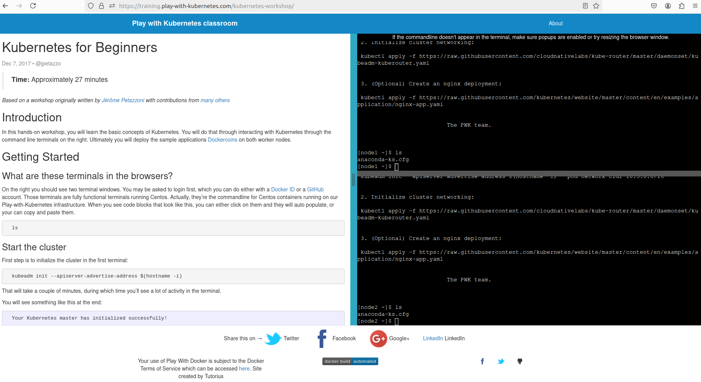

### Introducción

En este taller práctico, aprendere los conceptos básicos de Kubernetes interactuando con Kubernetes a través de terminales de línea de comandos. Finalmente, desplegare la aplicación de ejemplo Dockercoins en ambos nodos de trabajo.

### Primeros Pasos

¿Qué son estos terminales en el navegador?

A la derecha, debería ver dos ventanas de terminal. Puede que me pidan iniciar sesión primero, lo cual se puede hacer con un Docker ID o una cuenta de GitHub. Esos terminales son totalmente funcionales, ejecutando CentOS en la infraestructura de Play-with-Kubernetes. Cuando vea bloques de código, puedo hacer clic en ellos para que se autocompleten o copiarlos y pegarlos.

```bash
ls
```

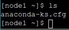
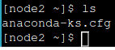

### Iniciar el Clúster

El primer paso es inicializar el clúster en el primer terminal:

```bash
kubeadm init --apiserver-advertise-address $(hostname -i)
```

```sh
Your Kubernetes control-plane has initialized successfully!

To start using your cluster, you need to run the following as a regular user:

  mkdir -p $HOME/.kube
  sudo cp -i /etc/kubernetes/admin.conf $HOME/.kube/config
  sudo chown $(id -u):$(id -g) $HOME/.kube/config

Alternatively, if you are the root user, you can run:

  export KUBECONFIG=/etc/kubernetes/admin.conf

You should now deploy a pod network to the cluster.
Run "kubectl apply -f [podnetwork].yaml" with one of the options listed at:
  https://kubernetes.io/docs/concepts/cluster-administration/addons/

Then you can join any number of worker nodes by running the following on each as root:

kubeadm join 192.168.0.18:6443 --token nk8zwv.hxgo3xb7odfhtpwf \
        --discovery-token-ca-cert-hash sha256:68b75f61d5e5eaee2a58e237a57c5608c49ff0903b139cd22a2cadcf30ecf22c 
Waiting for api server to startup
Warning: resource daemonsets/kube-proxy is missing the kubectl.kubernetes.io/last-applied-configuration annotation which is required by kubectl apply. kubectl apply should only be used on resources created declaratively by either kubectl create --save-config or kubectl apply. The missing annotation will be patched automatically.
daemonset.apps/kube-proxy configured
No resources 
```

Explicacion:

- El comando `kubeadm init --apiserver-advertise-address $(hostname -i)` lo utilizo para inicializar un nodo maestro en un clúster de Kubernetes, configurando la dirección IP de la API del servidor. 

Despues copio toda la línea que comienza con `kubeadm join` del primer terminal y lo pego en el segundo terminal. 

```bash
kubeadm join 192.168.0.18:6443 --token nk8zwv.hxgo3xb7odfhtpwf \
        --discovery-token-ca-cert-hash sha256:68b75f61d5e5eaee2a58e237a57c5608c49ff0903b139cd22a2cadcf30ecf22c 
```

Con lo cual vere algo como esto:

```sh
Initializing machine ID from random generator.
W0702 20:21:54.146831    4804 initconfiguration.go:120] Usage of CRI endpoints without URL scheme is deprecated and can cause kubelet errors in the future. Automatically prepending scheme "unix" to the "criSocket" with value "/run/docker/containerd/containerd.sock". Please update your configuration!
[preflight] Running pre-flight checks
        [WARNING Swap]: swap is enabled; production deployments should disable swap unless testing the NodeSwap feature gate of the kubelet
[preflight] The system verification failed. Printing the output from the verification:
KERNEL_VERSION: 4.4.0-210-generic
OS: Linux
CGROUPS_CPU: enabled
CGROUPS_CPUACCT: enabled
CGROUPS_CPUSET: enabled
CGROUPS_DEVICES: enabled
CGROUPS_FREEZER: enabled
CGROUPS_MEMORY: enabled
CGROUPS_PIDS: enabled
CGROUPS_HUGETLB: enabled
CGROUPS_BLKIO: enabled
        [WARNING SystemVerification]: failed to parse kernel config: unable to load kernel module: "configs", output: "", err: exit status 1
        [WARNING FileContent--proc-sys-net-bridge-bridge-nf-call-iptables]: /proc/sys/net/bridge/bridge-nf-call-iptables does not exist
[preflight] Reading configuration from the cluster...
[preflight] FYI: You can look at this config file with 'kubectl -n kube-system get cm kubeadm-config -o yaml'
[kubelet-start] Writing kubelet configuration to file "/var/lib/kubelet/config.yaml"
[kubelet-start] Writing kubelet environment file with flags to file "/var/lib/kubelet/kubeadm-flags.env"
[kubelet-start] Starting the kubelet
[kubelet-start] Waiting for the kubelet to perform the TLS Bootstrap...

This node has joined the cluster:
* Certificate signing request was sent to apiserver and a response was received.
* The Kubelet was informed of the new secure connection details.

Run 'kubectl get nodes' on the control-plane to see this node join the cluster.

[node2 ~]$ 
```

Explicaion:

- Durante la inicialización, se genera una ID de máquina aleatoria. Se emite una advertencia sobre el uso obsoleto de CRI endpoints sin un esquema de URL, que ahora se corrige automáticamente al agregar "unix" al valor "criSocket". Se realizan verificaciones previas al vuelo y se emite una advertencia sobre la habilitación del intercambio de memoria, lo cual debe desactivarse en entornos de producción a menos que se pruebe la función NodeSwap del kubelet. Una vez completado, se informa que este nodo se ha unido al clúster y se puede verificar su inclusión ejecutando `kubectl get nodes` en el plano de control.

Eso significa que estoy casi listo. Por último, solo tengo que inicializar la red de mi clúster en el primer terminal:

```bash
kubectl apply -n kube-system -f "https://cloud.weave.works/k8s/net?k8s-version=$(kubectl version | base64 | tr -d '\n')"
```

Al ejecutar este comando en la terminal del nodo 1 obtengo la siguiente salida:

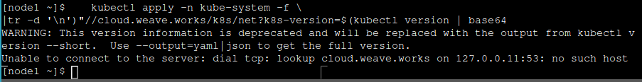

explicacion:

- La salida del comando `kubectl apply` intenta configurar Weave Net en Kubernetes, específicamente en el namespace `kube-system`. Sin embargo, el proceso falla debido a un problema de conexión con el servidor de Kubernetes. El error "Unable to connect to the server" indica que Kubernetes no pudo resolver la dirección `cloud.weave.works`, posiblemente debido a un fallo en la resolución DNS dentro del entorno de Kubernetes en el nodo `node1`. No pude resolver este problema pero de todas maneras explicare lo que deberia obtenerse al ejecutar ese comando proporcionado por el taller.

Deberia ver una salida como esta:

```bash
kubectl apply -n kube-system -f \
  >     "https://cloud.weave.works/k8s/net?k8s-version=$(kubectl version | base64 |tr -d '\n')"
  serviceaccount "weave-net" created
  clusterrole "weave-net" created
  clusterrolebinding "weave-net" created
  role "weave-net" created
  rolebinding "weave-net" created
  daemonset "weave-net" created
```

Explicacion:
- El comando `kubectl apply` se utiliza para aplicar la configuración de Weave Net en el namespace `kube-system`, obtenida dinámicamente desde `https://cloud.weave.works/k8s/net`. Este URL incluye el parámetro `k8s-version`, generado codificando la versión de Kubernetes en base64 con `kubectl version`. Los recursos necesarios para Weave Net, como serviceaccounts, clusterroles, clusterrolebindings, roles, rolebindings y un daemonset específico, han sido creados exitosamente. 

### ¿Qué es esta aplicación?

¡Es un minero de DockerCoin! 💰🐳📦🚢

No, no puedo comprar café con DockerCoins.

Cómo funciona DockerCoins:

- el trabajador solicita al rng que genere algunos bytes aleatorios

- el trabajador alimenta estos bytes al hasher
    y repite el proceso indefinidamente

- cada segundo, el trabajador actualiza redis para indicar cuántos bucles se han completado

- la interfaz web consulta redis, calcula y muestra la "velocidad de hash" en tu navegador

Explicacion: 

- DockerCoins funciona con un trabajador que pide al generador de números aleatorios (rng) que cree bytes aleatorios. Estos bytes son procesados por un hasher en un ciclo continuo. Cada segundo, el trabajador actualiza Redis con el número de ciclos completados. Luego, una interfaz web consulta Redis, calcula y muestra la velocidad de hash en el navegador del usuario.

### Obtener el código fuente de la aplicación

El taller tiene una aplicación de ejemplo para partes del taller. La aplicación está en el repositorio `dockercoins`.

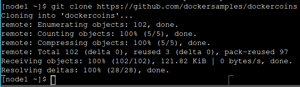

Explicacion:
- El comando `git clone` se usa para clonar un repositorio Git desde la URL proporcionada. En este caso, se está clonando el repositorio `dockercoins` desde `https://github.com/dockersamples/dockercoins`. La salida muestra el progreso del clonado, incluyendo la enumeración de objetos, el conteo y compresión de objetos, y finalmente la recepción de los objetos con éxito. 

### Ejecutar la aplicación

Voy al directorio `dockercoins` en el repositorio clonado:

```bash
cd ~/dockercoins
```

Explicacion:

- El comando `cd ~/dockercoins` se utiliza para cambiar el directorio actual del usuario a `dockercoins`, que está ubicado en su directorio personal (`~`). La salida muestra que el directorio actual ha cambiado de `~/` (directorios personales) a `~/dockercoins/`, indicando que ahora estás trabajando dentro del directorio `dockercoins` en el nodo `node1`.

Utilizo Compose para construir y ejecutar todos los contenedores:

```bash
docker-compose up
```

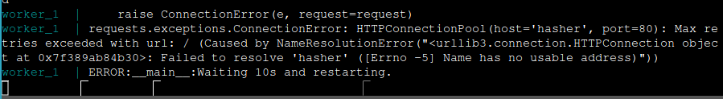

Explicacion: 
- Cuando intento ejecutar `docker-compose up`, surge un problema con el contenedor `worker_1`, el cual no puede resolver el nombre `hasher` para establecer una conexión HTTP en el puerto 80. Este error apunta a dificultades en la resolución de nombres dentro de la red de contenedores. No logre resolver ese problema tampoco, voy a continuar el taller basandome netamente en lo que dice el taller con recpeto a la ejecucion de esta aplicacion.

Compose deberia decirle a Docker que construya todas las imágenes de contenedor (descargando las imágenes base correspondientes), luego inicia todos los contenedores y muestra los registros agregados.

### Generación de muchos registros

La aplicación deberia producir registros de forma continua. En estos registros, deberia ver cómo el servicio de trabajador hace solicitudes al generador de números aleatorios (rng) y al hasher. Para no saturar la vista principal, es útil poner estos procesos en segundo plano.

### Conexión a la interfaz web

El contenedor de la interfaz web deberia ofrecer un panel de control accesible. Para visualizarlo, que se debe abrir un navegador web y conecta al nodo1 en el puerto 8000, que se creó al ejecutar la aplicación.

### Limpieza

Antes de seguir, apaguemos todo presionando Ctrl-C.

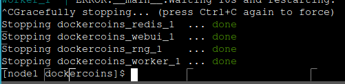

### Conceptos de Kubernetes

Kubernetes es un sistema de gestión de contenedores que ejecuta y administra aplicaciones en contenedores dentro de un clúster. Esto significa que Kubernetes proporciona una plataforma robusta para escalar, gestionar y mantener aplicaciones distribuidas en entornos de producción. Permite automatizar el despliegue, la escalabilidad y la gestión de recursos de las aplicaciones, asegurando que funcionen de manera eficiente y confiable en todo momento.

### Cosas básicas que podemos pedirle a Kubernetes

Podemos instruir a Kubernetes para realizar tareas esenciales como iniciar 5 contenedores utilizando la imagen atseashop/api:v1.3, y colocar un balanceador de carga interno para gestionar el tráfico hacia estos contenedores. También podemos iniciar 10 contenedores utilizando la imagen atseashop/webfront:v1.3, y configurar un balanceador de carga público para distribuir las solicitudes entrantes. En días de alto tráfico, como Black Friday o Navidad, podemos escalar nuestro clúster agregando más contenedores. Además, podemos actualizar a una nueva versión reemplazando los contenedores existentes con la imagen atseashop/webfront:v1.4, asegurando que el procesamiento de solicitudes continúe sin interrupciones al actualizar los contenedores uno a uno.

### Otras capacidades de Kubernetes

Kubernetes ofrece una serie de capacidades adicionales que incluyen autoscaling básico para ajustar automáticamente la cantidad de recursos según la demanda. También permite despliegues blue/green y canarios para implementar nuevas versiones de aplicaciones de manera controlada y segura. Facilita la ejecución de servicios de larga duración y trabajos por lotes, así como la sobrecomisión del clúster y el desalojo de trabajos de baja prioridad para optimizar el uso de recursos. Además, Kubernetes es capaz de ejecutar servicios con datos persistentes, como bases de datos, y proporciona un control de acceso granular para gestionar quién puede acceder y qué pueden hacer en los recursos. Facilita la integración de servicios de terceros a través de un catálogo de servicios y permite la automatización de tareas complejas mediante operadores especializados.

### Arquitectura de Kubernetes

La arquitectura de Kubernetes se basa en una colección de servicios que constituyen su "cerebro": el servidor de API, que sirve como punto de entrada para todas las operaciones; servicios esenciales como el scheduler y el controlador; y etcd, un almacén de datos clave/valor altamente disponible que funciona como la "base de datos" de Kubernetes. Estos servicios se agrupan para formar lo que se conoce como el "master". Pueden ejecutarse directamente en un host o dentro de contenedores, con la opción de ejecutar etcd en máquinas separadas o en la misma infraestructura. Para garantizar alta disponibilidad, es posible configurar más de un master, aunque al menos uno es necesario para operaciones básicas.

### Arquitectura de Kubernetes: los nodos

Los nodos que ejecutan nuestros contenedores están equipados con una serie de servicios adicionales: un motor de contenedores (generalmente Docker), kubelet (el agente del nodo) y kube-proxy (un componente de red necesario pero no suficiente). Anteriormente, estos nodos solían denominarse "minions". Es común evitar ejecutar aplicaciones en el nodo o nodos que también gestionan componentes del master, excepto en entornos de desarrollo con clústeres pequeños.

### Recursos de Kubernetes

La API de Kubernetes define una amplia variedad de objetos denominados recursos, los cuales se organizan por tipo o Kind en la API. Entre los tipos de recursos más comunes se encuentran: nodo (una máquina física o virtual dentro del clúster), pod (un grupo de contenedores que se ejecutan juntos en un nodo), servicio (un punto de acceso estable para conectarse a uno o varios contenedores), namespace (un grupo más o menos aislado de recursos), secret (un conjunto de datos sensibles destinados a ser pasados a un contenedor), y muchos otros más. La lista completa de recursos disponibles se puede consultar utilizando el comando `kubectl get`.

### Declarativo vs imperativo

En Kubernetes, hay una fuerte preferencia por el enfoque declarativo. En un enfoque declarativo, se especifica qué se desea lograr sin detallar los pasos individuales para lograrlo. Por ejemplo, "Quiero una taza de té". En contraste, el enfoque imperativo detalla los pasos necesarios para alcanzar el objetivo, como "Hierve agua, vierte en una tetera, añade hojas de té, deja reposar y sirve en una taza". El enfoque declarativo puede parecer más sencillo siempre y cuando se conozcan los pasos necesarios para obtener el resultado deseado.

### ¿Qué sería realmente declarativo?

En el contexto de Kubernetes, un enfoque realmente declarativo implica especificar el resultado deseado sin entrar en los detalles de cómo lograrlo paso a paso. Por ejemplo, "Quiero una taza de té, obtenida vertiendo una infusión de hojas de té en una taza. Una infusión se obtiene dejando el objeto reposar unos minutos en agua caliente. El líquido caliente se obtiene vertiéndolo en un recipiente adecuado y colocándolo en una estufa". Este enfoque permite que Kubernetes gestione automáticamente los procesos necesarios para alcanzar el estado deseado, asegurando la coherencia y la eficiencia en el despliegue y gestión de aplicaciones.

### Resumen de declarativo vs imperativo

En Kubernetes, los sistemas imperativos se caracterizan por su simplicidad y la necesidad de reiniciar desde cero si una tarea se interrumpe. En contraste, los sistemas declarativos permiten recuperarse de interrupciones o llegar a medio proceso al identificar lo que falta y ejecutar solo las acciones necesarias para alcanzar el estado deseado. Para ello, es crucial poder observar el sistema y calcular una "diferencia" entre el estado actual y el estado deseado, asegurando así una administración eficiente y adaptable de los recursos de la aplicación en Kubernetes.

### Declarativo vs imperativo en Kubernetes

En Kubernetes, casi todo lo que creamos se define a partir de una especificación. Al trabajar con archivos YAML, buscamos los campos de especificación que describen cómo deseamos que sea el recurso. Kubernetes se encarga de reconciliar automáticamente el estado actual con la especificación mediante varios controladores. Cuando necesitamos modificar algún recurso, actualizamos simplemente la especificación y Kubernetes se asegura de converger ese recurso según los nuevos parámetros definidos. Este enfoque permite una administración consistente y automatizada de los recursos en Kubernetes, facilitando la gestión y escalabilidad de las aplicaciones en entornos de producción.

### Modelo de red de Kubernetes

En Kubernetes, nuestro clúster, compuesto por nodos y pods, opera como una gran red IP plana. Esto implica que todos los nodos deben poder comunicarse entre sí sin necesidad de NAT (traducción de direcciones de red), al igual que todos los pods entre sí y los pods con los nodos. Cada pod es consciente de su propia dirección IP sin requerir NAT. Kubernetes no especifica una implementación particular para la red, lo que permite flexibilidad en la configuración y optimización de la red según las necesidades del entorno y las aplicaciones desplegadas.

### Modelo de red de Kubernetes: lo bueno

En el modelo de red de Kubernetes, todos los componentes pueden comunicarse directamente entre sí sin necesidad de traducción de direcciones ni de puertos. Esto significa que los pods y los nodos pueden interactuar sin restricciones adicionales de protocolos. Sin embargo, es importante notar que los pods no pueden conservar su dirección IP al moverse de un nodo a otro, y las direcciones IP no necesariamente tienen que ser "portátiles" de un nodo a otro. La especificación del modelo de red es lo suficientemente simple como para permitir una variedad de implementaciones, lo que facilita la configuración y la optimización de la red según los requisitos específicos del entorno y las aplicaciones desplegadas en Kubernetes.

### Modelo de red de Kubernetes: lo menos bueno

En el modelo de red de Kubernetes, si bien todos los componentes pueden comunicarse directamente entre sí, se requieren políticas de red adicionales para garantizar la seguridad. Esto implica que la implementación de red utilizada debe ser compatible con estas políticas. Existen numerosas implementaciones disponibles (se mencionan 15 en la documentación de Kubernetes), lo que puede complicar la selección de la más adecuada. Aunque el modelo parece ofrecer una red de nivel 3, en realidad solo proporciona características equivalentes a nivel 4, ya que la especificación requiere soporte para UDP y TCP pero no para rangos de puertos o paquetes IP arbitrarios. Además, kube-proxy, al estar en la trayectoria de los datos al conectarse a pods o contenedores, puede afectar el rendimiento debido a su dependencia de técnicas como proxying en userland o iptables.

### Modelo de red de Kubernetes: en práctica

En la práctica, los nodos que estamos utilizando han sido configurados para utilizar Weave como solución de red. No tenemos un respaldo particular hacia Weave, simplemente hemos encontrado que funciona bien para nuestras necesidades específicas. No es necesario preocuparse por la advertencia sobre el rendimiento de kube-proxy, a menos que este rutinariamente saturando interfaces de red de 10G, manejando millones de paquetes por segundo, operando plataformas de VOIP o juegos de alto tráfico, o realizando operaciones peculiares que implican millones de conexiones simultáneas. En tales casos, es probable que ya este familiarizado con la configuración avanzada del kernel para optimizar el rendimiento de red en Kubernetes.

### Primer contacto con kubectl

Kubectl es la herramienta principal que utilizaremos para interactuar con Kubernetes. Se trata de una potente herramienta de línea de comandos que facilita el acceso y la administración a través de la API de Kubernetes. Todo lo que se puede realizar con kubectl también puede ejecutarse directamente a través de la API. Además, puedo configurar kubectl utilizando el flag --kubeconfig para especificar un archivo de configuración, o directamente utilizando flags como --server, --user, entre otros. La pronunciación de kubectl puede variar, y comúnmente se la puede escuchar como "Cube C T L", "Cube cuttle" o "Cube cuddle", según la preferencia del usuario.


### kubectl get

#### Visualización de recursos de nodo

Utilizo `kubectl get` para explorar los recursos de nodo en el clúster Kubernetes. 

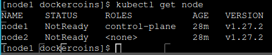

Explicacion:
- Cuando ejecuto `kubectl get node`, obtengo una lista de nodos en el clúster Kubernetes. En este caso, los nodos `node1` y `node2` están etiquetados como "NotReady", lo que indica que no están completamente disponibles para ejecutar cargas de trabajo. Ambos nodos tienen el rol de "control-plane" y están ejecutando la versión `v1.27.2` de Kubernetes. 

Puedo obtener esta información de varias maneras equivalentes:

- `kubectl get no`
- `kubectl get nodes`

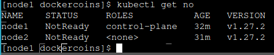
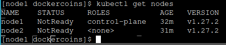

#### Obtención de salida en formato legible por máquina

`kubectl get` permite obtener resultados en formatos como JSON, YAML o formateados directamente:

- Para información detallada de los nodos en formato ancho YAML:
  ```
  kubectl get nodes -o wide
  ```

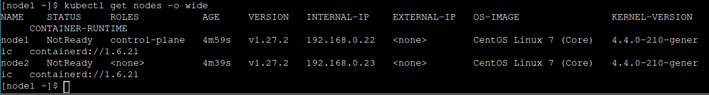

Explicacion:
- El comando muestra una lista detallada de los nodos en el clúster, incluyendo su estado, roles, edad, versión de Kubernetes, direcciones IP internas y externas, imagen del sistema operativo, versión del kernel y el runtime de contenedores. Se observa que ambos nodos `node1` y `node2` están en estado `NotReady`, con IPs internas `192.168.0.22` y `192.168.0.23`, ejecutando `CentOS Linux 7` y utilizando `containerd` como runtime de contenedores.

- Reviso la informacion de los nodos en el cluster en formato yaml:

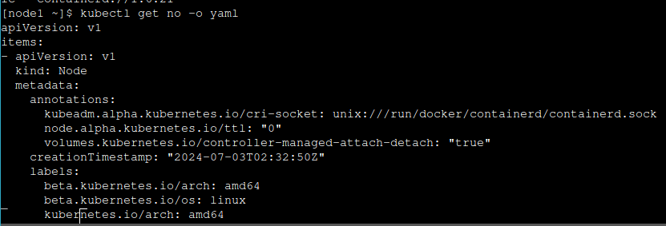

```sh
[node1 ~]$ kubectl get no -o yaml
apiVersion: v1
items:
- apiVersion: v1
  kind: Node
  metadata:
    annotations:
      kubeadm.alpha.kubernetes.io/cri-socket: unix:///run/docker/containerd/containerd.sock
      node.alpha.kubernetes.io/ttl: "0"
      volumes.kubernetes.io/controller-managed-attach-detach: "true"
    creationTimestamp: "2024-07-03T02:32:50Z"
    labels:
      beta.kubernetes.io/arch: amd64
      beta.kubernetes.io/os: linux
      kubernetes.io/arch: amd64
      kubernetes.io/hostname: node1
      kubernetes.io/os: linux
      node-role.kubernetes.io/control-plane: ""
      node.kubernetes.io/exclude-from-external-load-balancers: ""
    name: node1
    resourceVersion: "800"
    uid: 3d2317d1-095a-475a-90e5-339fa0ecf42d
  spec:
    taints:
    - effect: NoSchedule
      key: node-role.kubernetes.io/control-plane
    - effect: NoSchedule
      key: node.kubernetes.io/not-ready
  status:
    addresses:
    - address: 192.168.0.22
      type: InternalIP
    - address: node1
      type: Hostname
    allocatable:
      cpu: "8"
      ephemeral-storage: 65504Mi
      hugepages-1Gi: "0"
      hugepages-2Mi: "0"
      memory: 32946972Ki
      pods: "110"
    capacity:
      cpu: "8"
      ephemeral-storage: 65504Mi
      hugepages-1Gi: "0"
      hugepages-2Mi: "0"
      memory: 32946972Ki
      pods: "110"
    conditions:
    - lastHeartbeatTime: "2024-07-03T02:37:46Z"
      lastTransitionTime: "2024-07-03T02:32:49Z"
      message: kubelet has sufficient memory available
      reason: KubeletHasSufficientMemory
      status: "False"
      type: MemoryPressure
    - lastHeartbeatTime: "2024-07-03T02:37:46Z"
      lastTransitionTime: "2024-07-03T02:32:49Z"
      message: kubelet has no disk pressure
      reason: KubeletHasNoDiskPressure
      status: "False"
      type: DiskPressure
    - lastHeartbeatTime: "2024-07-03T02:37:46Z"
      lastTransitionTime: "2024-07-03T02:32:49Z"
      message: kubelet has sufficient PID available
      reason: KubeletHasSufficientPID
      status: "False"
      type: PIDPressure
    - lastHeartbeatTime: "2024-07-03T02:37:46Z"
      lastTransitionTime: "2024-07-03T02:32:49Z"
      message: 'container runtime network not ready: NetworkReady=false reason:NetworkPluginNotReady
        message:Network plugin returns error: cni plugin not initialized'
      reason: KubeletNotReady
      status: "False"
      type: Ready
    daemonEndpoints:
      kubeletEndpoint:
        Port: 10250
    images:
    - names:
      - registry.k8s.io/etcd@sha256:51eae8381dcb1078289fa7b4f3df2630cdc18d09fb56f8e56b41c40e191d6c83
      - registry.k8s.io/etcd:3.5.7-0
      sizeBytes: 101639218
    - names:
      - registry.k8s.io/kube-apiserver@sha256:bbbc0eb287dbb7507948b1c05ac8f221d1a504e04572e61d4700ff18b2a3afd0
      - registry.k8s.io/kube-apiserver:v1.27.15
      sizeBytes: 34094789
    - names:
      - registry.k8s.io/kube-controller-manager@sha256:9ff408d91018df95a8505149e778bc7815b261ba8798497ae9319beb2b73304a
      - registry.k8s.io/kube-controller-manager:v1.27.15
      sizeBytes: 31536477
    - names:
      - registry.k8s.io/kube-proxy@sha256:23c54b01075318fe6991b224192faf6d65e9412b954b335efe326977deb30332
      - registry.k8s.io/kube-proxy:v1.27.15
      sizeBytes: 27495464
    - names:
      - registry.k8s.io/kube-scheduler@sha256:9a7746f46e126b23098a844b5e3df34ee44b14b666d540a1e92a21ca7bbaac99
      - registry.k8s.io/kube-scheduler:v1.27.15
      sizeBytes: 18124766
    - names:
      - registry.k8s.io/pause@sha256:7031c1b283388d2c2e09b57badb803c05ebed362dc88d84b480cc47f72a21097
      - registry.k8s.io/pause:3.9
      sizeBytes: 321520
    - names:
      - registry.k8s.io/pause@sha256:3d380ca8864549e74af4b29c10f9cb0956236dfb01c40ca076fb6c37253234db
      - registry.k8s.io/pause:3.6
      sizeBytes: 301773
    nodeInfo:
      architecture: amd64
      bootID: ddf52b2b-0a45-4aa1-a34d-c9f704ef0f0f
      containerRuntimeVersion: containerd://1.6.21
      kernelVersion: 4.4.0-210-generic
      kubeProxyVersion: v1.27.2
      kubeletVersion: v1.27.2
      machineID: 535f290836d14b56adc84e2e6447d691
      operatingSystem: linux
      osImage: CentOS Linux 7 (Core)
      systemUUID: 6E717E48-761F-6640-AA8F-878704CE72ED
- apiVersion: v1
  kind: Node
  metadata:
    annotations:
      kubeadm.alpha.kubernetes.io/cri-socket: /run/docker/containerd/containerd.sock
      node.alpha.kubernetes.io/ttl: "0"
      volumes.kubernetes.io/controller-managed-attach-detach: "true"
    creationTimestamp: "2024-07-03T02:33:10Z"
    labels:
      beta.kubernetes.io/arch: amd64
      beta.kubernetes.io/os: linux
      kubernetes.io/arch: amd64
      kubernetes.io/hostname: node2
      kubernetes.io/os: linux
    name: node2
    resourceVersion: "891"
    uid: 2485971c-5e95-4318-b0ee-12e1341c727b
  spec:
    taints:
    - effect: NoSchedule
      key: node.kubernetes.io/not-ready
  status:
    addresses:
    - address: 192.168.0.23
      type: InternalIP
    - address: node2
      type: Hostname
    allocatable:
      cpu: "8"
      ephemeral-storage: 65504Mi
      hugepages-1Gi: "0"
      hugepages-2Mi: "0"
      memory: 32946972Ki
      pods: "110"
    capacity:
      cpu: "8"
      ephemeral-storage: 65504Mi
      hugepages-1Gi: "0"
      hugepages-2Mi: "0"
      memory: 32946972Ki
      pods: "110"
    conditions:
    - lastHeartbeatTime: "2024-07-03T02:38:47Z"
      lastTransitionTime: "2024-07-03T02:33:10Z"
      message: kubelet has sufficient memory available
      reason: KubeletHasSufficientMemory
      status: "False"
      type: MemoryPressure
    - lastHeartbeatTime: "2024-07-03T02:38:47Z"
      lastTransitionTime: "2024-07-03T02:33:10Z"
      message: kubelet has no disk pressure
      reason: KubeletHasNoDiskPressure
      status: "False"
      type: DiskPressure
    - lastHeartbeatTime: "2024-07-03T02:38:47Z"
      lastTransitionTime: "2024-07-03T02:33:10Z"
      message: kubelet has sufficient PID available
      reason: KubeletHasSufficientPID
      status: "False"
      type: PIDPressure
    - lastHeartbeatTime: "2024-07-03T02:38:47Z"
      lastTransitionTime: "2024-07-03T02:33:10Z"
      message: 'container runtime network not ready: NetworkReady=false reason:NetworkPluginNotReady
        message:Network plugin returns error: cni plugin not initialized'
      reason: KubeletNotReady
      status: "False"
      type: Ready
    daemonEndpoints:
      kubeletEndpoint:
        Port: 10250
    images:
    - names:
      - registry.k8s.io/kube-proxy@sha256:23c54b01075318fe6991b224192faf6d65e9412b954b335efe326977deb30332
      - registry.k8s.io/kube-proxy:v1.27.15
      sizeBytes: 27495464
    - names:
      - registry.k8s.io/pause@sha256:3d380ca8864549e74af4b29c10f9cb0956236dfb01c40ca076fb6c37253234db
      - registry.k8s.io/pause:3.6
      sizeBytes: 301773
    nodeInfo:
      architecture: amd64
      bootID: ddf52b2b-0a45-4aa1-a34d-c9f704ef0f0f
      containerRuntimeVersion: containerd://1.6.21
      kernelVersion: 4.4.0-210-generic
      kubeProxyVersion: v1.27.2
      kubeletVersion: v1.27.2
      machineID: b3385e01068743c993f2d70f39c625a2
      operatingSystem: linux
      osImage: CentOS Linux 7 (Core)
      systemUUID: 6E717E48-761F-6640-AA8F-878704CE72ED
kind: List
metadata:
  resourceVersion: ""
[node1 ~]$ 
```

Explicacion:
- El comando `kubectl get no -o yaml` devuelve la información detallada de los nodos en el clúster en formato YAML. Este comando muestra todos los metadatos, anotaciones y configuraciones de cada nodo. Por ejemplo, en el resultado proporcionado, se muestra la versión de la API, el tipo de recurso (Node), y las anotaciones específicas del nodo. 

#### Uso de jq con kubectl

Es posible generar informes personalizados utilizando `kubectl` en combinación con `jq`. Por ejemplo, para mostrar la capacidad de todos los nodos como objetos JSON:

```bash
kubectl get nodes -o json | jq ".items[] | {name:.metadata.name} + .status.capacity"
```

```sh
[node1 ~]$ kubectl get nodes -o json |
>       jq ".items[] | {name:.metadata.name} + .status.capacity"
{
  "name": "node1",
  "cpu": "8",
  "ephemeral-storage": "65504Mi",
  "hugepages-1Gi": "0",
  "hugepages-2Mi": "0",
  "memory": "32946972Ki",
  "pods": "110"
}
{
  "name": "node2",
  "cpu": "8",
  "ephemeral-storage": "65504Mi",
  "hugepages-1Gi": "0",
  "hugepages-2Mi": "0",
  "memory": "32946972Ki",
  "pods": "110"
}
[node1 ~]$ 
```

Explicacion:
- El comando `kubectl get nodes -o json | jq ".items[] | {name:.metadata.name} + .status.capacity"` obtiene información en formato JSON sobre los nodos en el clúster y la procesa con `jq` para extraer y mostrar el nombre del nodo junto con su capacidad. El resultado muestra que los nodos `node1` y `node2` tienen 8 CPUs, 65504Mi de almacenamiento efímero, etc.

#### Exploración de recursos disponibles

`kubectl` ofrece facilidades de introspección para listar todos los tipos de recursos disponibles y ver detalles específicos de un recurso:

- Listar todos los tipos de recursos:
  ```
  kubectl get
  ```

- Ver detalles de un recurso:
  ```
  kubectl describe type/name
  ```
  o
  ```
  kubectl describe type name
  ```

- Ver la definición de un tipo de recurso:
  ```
  kubectl explain type
  ```

#### Servicios en Kubernetes

Un servicio en Kubernetes es un punto de conexión estable para conectar con algo. Para listar los servicios en nuestro clúster:

```bash
kubectl get services
```

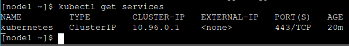

o simplemente
```bash
kubectl get svc
```

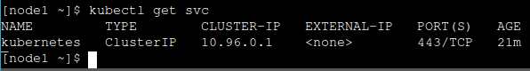

Explicacion:
- Ambos comandos muestran los servicios en el clúster de Kubernetes. En este caso, hay un servicio llamado `kubernetes` de tipo `ClusterIP` con la IP `10.96.0.1`, sin una IP externa asignada, que está escuchando en el puerto 443/TCP y ha estado activo durante 20 minutos.

#### Servicios ClusterIP

Los servicios ClusterIP son internos y solo están disponibles dentro del clúster, útiles para la introspección desde contenedores:

- Intentar conectar al API con ClusterIP:
  ```bash
  curl -k https://10.96.0.1
  ```

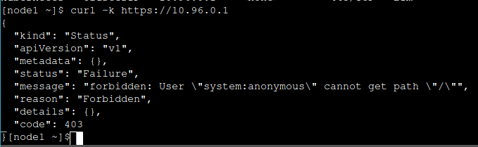

Explicacion:
- El comando `curl -k https://10.96.0.1` intenta acceder al servicio de Kubernetes en la IP del clúster. La respuesta es un mensaje de error JSON indicando que el acceso está prohibido. 

#### Listado de contenedores en ejecución

Los contenedores se manipulan a través de pods, que son grupos de contenedores que comparten recursos. Para listar los pods en nuestro clúster:

```bash
kubectl get pods
```

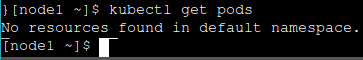

Explicacion:
- El comando `kubectl get pods` muestra que no hay recursos, es decir, no hay pods actualmente en el namespace predeterminado de Kubernetes.

#### Namespaces

Los namespaces permiten la segregación de recursos. Para listar los namespaces en el clúster:

```bash
kubectl get namespaces
```

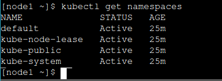
o
```bash
kubectl get ns
```
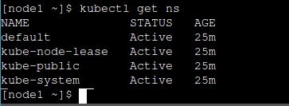

Explicacion:
- Ambos comandos muestran una lista de namespaces en el clúster de Kubernetes, indicando que los namespaces `default`, `kube-node-lease`, `kube-public` y `kube-system` están activos y tienen 25 minutos de existencia.

#### Acceso a namespaces

Tambien puedo cambiar al namespace deseado usando la opción `-n`:

```bash
kubectl -n kube-system get pods
```

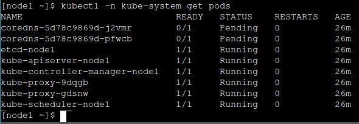

Explicacion:
- El comando muestra el estado de los pods en el namespace `kube-system`. Los pods `coredns-5d78c9869d-j2vmr` y `coredns-5d78c9869d-pfwcb` están en estado pendiente, mientras que otros pods esenciales como `etcd-node1`, `kube-apiserver-node1`, `kube-controller-manager-node1`, `kube-proxy-9dqgb`, `kube-proxy-gdsnw` y `kube-scheduler-node1` están en estado de ejecucion sin reinicios y tienen 26 minutos de actividad.

#### Componentes en los pods

Los pods incluyen varios componentes esenciales como `etcd`, `kube-apiserver`, `kube-controller-manager`, `kube-scheduler`, `kube-dns`, `kube-proxy`, y `weave`.

#### Ejecución de nuestro primer pod en Kubernetes

Para ejecutar un pod inicial y verificar los recursos creados:

```bash
kubectl run pingpong --image alpine ping 8.8.8.8
```

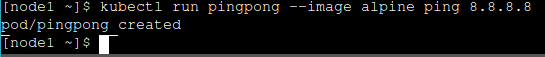

explicacion:

- El comando crea un pod llamado `pingpong` utilizando la imagen `alpine` y ejecuta el comando `ping` hacia la dirección IP `8.8.8.8`. El pod `pingpong` fue creado exitosamente.

#### Detrás de kubectl run

El comando `kubectl run` crea varios recursos como deployment (`deploy/pingpong`), replica set (`rs/pingpong-xxxx`), y pod (`po/pingpong-yyyy`).

Enumero la mayoría de los tipos de recursos:

```bash
kubectl get all
```

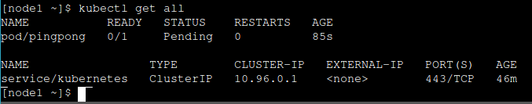

explicacion:
- El comando intenta mostrar los registros del deployment llamado `pingpong`, pero devuelve un error indicando que el deployment no fue encontrado en el clúster.

#### ¿Qué son estas cosas diferentes?
Un `Deployment` en Kubernetes es un constructo de alto nivel que permite escalar, realizar actualizaciones continuas y retrocesos. Puede delegar la gestión de pods a conjuntos de réplicas (`Replica Sets`). Por otro lado, un `Replica Set` es un constructo de bajo nivel que garantiza que un número específico de pods idénticos esté en ejecución y permite el escalado. El `Replication Controller` es su predecesor, aunque está obsoleto.

#### Nuestro despliegue pingpong
Cuando ejecutamos `kubectl run`, creamos un `Deployment` (`deploy/pingpong`). Este `Deployment` crea un `Replica Set` (`rs/pingpong-xxxx`), que a su vez crea un pod (`po/pingpong-yyyy`). Estos componentes trabajan juntos para escalar, mantener alta disponibilidad y realizar actualizaciones continuas.

#### Visualización de la salida del contenedor
Para ver la salida de un contenedor en Kubernetes, use utiliza el comando `kubectl logs`. Podemos especificar el nombre de un pod o usar un selector como `deployment` o `replica set`. Por defecto, muestra los registros del primer contenedor en el pod.

Comando:
```
kubectl logs deploy/pingpong
```

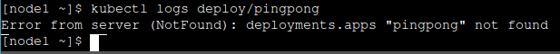

explicacion:
- El comando intenta mostrar los registros del deployment llamado `pingpong`, pero devuelve un error indicando que el deployment no fue encontrado en el clúster.

#### Transmisión de registros en tiempo real
Similar a `docker logs`, `kubectl logs` admite opciones como `-f/--follow` para ver registros en tiempo real y `--tail` para ver un número específico de líneas desde el final. Podemos usar `kubectl logs --tail 1 --follow` para ver los registros más recientes en continuo.

```
kubectl logs deploy/pingpong --tail 1 --follow
```

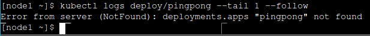

Explicacion:
- El comando intenta mostrar los registros del deployment llamado `pingpong`, especificando que solo se muestre la última línea y que se sigan los registros en tiempo real. Sin embargo, devuelve un error indicando que el deployment no fue encontrado en el clúster. 

#### Escalado de nuestra aplicación
Podemos escalar los contenedores (o pods) usando `kubectl scale`. Por ejemplo, `kubectl scale deploy/pingpong --replicas 8` aumentaría el número de réplicas del `Deployment` `pingpong`.

```
kubectl scale deploy/pingpong --replicas 8
```

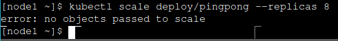

Explicacion:
- El comando intenta escalar el deployment llamado `pingpong` a 8 réplicas, pero devuelve un error indicando que no se encontraron objetos válidos para escalar. 

#### Resiliencia
El `Deployment` `pingpong` supervisa su `Replica Set`, asegurando que el número correcto de pods esté en ejecución. Si un pod desaparece, el sistema lo detectará y lo reemplazará automáticamente.

```
kubectl get pods -w
```

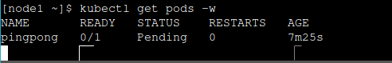

Explicacion:

- El comando se utiliza para observar en tiempo real el estado de los pods en el clúster Kubernetes. En este caso, muestra un pod llamado `pingpong` que está en estado "Pending", lo que significa que Kubernetes aún no ha podido programar este pod en ningún nodo del clúster. 

```
kubectl delete pod pingpong-yyyy
```
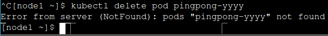

Explicacion:
- El comando intenta eliminar un pod específico llamado `pingpong-yyyy`. Pero, el error "Error from server (NotFound): pods 'pingpong-yyyy' not found" indica que no se encontró ningún pod con ese nombre en el clúster Kubernetes. 

#### ¿Qué pasa si queremos algo diferente?
Si quiero ejecutar un contenedor de "un solo uso" que no se reinicie, podemos usar `kubectl run --restart=OnFailure` o `kubectl run --restart=Never`. Estos comandos crearían trabajos (`Jobs`) o pods en lugar de despliegues.

#### Visualización de registros de múltiples pods
Al especificar el nombre de un `Deployment`, `kubectl logs` muestra los registros de un único pod. Para ver registros de múltiples pods, usamos un selector basado en etiquetas. Por ejemplo, `kubectl logs -l run=pingpong --tail 1` mostraría la última línea de registros de todos los pods con la etiqueta `run=pingpong`.

```
kubectl logs -l run=pingpong --tail 1
```

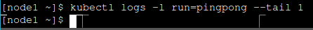

Explicacion:
- El comando intenta mostrar los logs del último contenedor en ejecución que tenga la etiqueta `run=pingpong`. Pero, como no se muestra ningún resultado después de ejecutar el comando, esto podría indicar que no hay pods actualmente en ejecución con esa etiqueta específica (`run=pingpong`). 

#### Limpieza
Para limpiar un despliegue, podemos eliminar con `kubectl delete deploy/pingpong`.

```
kubectl delete deploy/pingpong
```

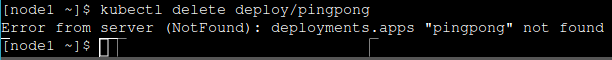

Explicacion:
- El comando intenta eliminar el deployment llamado "pingpong", pero devuelve un error indicando que no se encontró el deployment con ese nombre. Esto podría ocurrir si el deployment "pingpong" no existe en el namespace actual o si lo especifique incorrectamente. 

#### Exponiendo contenedores
`kubectl expose` crea un servicio para los pods existentes en Kubernetes. Esto proporciona una dirección estable para conectar a los pods. Puedo usar diferentes tipos de servicios como `ClusterIP`, `NodePort`, `LoadBalancer`, o `ExternalName` dependiendo de los requisitos de conectividad y acceso.

#### Ejecución de contenedores con puertos abiertos
Para ejecutar contenedores que necesitan puertos abiertos en Kubernetes, como los de ElasticSearch, utilizo `kubectl run` con la imagen específica y el número de réplicas. Puedo supervisar el estado de estos pods con `kubectl get pods -w`.

#### Exponiendo nuestro despliegue
Para exponer un despliegue, puedo crear un servicio `ClusterIP` predeterminado utilizando `kubectl expose`. Por ejemplo, puedo exponer el puerto de la API HTTP de ElasticSearch con `kubectl expose deploy/elastic --port 9200`.

```
kubectl expose deploy/elastic --port 9200
```

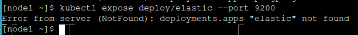

Explicacion:
- El comando intenta exponer el servicio asociado al deployment llamado "elastic", pero devuelve un error indicando que no se encontró el deployment con ese nombre. 

dirección IP que se debio asignar:

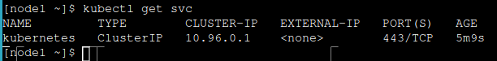

Explicacion:
- El comando muestra una lista de servicios desplegados en el cluster Kubernetes actual. En este caso, solo se muestra el servicio `kubernetes`, que es un servicio interno del cluster utilizado para la comunicación interna entre los componentes de Kubernetes. 

#### Los servicios son constructos de capa 4
Puedo asignar direcciones IP a los servicios, pero siguen siendo de capa 4 (es decir, un servicio no es solo una dirección IP; es una dirección IP + protocolo + puerto). Esto se debe a la implementación actual de kube-proxy, que depende de mecanismos que no admiten la capa 3. Por lo tanto, debo indicar el número de puerto para mi servicio.

#### Probando nuestro servicio
Voy a enviar algunas solicitudes HTTP a los pods de ElasticSearch:

```bash
IP=$(kubectl get svc elastic -o go-template --template '{{ .spec.clusterIP }}')
```

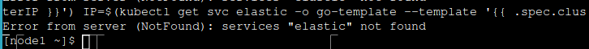

Explicacion:
- El comando intenta obtener detalles del servicio llamado "elastic" en el cluster Kubernetes, pero devuelve un error indicando que el servicio no fue encontrado. Esto significa que no existe un servicio llamado "elastic" actualmente desplegado en el namespace o contexto de Kubernetes desde donde se ejecutó el comando. 

Trato de enviar algunas solicitudes:

```bash
curl http://$IP:9200/
```

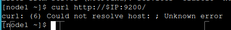

Explicacion:
- El comando intenta hacer una solicitud HTTP al IP especificado en el entorno de Kubernetes, pero devuelve un error indicando que no se pudo resolver el host. 

#### Limpieza
Termino con el despliegue de ElasticSearch, así que voy a limpiarlo:

```bash
kubectl delete deploy/elastic
```

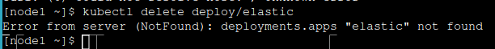

Explicacion:
- El comando intenta eliminar el deployment llamado "elastic", pero devuelve un error indicando que no se encontró ningún deployment con ese nombre. 

#### Nuestra aplicación en Kubernetes
¿Qué se tiene planeado?

En esta parte, voy a:

- Construir imágenes para la aplicación,
- Publicar estas imágenes en un registro,
- Ejecutar despliegues utilizando estas imágenes,
- Exponer estos despliegues para que puedan comunicarse entre sí,
- Exponer la interfaz web para acceder desde fuera.

#### El plan
1. Construir en nuestro nodo de control (node1),
2. Etiquetar las imágenes para que se nombren como $USERNAME/servicename,
3. Subirlas a Docker Hub,
4. Crear despliegues utilizando las imágenes,
5. Exponer (con un ClusterIP) los servicios que necesitan comunicarse,
6. Exponer (con un NodePort) la interfaz web.

#### Configuración
En el primer terminal, establecere una variable de entorno para mi nombre de usuario de Docker Hub. Debo asegurarme de estar en el directorio `dockercoins`.

```bash
export USERNAME=TU_USUARIO
pwd
```

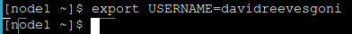

Explicacion:
- El comando establece una variable de entorno llamada `USERNAME` con el valor `davidreevesgoni`. La variable `USERNAME` estará disponible para cualquier comando o script que se ejecute en esa sesión de terminal, permitiendo que el valor `davidreevesgoni` sea utilizado como referencia en diversas operaciones dentro del entorno de trabajo actual.

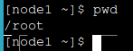

Explicacion:
- El comando `pwd` muestra la ruta completa del directorio actual en el cual se encuentra el usuario actualmente. En este caso, el resultado indica que el directorio actual es `/root`, que es el directorio raíz del usuario `root`. 

#### Una nota sobre los registros
Para este taller, usare Docker Hub. También hay otras opciones, como Docker Trusted Registry y Docker Open Source Registry.

#### Docker Hub
Docker Hub es el registro predeterminado para Docker. Los nombres de imagen en Hub son simplemente `$USERNAME/$IMAGENAME` o `$ORGANIZATIONNAME/$IMAGENAME`.

Para usar Hub, debo asegurarme de tener una cuenta. Luego, escribere `docker login` en el terminal e inicio sesión con mi nombre de usuario y contraseña.

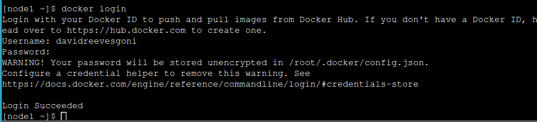

Explicacion:
- Al ejecutar el comando `docker login`, inicié sesión con mi Docker ID para facilitar la descarga y subida de imágenes desde Docker Hub. Ingresé mi nombre de usuario y contraseña cuando se solicitó, y Docker validó estas credenciales. 

#### Construcción y subida de nuestras imágenes
Utilizare una función conveniente de Docker Compose. Voy al directorio `stacks`,  construyo y subo las imágenes:

```bash
cd ~/dockercoins/stacks
docker-compose -f dockercoins.yml build
docker-compose -f dockercoins.yml push
```

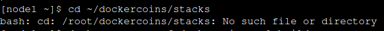
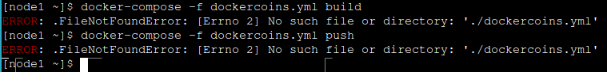

Explicacion:
- Cuando se ejecuta estos comandos en el directorio actual (`./`), no lo encuentra y muestra un error de tipo `FileNotFoundError`. Esto indica que el archivo YAML necesario para la configuración de Docker Compose no está presente en el directorio desde donde se está ejecutando el comando. 

#### Despliegue de todas las cosas
Ahora trato de desplegar el código (así como una instancia de redis). Despleguo redis y todo lo demás:

```bash
kubectl run redis --image=redis

for SERVICE in hasher rng webui worker; do
  kubectl run $SERVICE --image=$USERNAME/$SERVICE -l app=$SERVICE
done
```

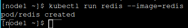

Explicacion:
- Cuando se ejecuta el comando, se crea un nuevo pod en Kubernetes utilizando la imagen de Redis desde el registro de contenedores predeterminado. 

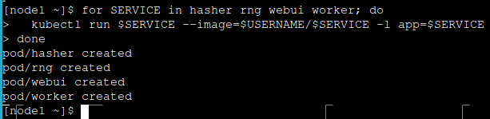

Explicacion:
- Al ejecutar estos comandos, se están creando varios pods en Kubernetes de manera automatizada. 

#### ¿Está funcionando?
Después de esperar a que se complete el despliegue, reviso los registros. Para ello utilizo `kubectl get deploy -w` para ver eventos de despliegue y `kubectl logs` para ver los registros de rng y worker.

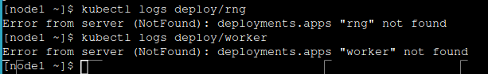

Explicacion:
- Al intentar obtener los logs de `deploy/rng` y `deploy/worker` utilizando el comando `kubectl logs`, se genera un error indicando que no se encontraron los deployments especificados. 

#### Exponiendo servicios
#### Internamente
Expongo cada despliegue, especificando el puerto correcto:

```bash
kubectl expose deployment redis --port 6379
kubectl expose deployment rng --port 80
kubectl expose deployment hasher --port 80
```

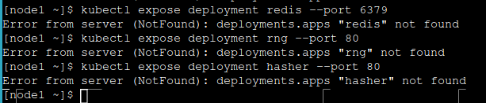

Explicacion:
- Al intentar exponer los deployments `redis`, `rng`, y `hasher` utilizando el comando `kubectl expose deployment`, se genera un error indicando que no se encontraron los deployments especificados. 

#### ¿Está funcionando ya?
El worker tiene un bucle infinito que se reintentará cada 10 segundos después de un error. Transmite los registros del worker para verlo funcionar:

```bash
kubectl logs deploy/worker --follow
```

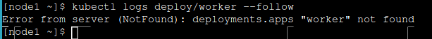

Explicacion:
- Cuando intento ver los logs del deployment llamado `worker` utilizando `kubectl logs deploy/worker --follow`, recibo un error que indica que no se encontró el deployment con ese nombre en el clúster de Kubernetes. 

#### Para acceso externo
Ahora quiero acceder a la interfaz web. La expondre con un NodePort. Creo un servicio NodePort para la interfaz web:

```bash
kubectl create service nodeport webui --tcp=80 --node-port=30001
```

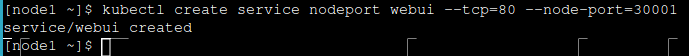

Explicacion:
- Cuando ejecuto el comando, estoy creando un nuevo servicio llamado `webui` de tipo NodePort en Kubernetes. Este servicio expone el puerto 80 de los pods seleccionados por el selector predeterminado, permitiendo acceder a ellos desde fuera del clúster a través del puerto 30001 en cada nodo del clúster. 

Verificar que el puerto que fue asignado:

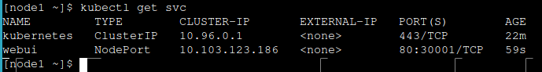

#### Acceso a la interfaz web
Ahora se deberia conectar cualquier nodo al puerto asignado para ver la interfaz web.

#### Implicaciones de seguridad de kubectl apply

Cuando utilizo `kubectl apply -f <URL>`, creo recursos arbitrarios. Los recursos pueden ser maliciosos; por ejemplo un despliegue que:

- Inicie mineros de Bitcoin en todo el clúster
- Se esconda en un espacio de nombres no predeterminado
- Monte enlazado el sistema de archivos de nuestros nodos
- Inserte claves SSH en la cuenta raíz (en el nodo)
- Encripte nuestros datos y los rinda

`kubectl apply` es el nuevo `curl | sh`. `curl | sh` es conveniente y seguro si se utilizan URLs HTTPS de fuentes confiables. `kubectl apply -f` también es conveniente y seguro bajo las mismas condiciones, pero introduce nuevos modos de fallo.

#### Escalando un despliegue

Comenzare con uno fácil: el despliegue del worker.

```bash
kubectl get pods
kubectl get deployments
kubectl scale deploy/worker --replicas=10
```

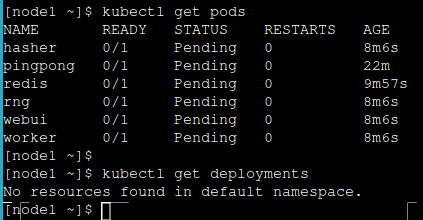

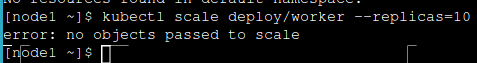

Explicacion:
- Al ejecutar el comando, se indica que no se encontraron recursos en el namespace por defecto (`default`), lo que sugiere que no hay despliegues (deployments) activos en este momento en ese namespace.
- Al intentar escalar el deployment llamado `worker` a 10 réplicas utilizando el comando `kubectl scale`, se devuelve un error que indica "no objects passed to scale". Esto significa que el comando no pudo encontrar el deployment llamado `worker` en el clúster Kubernetes. 

Después de unos segundos, el gráfico en la interfaz web debería aparecer (y alcanzar hasta 10 hashes/segundo, igual que cuando estaba ejecutando en uno solo).

#### Daemon sets

¿Qué pasa si quiero una (y exactamente una) instancia de `rng` por nodo? Si simplemente escalo `deploy/rng` a 2, nada garantiza que se propaguen. En lugar de un despliegue, utilizare un daemon set.

#### Creando un daemon set

Desafortunadamente, a partir de Kubernetes 1.9, la CLI no puede crear daemon sets. Sin embargo, cualquier tipo de recurso siempre se puede crear proporcionando una descripción YAML:

```bash
kubectl apply -f foo.yaml
```

#### Creando el archivo YAML para nuestro daemon set

Comienzo con el archivo YAML para el recurso `rng` actual.

```bash
kubectl get deploy/rng -o yaml --export > rng.yml
```

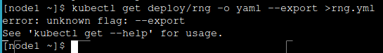

Explicacion:
- El comando intenta exportar la configuración del deployment llamado `rng` a un archivo YAML llamado `rng.yml`. Sin embargo, el error "unknown flag: --export" indica que la versión de `kubectl` utilizada no admite el flag `--export` en la operación `kubectl get`.

#### "Lanzar" un recurso a otro

¿Qué pasa si simplemente cambio el campo `kind`?

```bash
vi rng.yml
```

Cambio `kind: Deployment` a `kind: DaemonSet`, guardo y salgo.

Intento crear mi nuevo recurso:

```bash
kubectl apply -f rng.yml
```

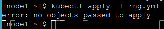

Explicacion:
- El comando intenta aplicar los recursos definidos en el archivo YAML rng.yml, pero devuelve un error indicando que no se encontraron objetos para aplicar.

#### Usando el --force, Luke

Puedo tratar de decirle Kubernetes que ignore estos errores y lo intente de todos modos.

```bash
kubectl apply -f rng.yml --validate=false
```

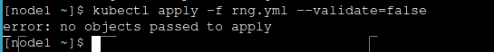

Explicacion:
- El comando intenta aplicar la configuración contenida en el archivo `rng.yml` al cluster Kubernetes, deshabilitando la validación de los recursos. El error "no objects passed to apply" indica que el archivo `rng.yml` no contiene ningún objeto Kubernetes válido para aplicar.

#### Comprobando lo que hemos hecho

¿Transforme el despliegue en un daemon set?

```bash
kubectl get all
```


Explicacion:
- El comando muestra el estado actual de todos los recursos desplegados en el clúster Kubernetes. En la salida proporcionada, se observa que varios pods (`hasher`, `pingpong`, `redis`, `rng`, `webui`, `worker`) están en estado "Pending", lo que indica que aún no se han programado en ningún nodo del clúster para su ejecución. 

#### Explicación

Puedo tener diferentes tipos de recursos con el mismo nombre (es decir, un despliegue y un daemon set ambos nombrados `rng`). Todavía tengo el antiguo despliegue `rng`, pero ahora también tengo el nuevo daemon set `rng`.

#### ¿Qué están haciendo todos estos pods?

Verifico los registros de todos estos pods `rng`. Todos estos pods tienen una etiqueta `run=rng`.

```bash
kubectl logs -l run=rng --tail 1
```


Explicacion:
- El comando intenta mostrar los registros del último contenedor que ejecutaba la etiqueta `run=rng`. Sin embargo, en este caso, no se encontraron recursos en el espacio de nombres predeterminado que coincidan con esa etiqueta, lo que sugiere que no hay ningún pod actualmente desplegado que tenga esa etiqueta específica.

#### Removiendo el primer pod del balanceador de carga

¿Qué sucedería si elimino ese pod con `kubectl delete pod ...`?

- El replicaset lo recrearía inmediatamente.

¿Qué pasaría si elimino la etiqueta `run=rng` de ese pod?

- El replicaset lo recrearía inmediatamente.

Porque lo que importa para el replicaset es el número de pods que coinciden con ese selector.

#### Profundizando en los selectores

Voy a ver los selectores para el despliegue `rng` y el replicaset asociado.

Muestro información detallada sobre el despliegue `rng`:

```bash
kubectl describe deploy rng
```


Explicacion:
- El comando intenta describir los detalles del despliegue llamado `rng`. Pero presenta un error un error que indica que no se pudo encontrar ningún despliegue con el nombre "rng" en el clúster. 

Muestro información detallada sobre el replicaset `rng-yyyy`:

```bash
kubectl describe rs rng-yyyy
```


Explicacion:
- El comando intenta describir los detalles de un conjunto de réplicas con el nombre "rng-yyyy". Pero presenta un error que indica que no se pudo encontrar ningún conjunto de réplicas con ese nombre en el clúster. 

El selector del replicaset también debe tener un `pod-template-hash`, a diferencia de los pods en mi daemon set.

#### Actualizando un servicio a través de etiquetas y selectores

¿Qué pasa si quiero quitar el despliegue `rng` del balanceador de carga?

Opción 1:
- Destruirlo.

Opción 2:
- Agregar una etiqueta adicional al daemon set
- Actualizar el selector del servicio para que se refiera a esa etiqueta.

#### Agregar una etiqueta adicional al daemon set

Voy a actualizar la especificación del daemon set.

Opción 1:
- Editar el archivo `rng.yml` que usamos antes.
- Cargar la nueva definición con `kubectl apply`.

Opción 2:
- Usar `kubectl edit`.

Actualizo el daemon set para agregar `isactive: "yes"` a la etiqueta del selector y de la plantilla:

```bash
kubectl edit daemonset rng
```


Explicacion:
- El comando intenta abrir y editar el daemonset llamado "rng". Pero presenta un error indicando que no se pudo encontrar ningún daemonset con ese nombre en el clúster actual. 

```bash
kubectl edit service rng
```


Explicacion:
- El comando intenta abrir y editar el servicio llamado "rng", pero el error indica que no se pudo encontrar ningún servicio con ese nombre en el clúster actual. 

#### Verificando lo que hemos hecho

Verifico los registros de todos los pods `run=rng` para confirmar que solo 2 de ellos están activos ahora:

```bash
kubectl logs -l run=rng
```


Explicacion:
- El comando intenta mostrar los registros de los pods que tienen la etiqueta `run=rng`, pero no se encontraron recursos que coincidan con esa etiqueta en el espacio de nombres predeterminado. 

Los sellos de tiempo deberían darme una pista sobre cuántos pods están recibiendo tráfico actualmente.

Miro los pods que tengo ahora:

```bash
kubectl get pods
```


#### Recuperándonos de un despliegue fallido

Podria empujar alguna imagen v0.3 (la lógica de reintentos del pod eventualmente lo capturará y el despliegue continuará).

O podria invocar un rollback manual.

Cancelar el despliegue y esperar a que el polvo se asiente:

```bash
kubectl rollout undo deploy worker
kubectl rollout status deploy worker
```


Explicacion:
- El comando intenta revertir un despliegue anterior del deployment llamado "worker", pero devuelve un error indicando que no se encontró el deployment especificado.

#### Cambiar parámetros de rollout

Queremos:
- Revertir a v0.1.
- Ser conservadores en la disponibilidad (siempre tener el número deseado de workers disponibles).
- Ser agresivos en la velocidad de rollout (actualizar más de un pod a la vez).
- Dar algo de tiempo a los workers para "calentarse" antes de comenzar más.

#### Aplicar cambios a través de un parche YAML

Podria usar `kubectl edit deployment worker`, pero también podria usar `kubectl patch` con el YAML exacto mostrado antes.

Aplicar todos mis cambios y esperar a que surtan efecto:


Explicacion:
- El comando está intentando aplicar los recursos definidos en el archivo rng.yml, pero el error indica que no se encontraron objetos válidos para aplicar en el archivo especificado.

#### Próximos pasos

Bien, ¿cómo empiezo a containerizar mis aplicaciones?

Lista de verificación sugerida para la containerización:

- Escribir un Dockerfile para un servicio en una aplicación.
- Escribir Dockerfiles para los otros servicios (compilables).
- Escribir un archivo Compose para toda esa aplicación.
- Asegurarse de que los desarrolladores puedan ejecutar la aplicación en contenedores.
- Configurar construcciones automáticas de imágenes de contenedores desde el repositorio de código.
- Configurar un pipeline de integración continua utilizando estas imágenes.
- Configurar un pipeline de entrega continua (para staging/QA) utilizando estas imágenes.

¡Y luego es hora de mirar la orquestación!

#### Espacios de nombres (Namespaces)

Los espacios de nombres me permiten ejecutar múltiples pilas idénticas lado a lado.

Dos espacios de nombres (por ejemplo, azul y verde) pueden tener su propio servicio redis.

Cada uno de los dos servicios redis tiene su propio ClusterIP.

kube-dns crea dos entradas, mapeando estas dos direcciones IP de ClusterIP:

- `redis.blue.svc.cluster.local` y `redis.green.svc.cluster.local`

Los pods en el espacio de nombres azul obtienen un sufijo de búsqueda de `blue.svc.cluster.local`.

Como resultado, resolver redis desde un pod en el espacio de nombres azul devuelve el redis "local".

Esto no proporciona aislamiento. Esa sería la tarea de las políticas de red.

#### Servicios persistentes (databases, etc.)

Como primer paso, es más prudente mantener los servicios persistentes fuera del clúster.

Exponerlos a los pods se puede hacer con múltiples soluciones:

- Servicios ExternalName (redis.blue.svc.cluster.local será un registro CNAME).
- Servicios ClusterIP con Endpoints explícitos (en lugar de dejar que Kubernetes genere los endpoints a partir de un selector).
- Servicios Ambassador (proxies a nivel de aplicación que pueden proporcionar inyección de credenciales y más).

#### Manejo del tráfico HTTP

Los servicios son construcciones de capa 4.

HTTP es un protocolo de capa 7.

Es manejado por ingresses (un recurso diferente).

Los ingresses permiten:

- Enrutamiento virtual de hosts.
- Persistencia de sesión.
- Mapeo de URI.
- ¡Y mucho más!

#### Registro y métricas

El registro se delega al motor de contenedores.

Las métricas típicamente se manejan con Prometheus.

#### Manejo de la configuración de nuestras aplicaciones

Dos construcciones son particularmente útiles: secrets y config maps.

Permiten exponer información arbitraria a nuestros contenedores.

Evita almacenar la configuración en imágenes de contenedores (hay algunas excepciones a esa regla, pero generalmente es una mala idea).

Nunca se debe almacenar información sensible en imágenes de contenedores (es el equivalente a tener la contraseña en una nota adhesiva en la pantalla).

#### Federación de clústeres

La operación maestra de Kubernetes depende de etcd.

etcd utiliza el protocolo Raft.

Raft recomienda baja latencia entre nodos.

¿Qué pasa si el clúster se extiende a múltiples regiones?

Se debe dividir en clústeres locales.

Agrúpalos en una federación de clústeres.

Sincronizar recursos entre clústeres.

Descubrir recursos entre clústeres.

#### Experiencia del desarrollador
¿Cómo integras a un nuevo desarrollador?
- ¿Qué necesitan instalar para obtener una pila de desarrollo?
- ¿Cómo se hace que un cambio de código pase de dev a producción?
- ¿Cómo alguien añade un componente a una pila?

1. **Integración de un nuevo desarrollador:**
   Al integrar a un nuevo desarrollador en el equipo, es fundamental que instale Docker y configure Kubernetes localmente para ejecutar la pila de desarrollo de manera consistente. Esto asegura que todos los miembros del equipo trabajen en un entorno reproducible y coherente. Además, familiarizarse con los Dockerfiles y los archivos Compose es crucial para comprender la estructura y la interacción de los servicios dentro del entorno Kubernetes.

2. **Instalación para obtener una pila de desarrollo:**
   Para obtener una pila de desarrollo funcional, los nuevos desarrolladores deben instalar varias herramientas esenciales. Esto incluye configurar Docker en sus máquinas para gestionar contenedores que alojen cada servicio de la aplicación. Además, es crucial configurar un entorno local de Kubernetes usando herramientas como `minikube` o `Docker Desktop`, junto con `kubectl` para interactuar con el clúster Kubernetes local. Esta configuración permite a los desarrolladores ejecutar y probar la aplicación en un entorno similar al de producción, facilitando el desarrollo y la depuración de problemas antes de desplegar el código en entornos críticos.

3. **Cambio de código de dev a producción:**
   Los cambios de código se mueven de dev a producción a través de un pipeline de CI bien definido. Durante este proceso, el código se compila en contenedores Docker y se somete a pruebas automatizadas para validar su funcionalidad. Después de pasar las pruebas en entornos de staging o QA, el pipeline de CD despliega automáticamente los contenedores probados en producción. Este enfoque controlado y automatizado minimiza el riesgo de fallos en producción al tiempo que garantiza que las nuevas versiones se desplieguen de manera segura y eficiente.

4. **Adición de un componente a una pila:**
   Añadir un nuevo componente a la pila implica definir un Dockerfile para el servicio adicional y actualizar el archivo Compose correspondiente. Estos cambios se incorporan al pipeline de CI/CD, donde el nuevo componente se construye, prueba y despliega automáticamente en los entornos de desarrollo y producción. Este proceso asegura que la integración del nuevo componente sea coherente y eficiente, manteniendo la estabilidad del sistema mientras se escala la infraestructura según sea necesario.
