# Docker-kubernetes-Microservicios versión 3
# Descripción del la versión 3 de la actividad: V3

El juego "Tower Defense" es un videojuego de consola donde 
el jugador defiende su base de oleadas de enemigos colocando 
torres estratégicamente en el mapa. Para las pruebas unitarias 
y de integración, se utilizarán mocks, stubs y fakes con Mockito 
y pruebas de mutación.

## Estructura de la V3

El proyecto consta de varios microservicios en Java que 
colaboran para crear un juego de defensa de torres. 
Cada microservicio maneja una función específica del 
juego, como el mapa, el jugador, las torres y las oleadas 
de enemigos.

Las principales clases del proyecto son:

1. Microservicio de Juego (`GameService`): Controla la lógica general del juego.
2. Microservicio de Jugador (`PlayerService`): Representa al jugador y sus estadísticas.
3. Microservicio de Mapa (`MapService`): Administra la representación y manipulación del mapa.
4. Microservicio de Enemigos (`EnemyService`): Gestiona la creación y comportamiento de los enemigos.
5. Microservicio de Torres (`TowerService`): Administra la creación y comportamiento de las torres.
6. Microservicio de Oleadas (`WaveService`): Maneja la lógica de las oleadas de enemigos.

### Inputs y Outputs

**Input:**
- Datos iniciales del mapa y configuración del juego.
- Comandos del usuario para colocar torres, iniciar oleadas, etc.

**Output:**
- Estado del juego después de cada comando.
- Puntuación y estado de salud de la base.

# Detalles de la V3

### 1. GameService

El microservicio `GameService` es el controlador principal del juego y maneja la 
lógica central, coordinando la interacción entre los diferentes microservicios.
```java
package org.example;

import java.util.*;

public class GameService {
    private MapService mapService;  // Servicio para gestionar el mapa del juego
    private PlayerService playerService;  //Servicio para gestionar el estado del jugador
    private List<WaveService> waves;  //Lista de oleadas de enemigos

    //Constructor para inicializar los servicios del mapa, jugador y la lista de oleadas
    public GameService() {
        this.mapService = new MapService();
        this.playerService = new PlayerService();
        this.waves = new ArrayList<>();
    }

    //Método para colocar una torre en la posición (x,y) del mapa
    public void placeTower(TowerService tower, int x, int y) {
        mapService.placeTower(tower, x, y);
    }

    // Método para iniciar una nueva oleada de enemigos
    public void startWave() {
        WaveService wave = new WaveService();
        waves.add(wave);  //Añade la oleada a la lista de oleadas
        wave.start();  // Inicia la oleada
    }

    // Método para mostrar el estado actual del juego
    public void gameState() {
        System.out.println(mapService);  //Muestra el estado del mapa
        System.out.println("Puntuación: " + playerService.getScore());  // Muestra la puntuación del jugador
        System.out.println("Vida de la base: " + playerService.getBaseHealth());  // Muestra la vida de la base del jugador
    }

    public static void main(String[] args) {
        GameService game = new GameService();  //Inicializa un nuevo juego
        TowerService tower = new TowerService('T');  // Crea una nueva torre con el símbolo 'T'

        game.placeTower(tower, 2, 2);  //Coloca la torre en la posición (2, 2) del mapa
        game.startWave();  //Inicia una nueva oleada de enemigos
        game.gameState();  // Muestra el estado actual del juego
    }
}
```

### Métodos:

- La clase GameService gestiona un juego mediante la interacción con varios servicios esenciales. En su constructor, inicializa instancias de MapService para gestionar el mapa del juego, PlayerService para manejar el estado del jugador, y una lista waves que contiene las oleadas de enemigos que se van generando durante el juego.

- El método placeTower permite colocar una nueva torre en una posición específica del mapa, utilizando el servicio mapService para realizar esta acción de forma efectiva.

- El método startWave inicia una nueva oleada de enemigos creando una instancia de WaveService y añadiéndola a la lista waves. Luego, la oleada se inicia llamando al método start() del objeto wave.

- El método gameState imprime el estado actual del juego, mostrando el estado del mapa a través de mapService, la puntuación del jugador obtenida desde playerService, y la vida restante de la base del jugador.

- En el método main, se instancia GameService para comenzar un nuevo juego. Se crea una torre específica con el símbolo 'T' mediante TowerService, la cual se coloca en la posición (2, 2) del mapa usando placeTower. Luego se inicia una nueva oleada de enemigos y se imprime el estado actual del juego con gameState.

### 2. MapService

Es el microservicio `MapService` el que se encarga de gestionar el estado del mapa del juego.

```java
package org.example;

public class MapService {
    private char[][] grid;  // Matriz que representa el mapa del juego

    //Constructor que inicializa el mapa con celdas vacías
    public MapService() {
        grid = new char[5][5];
        for (int i = 0; i < 5; i++) {
            for (int j = 0; j < 5; j++) {
                grid[i][j] = ' ';  //Cada celda se inicializa como vacía
            }
        }
    }

    // Método para colocar una torre en una posición (x,y)
    public void placeTower(TowerService tower, int x, int y) {
        grid[x][y] = tower.getSymbol();  // Coloca el símbolo de la torre en la posición dada
    }

    //Método para representar el estado del mapa como una cadena de texto
    @Override
    public String toString() {
        StringBuilder sb = new StringBuilder();
        for (char[] row : grid) {
            for (char cell : row) {
                sb.append("[").append(cell).append("]");  // Agregar cada celda a la representación en cadena
            }
            sb.append("\n");
        }
        return sb.toString();
    }
}

```

### Métodos:

- Constructor MapService(): Este método se encarga de inicializar la matriz grid del 
mapa del juego con un tamaño de 5x5. Cada celda de la matriz se configura inicialmente como vacía, 
usando el carácter de espacio (' ').

- placeTower(TowerService tower, int x, int y): Este método permite colocar una torre 
en una posición específica del mapa, indicada por las coordenadas (x, y). La torre se representa 
con un símbolo que se obtiene del método getSymbol() de la clase TowerService, y este símbolo se 
asigna a la celda correspondiente de la matriz grid.

- toString(): Este método proporciona una representación textual del estado actual del mapa. 
Recorre cada celda de la matriz grid, y construye una cadena de texto donde cada celda se muestra 
en formato [carácter]. Cada fila del mapa se separa con un salto de línea (\n). Al final, 
se devuelve la cadena completa que describe visualmente el mapa del juego.

### 3. PlayerService

El microservicio `PlayerService` se encarga de gestionar la puntuación y la vida de la base del jugador.

```java
package org.example;

public class PlayerService {
    private int score;  //Puntuación actual del jugador
    private int baseHealth;  // Vida actual de la base del jugador

    // Constructor que inicializa la puntuación en 0 y la vida de la base en 100
    public PlayerService() {
        this.score = 0;
        this.baseHealth = 100;
    }

    // Método para obtener la puntuación actual del jugador
    public int getScore() {
        return score;
    }

    //Método para obtener la vida actual de la base del jugador
    public int getBaseHealth() {
        return baseHealth;
    }
}
```

### Métodos:

- getScore(): Este método devuelve la puntuación actual del jugador. La puntuación es un valor 
entero que se incrementa a medida que el jugador avanza en el juego y completa ciertas tareas o 
derrotas enemigos.

- getBaseHealth(): Este método retorna la vida actual de la base del jugador. La vida de la 
base es un valor entero que decrece cuando los enemigos atacan con éxito la base. Inicialmente, 
la vida de la base está establecida en 100.

### 4. TowerService

El micorservicio `TowerService` se encarga de representar una torre en el juego.

```java
package org.example;

public class TowerService {
    private char symbol;  //Representa la torre en el mapa con el símbolo 'T'

    //Constructor que asigna el símbolo de la torre
    public TowerService(char symbol) {
        this.symbol = symbol;
    }

    // Devuelve el símbolo de la torre
    public char getSymbol() {
        return symbol;
    }
}

```

### Métodos:

- Constructor TowerService(char symbol): Este constructor inicializa la torre con un símbolo 
específico. El símbolo es un carácter que representa visualmente la torre en el mapa del juego.

- Método getSymbol(): Este método retorna el símbolo asociado con la torre. Al llamar a este 
método, se obtiene el carácter que identifica la torre en el mapa, permitiendo su representación 
y manipulación dentro del juego.

### 5. WaveService

El microservicio `WaveService` se encarga de gestionar la lógica de las oleadas de enemigos.

```java
package org.example;

public class WaveService {
    // Método para iniciar una nueva oleada de enemigos
    public void start() {
        System.out.println("Oleada iniciada!");  //Imprime un mensaje indicando que la oleada ha comenzado
    }
}

```

### Métodos:

- Método start(): Este método se encarga de iniciar 
una nueva oleada de enemigos en el juego. Al invocarlo, se imprime en la consola un mensaje que 
indica que la oleada ha comenzado, proporcionando retroalimentación visual sobre el estado del juego.

## Inicio del Juego

Inicié la ejecución del juego mediante el método main() de la clase GameService
Salida en la consola:


El juego ha comenzado sin problemas, mostrando inicialmente el mapa del juego, la puntuación 
inicial del jugador y la salud de la base, que está en 100 puntos.

# Creación de Dockerfile para cada microservicio

Con el objetivo de simplificar el despliegue y la ejecución de los microservicios, voy a desarrollar Dockerfiles específicos para cada uno de ellos. 
Cada Dockerfile está diseñado para construir imágenes Docker que 
pueden ejecutarse en cualquier entorno compatible con Docker. 
Esto destaca la capacidad de Docker para garantizar la portabilidad 
de las aplicaciones.

### 1. Dockerfile para GameService

Este archivo Dockerfile permite la creación de una imagen Docker 
para el servicio GameService, que actúa como el controlador principal del juego.
```
#Utilizo una imagen base de OpenJDK 17 
FROM openjdk:17

#Establezco el directorio de trabajo en /app
WORKDIR /app

#Copio todos los archivos del directorio actual al directorio de trabajo dentro del contenedor
COPY . /app

#Ejecuto el comando para compilar el archivo GameService.java
RUN chmod +x ./gradlew build

#Defino el comando por defecto para ejecutar el servicio Java
CMD ["java", "-cp", "src/main/java/org/example", "GameService"]
```

### 2. Dockerfile para MapService

Esta clase `MapService` se encarga de crea una imagen Docker para, que administra 
el estado del mapa del juego.

```
#Utilizo una imagen base de OpenJDK 17
FROM openjdk:17

#Establezco el directorio de trabajo en /app
WORKDIR /app

#Copio todos los archivos del directorio actual al directorio de trabajo dentro del contenedor
COPY . /app

#Ejecuto el comando para compilar el archivo MapService.java
RUN chmod +x ./gradlew build

#Defino el comando por defecto para ejecutar el servicio
CMD ["java", "-cp", "src/main/java/org/example", "MapService"]
```

### 3. Dockerfile para PlayerService

Esta clase `PlayerService` crea una imagen Docker para, que gestiona la 
puntuación y la vida de la base del jugador.

```
#Utilizo una imagen base de OpenJDK 17 
FROM openjdk:17

#Establezco el directorio de trabajo en /app
WORKDIR /app

#Copio todos los archivos del directorio actual al directorio de trabajo dentro del contenedor
COPY . /app

#Ejecuto el comando para compilar el archivo PlayerService.java
RUN chmod +x ./gradlew build

#Defino el comando por defecto para ejecutar el servicio
CMD ["java", "-cp", "src/main/java/org/example", "PlayerService"]
```

### 4. Dockerfile para TowerService

Esta clase `TowerService` crea  de Docker para el, que representa una torre en el juego.

```
#Utilizo una imagen base con OpenJDK 17
FROM openjdk:17

#Creo y cambio el directorio /app
WORKDIR /app

#Copio todos los archivos del directorio actual al directorio de trabajo en el contenedor
COPY . /app

#Compilo el archivo TowerService.java
RUN javac TowerService.java

#Defino el comando predeterminado para ejecutar el servicio java, nombre del microseervicio
CMD ["java", "TowerService"]

```

### 5. Dockerfile para WaveService

Esta clase `WaveService` genera una imagen Docker para, responsable de gestionar 
la lógica de las oleadas de enemigos.

```
#Utilizo una imagen base de OpenJDK 17
FROM openjdk:17

#Establezco el directorio de trabajo en /app
WORKDIR /app

#Copio todos los archivos del directorio actual al directorio de trabajo dentro del contenedor
COPY . /app

#Compilo el archivo WaveService.java
RUN javac WaveService.java

#Define el comando por defecto para ejecutar el servicio Java
CMD ["java", "WaveService"]
```

Para construir las imágenes de cada microservicio, ejecutamos el siguiente comando:

```
docker build -t <nombre-de-la-imagen> -f <nombre-Dockerfile> .
```

### **GameService:**

Ejecutamos el comando:

```
docker build -t gameservice-image -f DockerfileGameService .
```

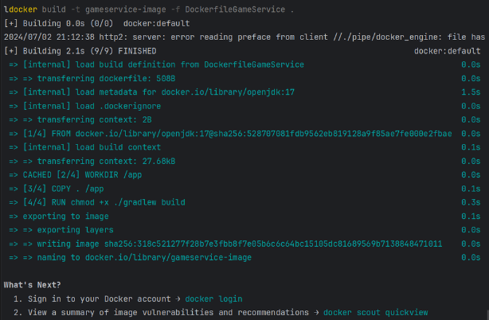

**Explicación**: La salida muestra la fecha de creación de la imagen 
gameservice-image y confirma su creación exitosa. Además, 
se presenta el hash (`sha256:318c521277f28b7e3fbb8f7e05b6c6c64bc15105dc81689569b7138848471011`), 
que es el identificador único de la imagen.

### **MapService:**

Ejecutamos el comando:

```
docker build -t mapservice-image -f DockerfileMapService .
```

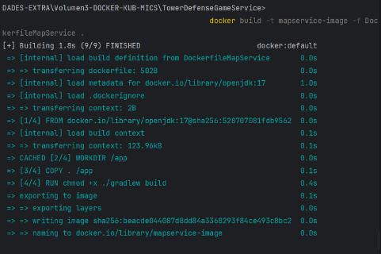

**Explicación**: La salida muestra la fecha de creación de la 
imagen mapservice-image y confirma su creación exitosa. Además, se presenta 
el hash (`sha256:beacde044087d8dd84a3368293f84ce493c8bc2`), que es el 
identificador único de la imagen.

### **PlayerService:**

Ejecutamos el comando:

```
docker build -t playerservice-image -f DockerfilePlayerService .
```

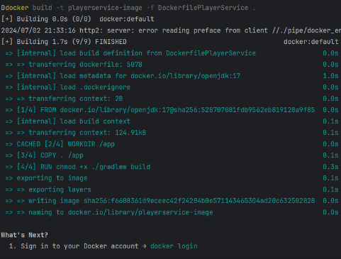

**Explicación**: La salida muestra la fecha de creación de la imagen 
playerservice-image y confirma su creación exitosa. Además, se 
presenta el hash (`sha256:f6608361d9eceec42f24284b0e571143465304ad20c632502828`), 
que es el identificador único de la imagen.

### **TowerService:**

Ejecutamos el comando:

```
docker build -t towerservice-image -f DockerfileTowerService .
```

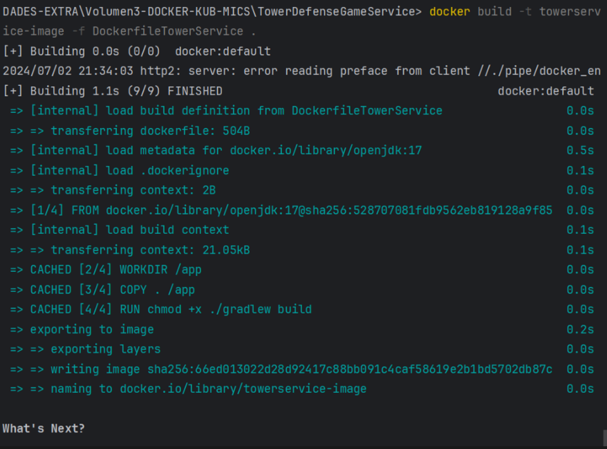

Explicación: La salida muestra la fecha de creación de la imagen 
towerservice-image y confirma su creación exitosa. Además, se presenta el 
hash (`sha256:66ed013022d28d92417c88bb091c4caf58619e2b1bd5702db87c`), que es 
el identificador único de la imagen.

### **WaveService:**

Ejecutamos el comando:

```
docker build -t waveservice-image -f DockerfileWaveService .
```

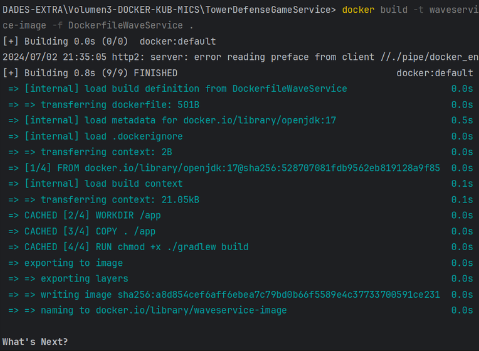

**Explicación**: La salida muestra la fecha de creación de la 
imagen waveservice-image y confirma su creación exitosa. Además, 
se presenta el hash (`sha256:a8d854cef6aff6ebea7c79bd0b66f5589e4c37733700591ce231`), 
que es el identificador único de la imagen.
```
version: '2.26.1'

services:
  game:
    build:
      context: .
      dockerfile: DockerfileGameService
    networks:
      - game-network
    volumes:
      - game-data:/app/data

  map:
    build:
      context: .
      dockerfile: DockerfileMapService
    networks:
      - game-network

  player:
    build:
      context: .
      dockerfile: DockerfilePlayerService
    networks:
      - game-network

  tower:
    build:
      context: .
      dockerfile: DockerfileTowerService
    networks:
      - game-network

  wave:
    build:
      context: .
      dockerfile: DockerfileWaveService
    networks:
      - game-network

networks:
  game-network:
    driver: bridge

volumes:
  game-data:
    driver: local

```

Aquí tienes una parafrasea del texto:

### Descripción de `docker-compose.yml`

1. **Versión de Compose:** En esta sección se indica la versión específica de 
Docker Compose que estamos empleando. En este caso, se utiliza la versión 2.28.1.

    ```yaml
    version: '2.28.1'
    ```

2. **Servicios:** La parte services del archivo define cada contenedor 
individualmente para los microservicios del sistema.
    - **Game Service**
        
        ```yaml
        services:
          game:
            build:
              context: .
              dockerfile: DockerfileGameService
            networks:
              - game-network
            volumes:
              - game-data:/app/data
        ```
Para configurar el servicio de GameService en el archivo docker-compose.yml, 
se especifica la ruta del directorio que contiene el Dockerfile utilizando build:,
asegurando que se utilice el DockerfileGameService adecuado. Además, 
se conecta el servicio a la red game-network mediante networks: - game-network. 
Para gestionar los datos de manera efectiva, se monta el volumen game-data en 
el directorio /app/data dentro del contenedor mediante 
volumes: - game-data:/app/data.

- **Map Service**
        
        ```yaml
         map:
            build:
              context: .
              dockerfile: DockerfileMapService
            networks:
              - game-network
        ```
        
        - `build:`: Se especifica la ruta del directorio que contiene el Dockerfile para `DockerfileMapService`.
        - `networks: - game-network`: Conecta este servicio a la red `game-network`.
    - **Player Service**
        
        ```yaml
        player:
            build:
              context: .
              dockerfile: DockerfilePlayerService
            networks:
              - game-network
        ```

En el archivo docker-compose.yml, se define la configuración para el 
servicio PlayerService utilizando build: para especificar la ruta del 
directorio que contiene el Dockerfile correspondiente, asegurando así que 
se utilice el DockerPlayerService. Además, se conecta este servicio específico 
a la red game-network mediante networks: - game-network, permitiendo la 
comunicación adecuada dentro del entorno de red definido.

- **Tower Service**
        
        ```yaml
        tower:
            build:
              context: .
              dockerfile: DockerfileTowerService
            networks:
              - game-network
        
          
        ```

Dentro del archivo docker-compose.yml, se utiliza build: para definir la 
ubicación del directorio que contiene el Dockerfile destinado al servicio 
TowerService, asegurando así que se emplee el DockerTowerService. Además, 
se integra este servicio con la red game-network a través de 
networks: - game-network, facilitando la comunicación y la interacción 
dentro del entorno de red especificado.

- **Wave Service**
        
        ```yaml
        wave:
            build:
              context: .
              dockerfile: DockerfileWaveService
            networks:
              - game-network
        ```
        
        - `build:`: Aqui se especifica la ruta del directorio que contiene el Dockerfile para `DockerWaveService`.
        - `networks: - game-network`: Conecta este servicio a la red `game-network`.
3. **Redes**
    
    ```yaml
    networks:
      game-network:
        driver: bridge
    
    ```
    
    Define una red llamada `game-network` utilizando el controlador `bridge,` el cual tiene como fin que los servicios se comuniquen entre sí en una red privada aislada.
    
4. **Volúmenes**
    
    ```yaml
    volumes:
      game-data:
        driver: local
    ```

Se establece un volumen denominado game-data utilizando el controlador local. 
Estos volúmenes se emplean para preservar datos más allá del ciclo de vida del 
contenedor, garantizando que la información no se pierda al detener o recrear 
los contenedores.

Posteriormente, al ejecutar el comando docker-compose up -d, se despliegan 
los contenedores correspondientes:

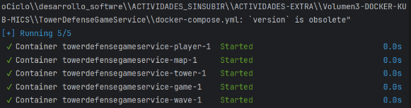

La imagen anterior indica que todos los contenedores definidos en el archivo `docker-compose.yml` se han inicializado correctamente. Cada contenedor asociado a los microservicios `gameservice`, `mapservice`, `playerservice`, `towerservice`, y `waveservice` se encuentra en estado "Started".

# Despliegue en Kubernetes

Voy a implementar los microservicios del juego en Kubernetes. 
Para esto, crearé archivos YAML ajustados para cada servicio:

### game-deployment.yaml

Este archivo establece el despliegue para el microservicio game-service.

```yaml
apiVersion: apps/v1
kind: Deployment
metadata:
  name: game-deployment
spec:
  replicas: 1
  selector:
    matchLabels:
      app: game-service
  template:
    metadata:
      labels:
        app: game-service
    spec:
      containers:
      - name: game-service
        image: gameservice-image:latest
        ports:
        - containerPort: 8080

```

### map-deployment.yaml

Con este archivo definiré el despliegue para el microservicio `map-service`.

```yaml
apiVersion: apps/v1
kind: Deployment
metadata:
  name: map-deployment
spec:
  replicas: 1
  selector:
    matchLabels:
      app: map-service
  template:
    metadata:
      labels:
        app: map-service
    spec:
      containers:
      - name: map-service
        image: map-service-image:latest
        ports:
        - containerPort: 8080

```

### player-deployment.yaml

Con este archivo definiré el despliegue para el microservicio `player-service`.

```yaml
apiVersion: apps/v1
kind: Deployment
metadata:
  name: player-deployment
spec:
  replicas: 1
  selector:
    matchLabels:
      app: player-service
  template:
    metadata:
      labels:
        app: player-service
    spec:
      containers:
      - name: player-service
        image: player-service-image:latest
        ports:
        - containerPort: 8080

```

### tower-deployment.yaml

Este archivo define el despliegue para el microservicio `tower-service`.

```yaml
apiVersion: apps/v1
kind: Deployment
metadata:
  name: tower-deployment
spec:
  replicas: 1
  selector:
    matchLabels:
      app: tower-service
  template:
    metadata:
      labels:
        app: tower-service
    spec:
      containers:
      - name: tower-service
        image: tower-service-image:latest
        ports:
        - containerPort: 8080

```

### wave-deployment.yaml

Este archivo define el despliegue para el microservicio `wave-service`.

```yaml
apiVersion: apps/v1
kind: Deployment
metadata:
  name: wave-deployment
spec:
  replicas: 1
  selector:
    matchLabels:
      app: wave-service
  template:
    metadata:
      labels:
        app: wave-service
    spec:
      containers:
      - name: wave-service
        image: wave-service-image:latest
        ports:
        - containerPort: 8080
```

Cada archivo .yaml presenta las siguientes características clave: apiVersion 
define la versión de la API de Kubernetes empleada, mientras que kind especifica 
que se trata de un Deployment. En metadata, se incluye el nombre del Deployment. 
En la sección spec, se detalla la configuración del Deployment, donde replicas 
establece el número de réplicas del pod, y selector permite seleccionar los pods 
según las etiquetas especificadas. Dentro de template, se define la plantilla 
del pod, donde metadata contiene las etiquetas del pod, y spec define el 
contenedor del pod. Cada contenedor está especificado por name, image, 
que es la imagen Docker utilizada, y ports, que define los puertos expuestos 
por el contenedor.

### Aplicar los Archivos de Configuración en Kubernetes

Primero inicializo kubernets con el comando `minikube start` 

Para poder aplicar los archivos de configuración y desplegar los microservicios 
en el clúster de Kubernetes, ejecute los siguientes comandos:

```
kubectl apply -f game-deployment.yaml
kubectl apply -f map-deployment.yaml
kubectl apply -f player-deployment.yaml
kubectl apply -f tower-deployment.yaml
kubectl apply -f wave-deployment.yaml
```

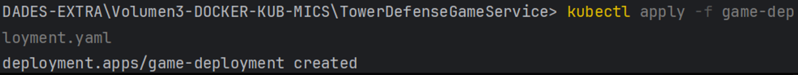

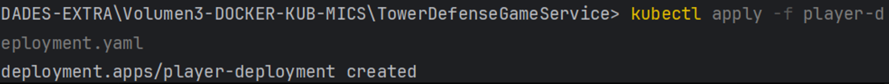

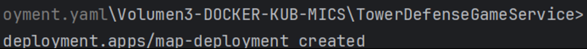

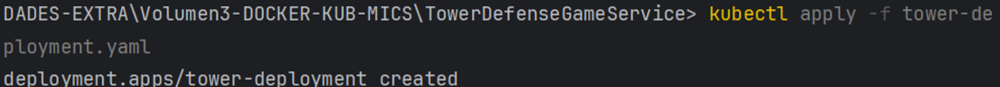

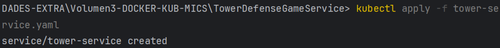

Puedo ver que en cada imagen que cada microservicio se ha creado correctamente 
en el cluster de kubernets 

# Crear archivos de servicio para Kubernetes

Realizaré los siguientes archivos YAML ajustado para cada servicio: 

### 1. game-service.yaml

Este archivo contiene el servicio para el microservicio game-service.

```yaml
apiVersion: v1
kind: Service
metadata:
  name: game-service
spec:
  selector:
    app: game-service
  ports:
    - protocol: TCP
      port: 80
      targetPort: 8080
  type: LoadBalancer

```

### 2. map-service.yaml

Este archivo contiene el servicio para el microservicio map-service.

```yaml
apiVersion: v1
kind: Service
metadata:
  name: map-service
spec:
  selector:
    app: map-service
  ports:
    - protocol: TCP
      port: 80
      targetPort: 8080
  type: LoadBalancer
```

### 3. player-service.yaml

Este archivo contiene el servicio para el microservicio player-service.

```yaml
apiVersion: v1
kind: Service
metadata:
  name: player-service
spec:
  selector:
    app: player-service
  ports:
    - protocol: TCP
      port: 80
      targetPort: 8080
  type: LoadBalancer
```

### 4. tower-service.yaml

Este archivo contiene el servicio para el microservicio tower-service.

```yaml
apiVersion: v1
kind: Service
metadata:
  name: tower-service
spec:
  selector:
    app: tower-service
  ports:
    - protocol: TCP
      port: 80
      targetPort: 8080
  type: LoadBalancer
```

### 5. wave-service.yaml

Este archivo contiene el servicio para el microservicio wave-service.

```yaml
apiVersion: v1
kind: Service
metadata:
  name: wave-service
spec:
  selector:
    app: wave-service
  ports:
    - protocol: TCP
      port: 80
      targetPort: 8080
  type: LoadBalancer
```

Aquí está el texto solicitado:

Cada archivo -service.yaml presenta las siguientes características esenciales: 
apiVersion define la versión de la API de Kubernetes utilizada (v1), 
mientras que kind especifica que se trata de un Service. En metadata, 
se incluye el nombre del servicio (game-service). En la sección spec, 
se detalla la especificación del servicio, donde selector permite seleccionar 
los pods que tienen la etiqueta app: game-service`. `Ports define los puertos 
que el servicio manejará, especificando el protocolo utilizado (TCP), 
el puerto expuesto por el servicio (80), y el targetPort, que indica 
el puerto en el contenedor donde el servicio enviará el tráfico (8080). Además, 
type especifica el tipo de servicio como LoadBalancer, que expone el 
servicio a través de un balanceador de carga.

## Aplicar los Archivos de Configuración en Kubernetes

Ahora ejecutaré los siguientes comandos:

```
kubectl apply -f game-service.yaml
kubectl apply -f map-service.yaml
kubectl apply -f player-service.yaml
kubectl apply -f tower-service.yaml
kubectl apply -f wave-service.yaml
```

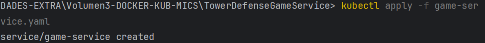

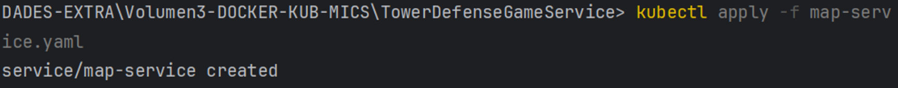

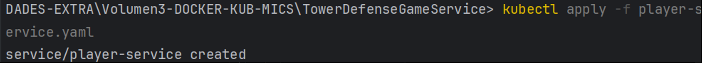


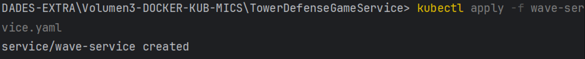

Podemos observar que en cada imagen que cada servicio se ha creado 
correctamente en el cluster de kubernets 

## Verificar el Estado de despliegue

Después de aplicar los archivos de configuración, voy a verificar el estado de los servicios con el siguiente comando:

```
kubectl get pods
kubectl get services
```

Con el primer comando listara

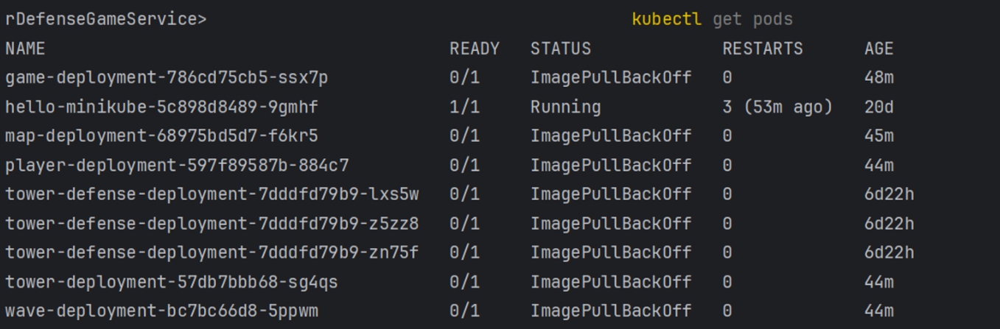

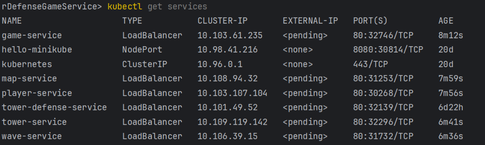

**Explicación**: La imagen anterior presenta una lista completa de todos 
los pods en el clúster, ofreciendo detalles básicos como el nombre del pod, 
su estado actual, el número de veces que se ha reiniciado y el 
tiempo transcurrido desde su creación. Entre estos pods se encuentran 
game-deployment, tower-deployment, y otros. Esto proporcionará una 
lista de todos los servicios en tu clúster, mostrando sus direcciones IP 
y los puertos asociados.

**Descripción de la salida:**

- **NAME**: Nombre del servicio.
- **TYPE**: Tipo de servicio, como ClusterIP, NodePort, o LoadBalancer.
- **CLUSTER-IP**: Dirección IP interna asignada al servicio dentro del clúster.
- **EXTERNAL-IP**: Dirección IP externa asignada al servicio. Puede mostrarse como <pending> si el servicio es del tipo LoadBalancer y aún no se ha asignado una IP externa.
- **PORT(S)**: Puertos a través de los cuales el servicio es accesible. Este campo incluye el puerto expuesto (por ejemplo, 80) y el puerto en el clúster (por ejemplo, 32746/TCP).
- **AGE**: Tiempo transcurrido desde que el servicio fue desplegado.

**Análisis de la salida:**

- **game-service**: Tipo LoadBalancer. Tiene una IP interna de 10.103.61.235, pero la IP externa está <pending>, indicando que el balanceador de carga aún no ha asignado una IP externa.
- **map-service**, **player-service**, **tower-service**, **wave-service**: Todos son del tipo LoadBalancer con IPs internas asignadas, pero IPs externas mostradas como <pending>.

# Implementación de Pruebas Unitarias y de Integración

### Configuración de Mockito en Gradle

Incluyo las dependencias necesarias de Mockito al archivo `build.gradle`.
```bash
plugins {
    id 'java'
}

group = 'com.jhaner'
version = '1.0-SNAPSHOT'

repositories {
    mavenCentral()
}

dependencies {
    testImplementation platform('org.junit:junit-bom:5.9.1')
    //dependencia junit
    testImplementation 'org.junit.jupiter:junit-jupiter'
    testImplementation 'org.assertj:assertj-core:3.25.3'
    testImplementation 'org.jetbrains:annotations:24.0.0'
    //dependencias para usar mockito
    implementation group: 'org.mockito', name: 'mockito-core', version: '5.12.0'
}

test {
    useJUnitPlatform()
}

```

Con el comando `.\gradlew build` construyo el archivo gradle :

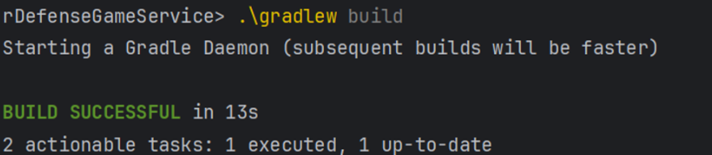

Observo que la ejecución fue éxitosa al construirse correctamente el 
archivo build.gradle

### Clase de Prueba con Mockito

Implemento la clase GameServiceTest para verificar que el método 
placeTower de GameService funciona correctamente usando mocks que cumpliran 
rol simuladores de las clases MapService,PlayerService,gameService:

```java
package org.example;

import org.junit.jupiter.api.Test;
import org.junit.jupiter.api.BeforeEach;
import org.mockito.InjectMocks;
import org.mockito.Mock;
import org.mockito.MockitoAnnotations;
import static org.mockito.Mockito.*;

//Pruebas unitarias para la clase GameService.

public class GameServiceTest {

    //Mock de la clase MapService para simular su comportamiento.
    @Mock
    private MapService mockMapService;

    //Mock de la clase PlayerService para simular su comportamiento.
    @Mock
    private PlayerService mockPlayerService;

    //Instancia de GameService donde se inyectarán los mocks.
    @InjectMocks
    private GameService gameService;

    //Configuración inicial antes de cada prueba.Inicializa los mocks y realiza las inyecciones necesarias.
    @BeforeEach
    public void setUp() {
        MockitoAnnotations.openMocks(this); // Inicializa los mocks y las inyecciones usando Mockito.
    }


//Prueba para verificar el método placeTower de GameService.
//Se asegura de que el método coloque correctamente una torre en el mapa.
    @Test
    public void testPlaceTower() {
        //Mock de la clase TowerService para simular una torre.
        TowerService mockTower = mock(TowerService.class);
        //Llama al método placeTower de GameService con el mock de torre y coordenadas (2, 2).
        gameService.placeTower(mockTower, 2, 2);
        //Verifica que el método placeTower del mock de MapService fue llamado con los parámetros mockTower y coordenadas (2, 2).
        verify(mockMapService).placeTower(mockTower, 2, 2);
    }
}

```

**Descripcion del codigo :** 

Claro, aquí tienes el párrafo combinado:

En las pruebas unitarias de GameServiceTest, mockMapService y mockPlayerService 
actúan como simulaciones de MapService y PlayerService, respectivamente, 
proporcionando un entorno controlado para verificar el comportamiento del 
GameService. El método setUp, ejecutado antes de cada prueba, inicializa 
los mocks y sus inyecciones mediante MockitoAnnotations.openMocks(this). 
En el método de prueba testPlaceTower, se crea un mock de TowerService 
(mockTower) y se llama al método placeTower de gameService con este mock 
y las coordenadas (2, 2). La verificación posterior asegura que 
mockMapService.placeTower haya sido invocado exactamente una vez 
con los mismos parámetros, validando así la correcta interacción entre 
GameService y MapService.

Ahora ejecutaremos la prueba: 

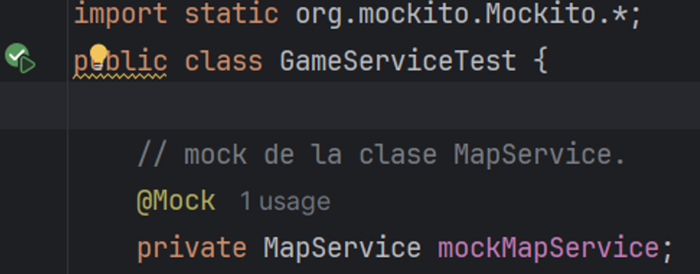

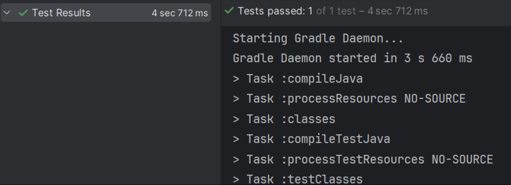

La imagen anterior muestra que la prueba testPlaceTower de la clase  GameServiceTest
se ejecuto  y paso correctamente .

## Implementación de Pruebas de Mutación con Pitest

Utilizaré Pitest para evualar la calidad de nuestras pruebas .

### Configuración en Gradle

Me dirigimos al archivo `build.gradle` para añadir el id de pitest al plugins del archivo build,
Después de añadir la dependencia para usar pitest con gradle al conjunto 
de dependencias del archivo build.gradle, configuro el plugin de pitest de la siguiente manera: 

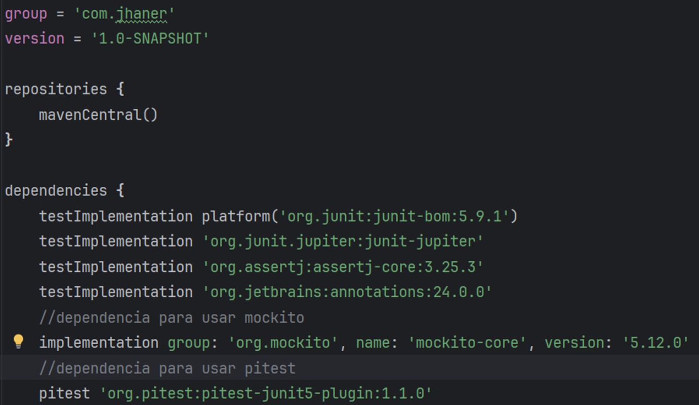

### Ejecutar Pitest

Para ejecutar Pitest, utiliza el siguiente comando:

```
./gradlew pitest
```

Este comando me generará un informe de mutación para el proyecto, 
evaluando la calidad de las pruebas unitarias que he creado : 

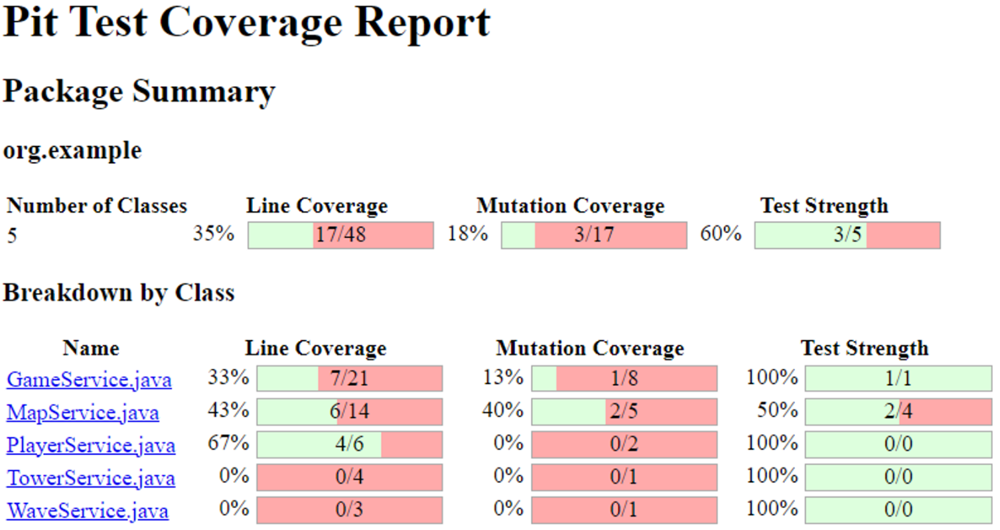

1. **GameService.java**
    - Cobertura de Línea: 33% (7 de 21 líneas)
    - Cobertura de Mutación: 13% (1 de 8 mutaciones)
    - Fuerza de Prueba: 100% (1 de 1 prueba)
    - En GameService, la cobertura de línea alcanza el 33%, con solo el 13% de las mutaciones cubiertas. Sin embargo, la prueba detectó y manejó todas las mutaciones identificadas.

2. **MapService.java**
    - Cobertura de Línea: 43% (6 de 14 líneas)
    - Cobertura de Mutación: 40% (2 de 5 mutaciones)
    - Fuerza de Prueba: 50% (2 de 4 pruebas)
    - La cobertura de línea en MapService llega al 43%, con un notable 40% de mutaciones detectadas por las pruebas. La mitad de las pruebas diseñadas para mutaciones fueron exitosas.

3. **PlayerService.java**
    - Cobertura de Línea: 67% (4 de 6 líneas)
    - Cobertura de Mutación: 0% (0 de 2 mutaciones)
    - Fuerza de Prueba: 100% (0 de 0 pruebas)
    - PlayerService muestra una sólida cobertura de línea del 67%, pero no se detectaron mutaciones con las pruebas existentes. La prueba estándar no incluyó casos de mutaciones.

4. **TowerService.java**
    - Cobertura de Línea: 0% (0 de 4 líneas)
    - Cobertura de Mutación: 0% (0 de 0 mutaciones)
    - Fuerza de Prueba: 100% (0 de 0 pruebas)
    - Comentario: TowerService carece de cobertura de línea y mutación, lo que indica ausencia de pruebas específicas en estas áreas.

5. **WaveService.java**
    - Cobertura de Línea: 0% (0 de 3 líneas)
    - Cobertura de Mutación: 0% (0 de 1 mutación)
    - Fuerza de Prueba: 100% (0 de 0 pruebas)
    - Comentario: Similar a TowerService, WaveService no presenta cobertura de línea ni de mutación, reflejando falta de pruebas dedicadas a estas áreas específicas.